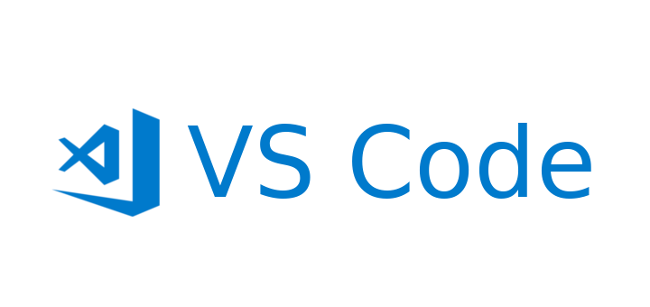

# ¿Qué es Visual Studio Code?

Es un **editor de texto avanzado** pensado para escribir código. Es desarrollado por Microsoft y es de acceso gratuito. Actualmente es una de las herramientas más utilizadas entre especialistas de la programación y analistas de datos.

# Principales ventajas

- Es un programa liviano y extensible, por tanto, personalizable
- Soporta múltiples lenguajes de programación (Python, R, HTML, etc)
- Facilita la aplicación de control de versiones
- Terminal integrada
- Ideal para flujos de trabajo reproducible (Git/GitHub y documentos dinámicos)
- Integra copilot

# Instalación del programa

[Link de descarga](https://code.visualstudio.com/)

-> aquí incrustar un canva con los pasos de la instalación

# Interfaz

  <iframe loading="lazy" style="position: absolute; width: 100%; height: 100%; top: 0; left: 0; border: none; padding: 0;margin: 0;"
    src="https://www.canva.com/design/DAHETpusuAQ/GxF81d5_GHNhAI7LTsueTg/view?embed" allowfullscreen="allowfullscreen" allow="fullscreen">
  </iframe>

<a href="https:&#x2F;&#x2F;www.canva.com&#x2F;design&#x2F;DAHETpusuAQ&#x2F;GxF81d5_GHNhAI7LTsueTg&#x2F;view?utm_content=DAHETpusuAQ&amp;utm_campaign=designshare&amp;utm_medium=embeds&amp;utm_source=link" target="_blank" rel="noopener">Paso a paso</a> Interfaz VSCode

En este punto la idea es presentar cada sección de la interfaz y sus opciones

## Menú superior (describir los más importantes)

### Archivos

### Edición

### Selección

### Vista

## Barra de herramientas

mostrar las herramientas una por una y explicar brevemente qué hace cada una 

### Buscador

- El software tiene un buscador de archivos integrado

- Busca en distintos niveles de anidación: permite ubicar tanto palabras   dentro de los documentos como dentro de las carpeta

### Documentos

- VSCode trabaja con carpetas como áreas de trabajo.

- Cada carpeta puede contener múltiples archivos y subcarpetas.

- Se puede abrir una carpeta existente o crear una nueva desde VSCode.

- Los archivos pueden ser de cualquier tipo: código fuente, texto plano, datos, etc.

- La estructura de carpetas y archivos es clave para la organización y reproducibilidad (ej: protocolo IPO).

### Extensiones

- Las extensiones son complementos que agregan funcionalidades a VSCode.
  
- Existen extensiones para diferentes lenguajes de programación, herramientas y flujos de trabajo.

- Buscar e instalar extensiones: desde el Marketplace de VSCode.

- Abre la vista de extensiones con el ícono de cuadrados en la barra lateral o con el atajo `Ctrl+Shift+X`.

- Busca las extensiones por nombre (ej: “Quarto”, “R”, “Zotero”).

- Haz clic en “Install” para instalar cada extensión.

- Reinicia VS Code si es necesario para activar las extensiones.

# Shortcuts

Mostrar los principales atajos que existen en VSC para facilitar el flujo de trabajo

# Actividades prácticas

## Actividad 1

1. Genere un nuevo archivo, seleccionar un lenguaje y guardarlo
2. Instale 3 extensiones de su interés y aplíquelas a su entorno de trabajo

## Actividad 2

Cree una carpeta en el escritorio del computador (idealmente siguiendo el protocolo IPO) y siga las siguientes instrucciones:

1. Abra la carpeta desde VSCode para que el programa la interprete como el directorio de trabajo
2. Genere un nuevo archivo y escriba un breve texto en él
3. Guárdelo en la carpeta que creó anteriormente
4. Busque algún contenido clave del documento utilizando las herramientas dispuestas en la barra lateral