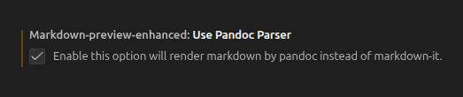

# Zotero: introducción 

En este práctico aprenderemos a utilizar gestores de referencias, específicamente Zotero, para luego integrarlo a nuestro flujo de trabajo en VSCode. Recordemos que los gestores de referencias nos permiten almacenar, organizar y compartir nuestra bibliografía.

## Instalación

  <iframe loading="lazy" style="position: absolute; width: 100%; height: 100%; top: 0; left: 0; border: none; padding: 0;margin: 0;"
    src="https://www.canva.com/design/DAHFBM75wAE/OYYm05LoLXmT9ANX9-a7Lg/view?embed" allowfullscreen="allowfullscreen" allow="fullscreen">
  </iframe>

<a href="https:&#x2F;&#x2F;www.canva.com&#x2F;design&#x2F;DAHFBM75wAE&#x2F;OYYm05LoLXmT9ANX9-a7Lg&#x2F;view?utm_content=DAHFBM75wAE&amp;utm_campaign=designshare&amp;utm_medium=embeds&amp;utm_source=link" target="_blank" rel="noopener">Instalación de Zotero</a>

## Uso del software

### Bibliotecas y colecciones

Al entrar a Zotero, el software por defecto genera una  biblioteca personal. Dentro de su biblioteca pueden crear  colecciones, las cuales funcionan como carpetas para organizar de mejor manera los contenidos de la biblioteca.

Para crear una colección, deben clickear el botón de la carpeta gris que está arriba de  My Librarie.

### Cómo guardar citas

Practiquemos cómo guardar las citas. Existen 3 maneras de guardarlas:

- 1) Mediante la extensión de Google Chrome

  - Primero hay que asegurar que esté abierto Zotero para que funcione la extensión

  - Debemos abrir la página donde se encuentra alojado el artículo, [como aquí](https://www.tandfonline.com/doi/full/10.1080/13501760701314417#abstract)

  - Clickeamos la extensión y nos dará la opción de guardar el artículo

  - Aparece una de nuestras bibliotecas por defecto. Al apretar la flecha que aparece al lado del nombre, se despliega la lista de las demás bibliotecas en caso de que necesitemos cambiarla

- 2) Mediante DOI/ISBN

  - Debemos disponer del DOI y/o ISBN del artículo y copiarlo (`Ctrl + C`)

  - Entramos a Zotero y abrimos la biblioteca en donde queremos guardar la referencia
  
  - Clickeamos la varita que se encuentra en la parte superior izquierda

  - Pegamos (`Ctrl + V`) el DOI/ISBN del texto y apretamos `Enter` para guardar

- 3) Vía manual

  - Abrimos la biblioteca donde guardaremos la referencia

  - Clickeamos el botón de `add item` que se encuentra al lado izquierdo de la varita (parte superior izquierda)

  - Elegimos el tipo de documento que registraremos

  - Rellenamos las secciones con los datos del artículo 

## Better BibTeX

Es un plugin de Zotero que permite exportar las referencias en un formato legible en Latex, Markdown y Quarto.

- Para utilizarlo, primero debemos instalar el plugin desde [este link](https://retorque.re/zotero-better-bibtex/installation/index.html)

- Una vez descargado, debemos abrir Zotero, ir al menú superior izquierdo y clickear en Tools > Plugins >   > Install plugin from file y seleccionar el archivo descargado

- Para exportar referencias, debemos hacer click derecho en una biblioteca, colección o en los textos que necesitemos, y apretar `Export items`

- Seleccionamos el formato Betterbibtex y apretamos `Ok`. 

- Se generará un archivo .bib que tendrá almacenadas nuestras referencias, las cuales podemos vincular a los documentos en VSCode

# Zotero en VSCode

## Fundamentales

Para referenciar correctamente nuestras citas en los documentos (Quarto), debemos tener en cuenta tres cosas: 1) incluir el archivo .bib en el YAML 2) añadir un archivo .csl (Citation Style Languaje) para especificar el estilo de citación 3) escribir correctamente la citation key 

- El archivo .bib debe estar idealmente dentro de nuestro directorio de trabajo para que sea sencillo agregarlo al YAML, ya que se debe escribir la ruta exacta de su ubicación

- El archivo .csl debe integrarse al YAML al igual que el archivo .bib para que el documento reconozca el tipo de citación que necesitamos

- Aquí pueden encontrar distintos tipos de .csl: [www.zotero.org/styles](https://www.zotero.org/styles)

El YAML (donde van los metadatos del documento) debería verse algo así:

    --- # <1>
    title: "Práctico 2"
    format: html
    bibliography: references.bib
    csl: apa.csl
    editor: source
    --- # <1>

- Para agregar referencias al documento, la citation key debe estar escrita entre corchetes [] para que sea considerada como una referencia

## Maneras de citar en texto plano con Zotero

| Se escribe                                         	| Renderiza                     	|
|----------------------------------------------------	|-------------------------------	|
| Como dice `@sabbagh_dimension_2003`                	|  Como dice Sabbagh (`2003`)    |
| `[@sabbagh_dimension_2003]` dice ...      	        |  (`Sabbagh, 2003`) dice ...    	|
| Sabbagh `[-@sabbagh_dimension_2003, pp.35]` dice ...|  Sabbagh (`2003, p.35`) dice ...|

Para las actividades prácticas, necesitaremos que ingresen a las configuraciones de la extensión R Markdown Enhanced y tachen la siguiente opción:

# Actividades prácticas 

## Actividad 1 

- Cree una carpeta en su escritorio que se llame "practico-02"

- Abra Zotero y añada una nueva colección en su biblioteca

- Cambie la fórmula de la citation key a esta: `[auth:lower]_[shorttitle1:lower]_[year]`

- Guarde 3 referencias en ella utilizando la extensión de Google Chrome o bien el DOI/ISBN

- Exporte su colección en formato Better BibTeX y guárdelo en la carpeta del práctico

- Descargue un archivo .csl (idealmente APA) y guárdelo en la carpeta creada

## Actividad 2

- Abra la carpeta que creó antes dentro de VSCode para que la reconozca como su directorio de trabajo

- Genere un nuevo documento 

- Cambie el lenguaje del documento a Quarto

- Ajuste el YAML para que reconozca los archivos .bib y .csl (puede guiarse con el que está en el ejemplo del práctico)

- Escriba un párrafo que le permita incluir al menos 2 de las referencias que guardó en el documento .bib

- Renderice el documento y verifique que las citas funcionen correctamente