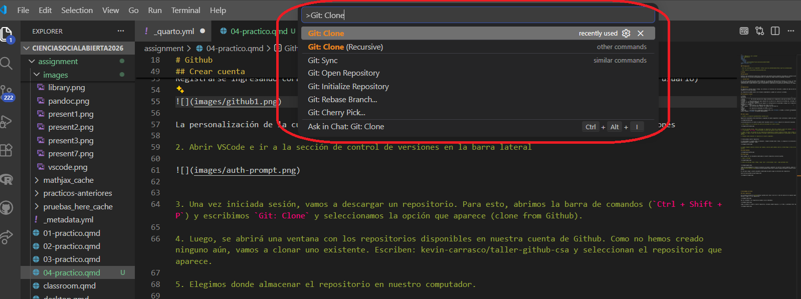
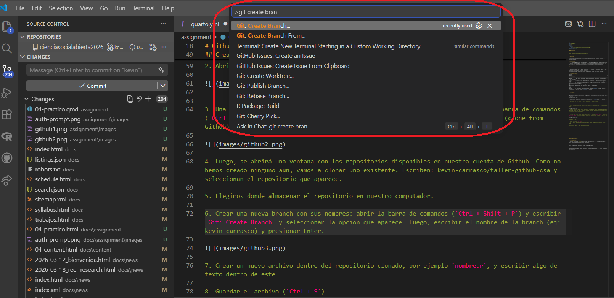
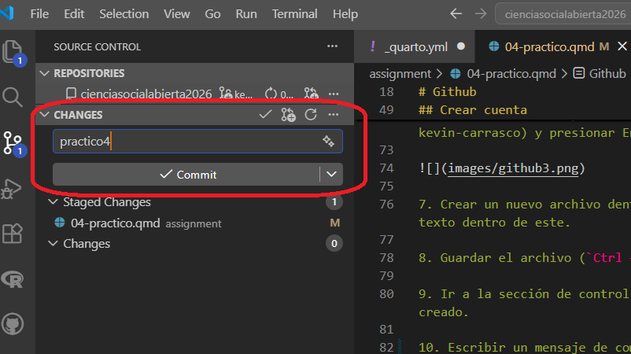
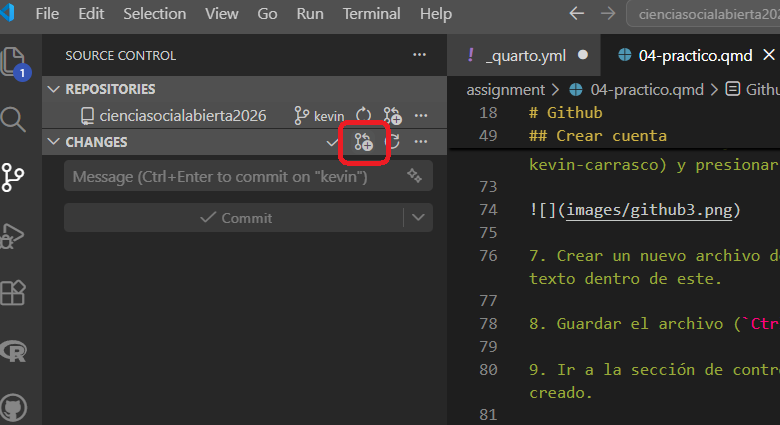
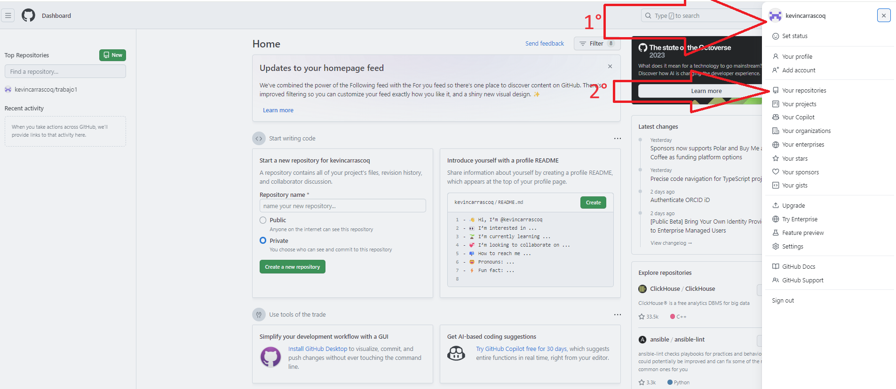
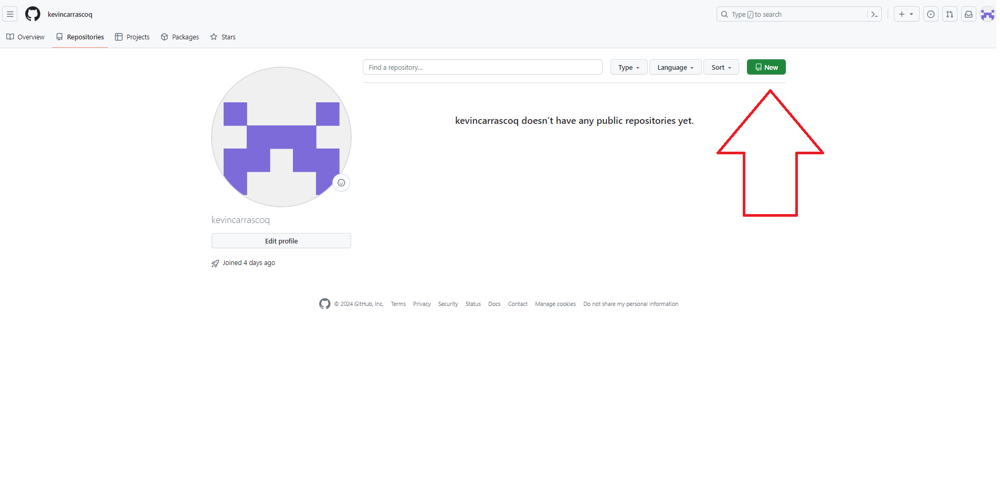
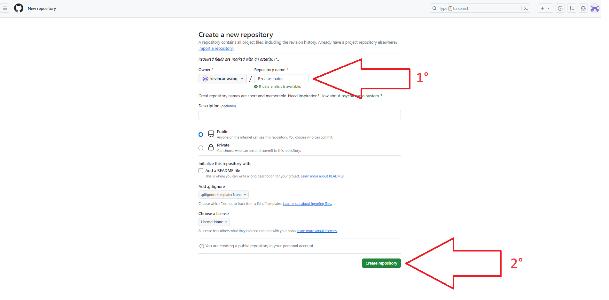

### Prerequisitos {.unnumbered}

- Tener Git instalado en el computador: [https://git-scm.com/downloads](https://git-scm.com/downloads)

- Extensiones necesarias en VSCode: Git History y GitHub Pull Requests

- Crear cuenta en [www.github.com](www.github.com)

# Github

## Descripción

Github es una **plataforma de desarrollo colaborativo** que permite alojar proyectos utilizando el sistema de control de versiones Git. Se utiliza principalmente para la creación de código fuente de programas (software). 

::: callout-note

El 4 de junio de 2018 Microsoft compró GitHub por la cantidad de 7500 millones de dólares. Al inicio, el cambio de propietario generó preocupaciones y la salida de algunos proyectos de este sitio; sin embargo, no fueron representativos. GitHub continúa siendo la plataforma más importante de colaboración para proyectos de código abierto.

:::

## Repositorios

Un repositorio contiene todo el código, tus archivos y el historial de revisiones y cambios de cada uno de ellos. Es el elemento más básico de Github.

Los repositorios pueden contar con múltiples colaboradores y pueden ser públicos o privados.

## Principales términos

| Término          | Definición                                                                                           |
|---------------|------------------------------------------------------------------------------------------------------|
| *Commit*        | 	Acción de registro de los cambios aplicados en un repositorio.|
| *Push*        | 	Acción de subir los cambios locales a un repositorio remoto.|
| *Pull*        | 	Acción de descargar los cambios de un repositorio remoto al local.|
| *Branch*        | 	Una versión paralela del código contenido en el repositorio, pero que no afecta a la rama principal.|
| *Clonar*        |	Para descargar una copia completa de los datos de un repositorio de GitHub.com, incluidas todas las versiones de cada archivo y carpeta.                                                                                   |
| *Fork*          | Un nuevo repositorio que comparte la configuración de visibilidad y código con el repositorio «ascendente» original.|
| *Merge*         | Para aplicar los cambios de una rama y en otra.                                       |
| *Pull request*  | Una solicitud para combinar los cambios de una branch en otra.                                             |
| *Remote*        | Un repositorio almacenado en GitHub, no en el equipo.                                                 |

## Crear cuenta

1. Acceder a la página de [GitHub](https://github.com/)

Registrarse ingresando correo electrónico y siguiendo los pasos siguientes (crear contraseña y nombre de usuario)

La personalización de la cuenta se puede saltar haciendo click en **skip** abajo de la selección de opciones

2. Abrir VSCode e ir a la sección de control de versiones en la barra lateral

3. Una vez iniciada sesión, vamos a descargar un repositorio. Para esto, abrimos la barra de comandos (`Ctrl + Shift + P`) y escribimos `Git: Clone` y seleccionamos la opción que aparece (clone from Github).

4. Luego, se abrirá una ventana con los repositorios disponibles en nuestra cuenta de Github. Como no hemos creado ninguno aún, vamos a clonar uno existente. Escriben: kevin-carrasco/taller-github-csa y seleccionan el repositorio que aparece.

5. Elegimos donde almacenar el repositorio en nuestro computador.

6. Crear una nueva branch con sus nombres: abrir la barra de comandos (`Ctrl + Shift + P`) y escribir `Git: Create Branch` y seleccionar la opción que aparece. Luego, escribir el nombre de la branch (ej: kevin-carrasco) y presionar Enter.

7. Crear un nuevo archivo dentro del repositorio clonado, por ejemplo `nombre.r`, y escribir algo de texto dentro de este.

8. Guardar el archivo (`Ctrl + S`).

9. Ir a la sección de control de versiones en la barra lateral, donde aparecerá el nuevo archivo creado.

10. Escribir un mensaje de commit y hacer click en el ícono de check para hacer el commit.

11. Sincronizar los cambios y luego hacer un pull-request.

12. Luego de que los pull-requests sean revisados y aceptados, el nuevo archivo creado aparecerá en la rama principal del repositorio. Pueden descargar estos nuevos archivos sincronizando los cambios y haciendo un "pull" de la rama principal.

# Actividades prácticas

1. En la página principal de [GitHub](https://github.com/) hacer click en el ícono de usuario de la esquina superior derecha y luego ir a Tus repositorios

2. Una vez accedemos a Tus repositorios hacemos click en New/Nuevo

3. Luego le ponemos un nombre a nuestro repositorio, evitando siempre espacios, ñ y tíldes, y apretamos Crear repositorio

4. Clonar este nuevo repositorio en sus computadores

5. Crear un nuevo archivo dentro del repositorio clonado, por ejemplo `tarea.qmd`, y escribir algo de texto dentro de este.

6. Invitar a colaborar a un- compañer- de curso a su repositorio. Para esto, ir a la página del repositorio en Github, hacer click en Settings, luego en Manage access y finalmente en Invitar a colaborador. Escribir el nombre de usuario de Github de su compañer- y hacer click en Invitar.

7. Que sus compañer-s acepten la invitación y luego clonen el repositorio para descargar los archivos realizados por ustedes.

8. Que la persona invitada a colaborar edite el documento `tarea.qmd` de sus compañer-s y agregue algo de texto. Después, hacer commit y push de los cambios para que que quien administra el repositorio pueda descargar (pull) los nuevos cambios realizados.

9. Descargar los nuevos cambios en sus repositorios locales y verificar que el documento `tarea.qmd` se ha actualizado con los cambios realizados por l-s colaboradores.