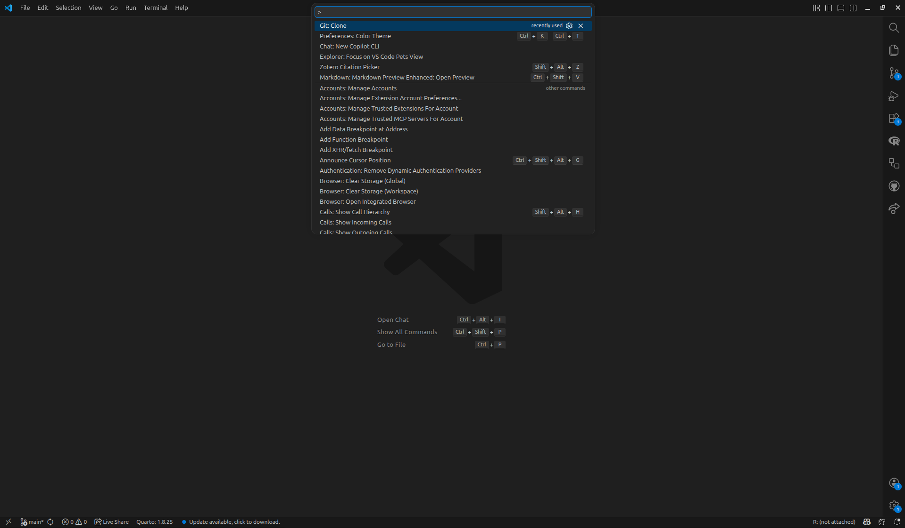
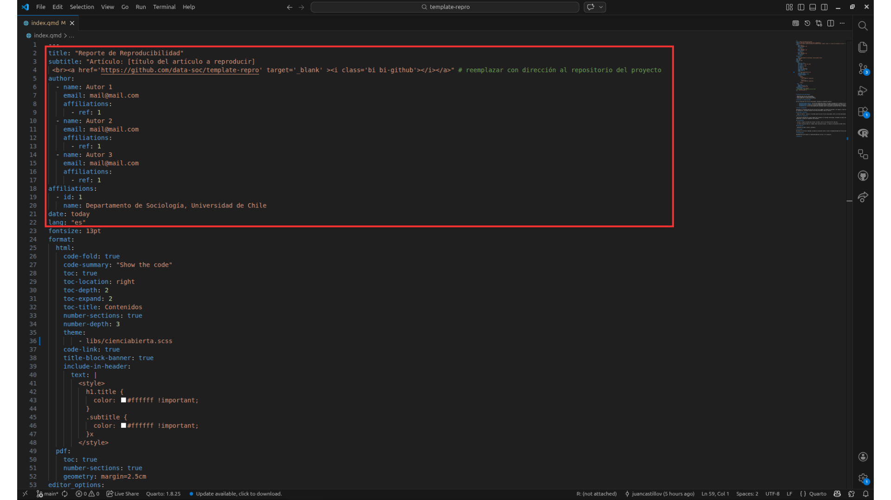
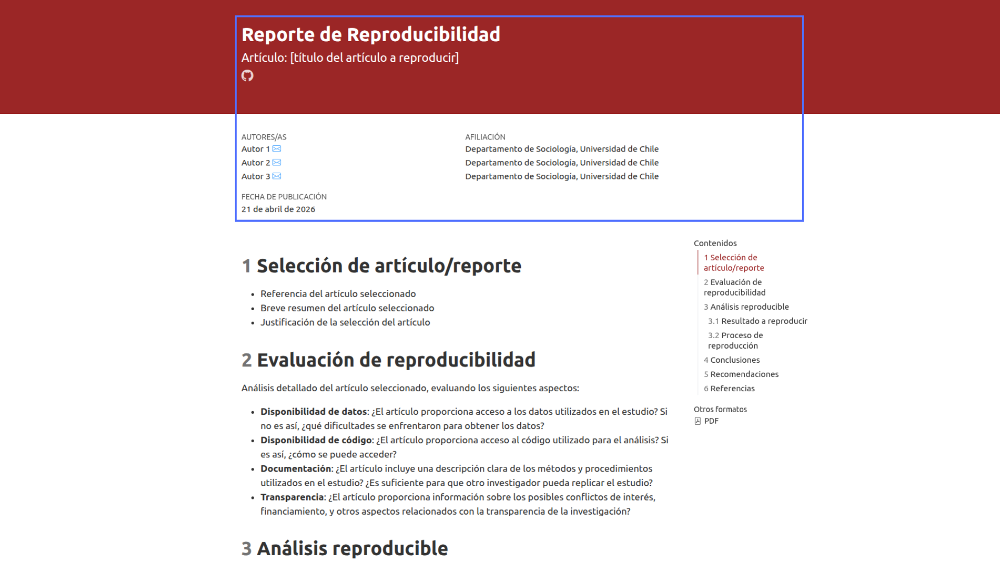
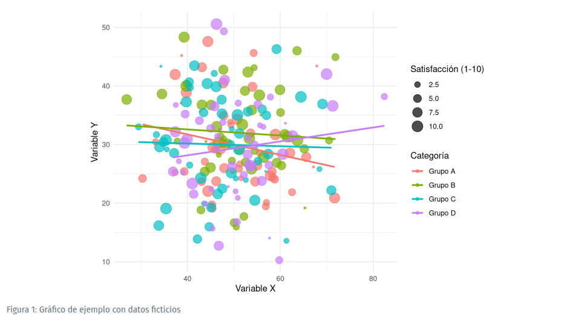

# Objetivo de la sesión {.unnumbered}

El objetivo de esta sesión es presentar la plantilla (template) para el ejercicio de reproducibilidad que deberán realizar como parte de la primera evaluación del curso. Este template está diseñado para orientar a l_s estudiantes en la construcción del informe, proporcionando un formato base para el desarrollo del ejercicio.

Aquí pueden encontrar el [repositorio del template](https://github.com/data-soc/template-repro) para seguir paso a paso el práctico.

# Cómo alojar el template en nuestra cuenta

<div style="position: relative; width: 100%; height: 0; padding-top: 56.2500%;
 padding-bottom: 0; box-shadow: 0 2px 8px 0 rgba(63,69,81,0.16); margin-top: 1.6em; margin-bottom: 0.9em; overflow: hidden;
 border-radius: 8px; will-change: transform;">
  <iframe loading="lazy" style="position: absolute; width: 100%; height: 100%; top: 0; left: 0; border: none; padding: 0;margin: 0;"
    src="https://www.canva.com/design/DAHHiwVqfIA/l-AGYUuICPDVni7WhU0alA/view?embed" allowfullscreen="allowfullscreen" allow="fullscreen">
  </iframe>
</div>
<a href="https:&#x2F;&#x2F;www.canva.com&#x2F;design&#x2F;DAHHiwVqfIA&#x2F;l-AGYUuICPDVni7WhU0alA&#x2F;view?utm_content=DAHHiwVqfIA&amp;utm_campaign=designshare&amp;utm_medium=embeds&amp;utm_source=link" target="_blank" rel="noopener">Copia del template en nuestra cuenta</a>

Una vez tenemos el template en un repositorio propio, debemos clonarlo en nuestro local. Para esto, abrimos VSCode, vamos a la sección de control de código fuente (`Ctrl + Shift + P`) y seleccionamos "Git: Clone" -> "Clone from GitHub" y elegimos el repositorio del template alojado en **nuestra cuenta**. 



# Presentación del template

**0) Metadatos del documento**

Se encuentran en el YAML del archivo `.qmd`

**1) Selección del artículo/reporte**

Detalles del documento seleccionado y justificación de su elección.

**2) Evaluación de reproducibilidad**

Análisis de la disponibilidad de los datos, código, documentación y transparencia de la investigación

**3) Análisis reproducible**

Proceso de reproducibilidad de la figura seleccionada

**4) Conclusiones**

Conclusiones sobre el nivel de reproducibilidad de la figura seleccionada

**5) Recomendaciones**

Recomendaciones para mejorar la reproducibilidad del artículo, si es necesario.

**6) Referencias**

# Cómo utilizar el template

## Metadatos

El template se encuentra en formato `.qmd`, una estructura de documento con la cual ya estamos familiarizados. En primer lugar, debemos modificar los metadatos del documento (YAML), como el título, fecha y autoría. Luego, podemos ir editando las demás secciones con el contenido correspondiente.



Al renderizar el documento, esta es la información que cambiará: 



## Referencias en la escritura del reporte

Para integrar referencias en el documento, debemos considerar tres elementos fundamentales: el archivo de referencias (**.bib**), el estilo de citación (**.csl**) y la sintaxis para citar en el texto (**citation keys**).

**Ejemplo**: tenemos una carpeta en Zotero con nuestras referencias, la cual exportamos como `cienciabierta.bib` y la guardamos en la carpeta `input` de nuestro proyecto. Luego, para que Quarto pueda reconocer este archivo, debemos especificar su ubicación en el YAML del documento.

El template ya trae la opción de integrar bibliografía, pero está escrito como comentario. Solamente debemos eliminar el # al inicio de `bibliography` para que Quarto reconozca la opción, y luego escribimos el nombre del archivo, respetando su ubicación. Para el .csl debemos seguir el mismo procedimiento. Entonces, si nuestro archivo .csl se llama `apa.csl`, el YAML debería verse así:

    --- # <1>
    bibliography: "input/cienciabierta.bib"
    csl: "input/apa.csl"
    --- # <1>

Una vez que tenemos esto configurado, podemos citar en el texto utilizando las citation keys. Por ejemplo, si queremos citar un artículo cuya citation key es `harvey_brief_2005`, escribimos `@harvey_brief_2005` en el texto, y al renderizar el documento, esta referencia se integrará automáticamente con el formato definido por el archivo .csl.

:::{.callout-note}

Si tienen dudas respecto a referencias en texto plano, pueden revisitar el [Práctico 02](https://cienciasocialabierta.netlify.app/assignment/02-practico)

:::

## Datos y código

Todo el análisis de código se realizará en el apartado de Análisis reproducible. Recordemos que para incluir datos y código en nuestro documento, debemos utilizar los chunks de Quarto. Por ejemplo, queremos reproducir la siguiente figura:



Considerando esto, nuestro código debería verse algo así:

```r
#| label: fig-ejemplo
#| fig-cap: "Gráfico de ejemplo con datos ficticios"
#| fig-cap-location: bottom
#| echo: false
#| warning: false

# Cargar librerías necesarias
library(ggplot2)
library(dplyr)

# Crear datos ficticios
set.seed(123)  # Para reproducibilidad
datos_ejemplo <- data.frame(
  categoria = rep(c("Grupo A", "Grupo B", "Grupo C", "Grupo D"), each = 50),
  valor_x = rnorm(200, mean = 50, sd = 10),
  valor_y = rnorm(200, mean = 30, sd = 8),
  satisfaccion = sample(1:10, 200, replace = TRUE)
)

# Crear el gráfico
ggplot(datos_ejemplo, aes(x = valor_x, y = valor_y, color = categoria)) +
  geom_point(aes(size = satisfaccion), alpha = 0.7) +
  geom_smooth(method = "lm", se = FALSE) +
  labs(
    x = "Variable X",
    y = "Variable Y",
    color = "Categoría",
    size = "Satisfacción (1-10)"
  ) +
  theme_minimal() 
```

Al renderizarlo, obtendremos la figura reproducida en nuestro documento:


```{r}
#| label: fig-ejemplo
#| fig-cap: "Gráfico de ejemplo con datos ficticios"
#| fig-cap-location: bottom
#| echo: false
#| warning: false

# Cargar librerías necesarias
library(ggplot2)
library(dplyr)

# Crear datos ficticios
set.seed(123)  # Para reproducibilidad
datos_ejemplo <- data.frame(
  categoria = rep(c("Grupo A", "Grupo B", "Grupo C", "Grupo D"), each = 50),
  valor_x = rnorm(200, mean = 50, sd = 10),
  valor_y = rnorm(200, mean = 30, sd = 8),
  satisfaccion = sample(1:10, 200, replace = TRUE)
)

# Crear el gráfico
ggplot(datos_ejemplo, aes(x = valor_x, y = valor_y, color = categoria)) +
  geom_point(aes(size = satisfaccion), alpha = 0.7) +
  geom_smooth(method = "lm", se = FALSE) +
  labs(
    x = "Variable X",
    y = "Variable Y",
    color = "Categoría",
    size = "Satisfacción (1-10)"
  ) +
  theme_minimal() 
```

Este ejemplo cumple con **ilustrar** cómo incluir código y datos en nuestro documento a partir de datos generados en el mismo chunk. En el caso de sus trabajos, deberán **cargar los datos desde la carpeta input**, o bien, con la url que dirija a la base de datos. Luego, reproducen la figura seleccionada utilizando el código proporcionado por los autores del artículo o reporte, en caso de que lo tengan a disposición. 

:::{.callout-note}

Si tienen dudas respecto a la escritura en texto plano, pueden revisitar el [Práctico 03](https://cienciasocialabierta.netlify.app/assignment/03-practico)

:::


# Actividad práctica

**1)** Trabajen en el template colaborativamente siguiendo los siguientes pasos:

- Entre los integrantes de sus respectivos grupos, elijan el repositorio de **una persona** que contenga el template, el cuál será su espacio de trabajo para la evaluación n°1. 

- Luego, cada integrante debe clonar el repositorio en su local. 

- Finalmente, cada integrante del grupo debe generar un commit con su nombre y apellido, aplicando los cambios que estimen necesarios.

- Recuerden que el template es solamente una guía, por lo que pueden modificarlo a su conveniencia, siempre y cuando se mantenga la estructura general del informe. 

:::{.callout-note}
Recuerden que, cada vez alguna persona del grupo realice un commit, l_s demás deben hacer un pull para actualizar su local con los cambios realizados por sus compañer_s, y así evitar conflictos a la hora de hacer commits posteriores.
:::