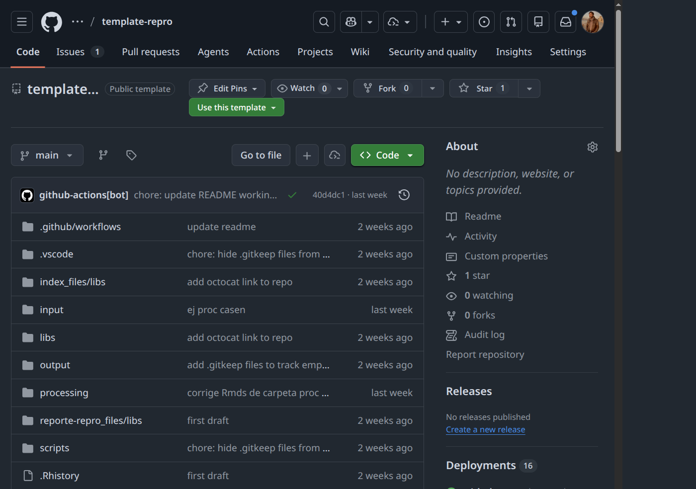
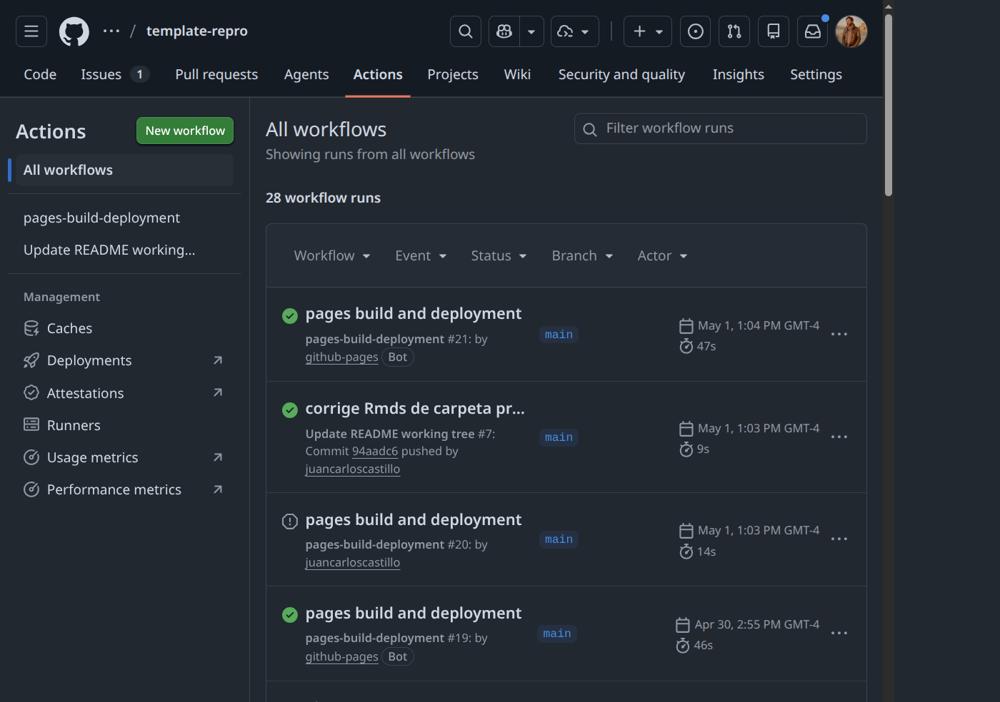

# Objetivo de la sesión {.unnumbered}

El objetivo de esta sesión es implementar GitHub Pages en el repositorio grupal del trabajo de reproducibilidad, de modo que los resultados y materiales del proyecto queden publicados en la web de forma abierta, trazable y reproducible.

Al finalizar este práctico podrán:

- Explicar las dos formas de publicar con GitHub Pages y cuándo usar cada una.
- Configurar la publicación desde la carpeta `docs/` para mantener la raíz del repositorio limpia.
- Verificar el despliegue y diagnosticar errores comunes.
- Usar Hypothes.is para anotar y comentar sitios web publicados.

# Punto de partida: el repositorio grupal {.unnumbered}

El trabajo de reproducibilidad que han desarrollado utiliza como base la plantilla del protocolo IPO disponible en:

[https://github.com/data-soc/template-repro](https://github.com/data-soc/template-repro)

{fig-align="center" width="100%"}

Esta plantilla organiza el proyecto en tres carpetas principales:

| Carpeta | Contenido |
|---|---|
| `input/` | Datos originales, imágenes, bibliografía |
| `procesamiento/` | Scripts de preparación y análisis |
| `output/` | Tablas y figuras producto del análisis |

El archivo `index.qmd` en la raíz sirve como fuente de la página principal del informe. 

# Publicando con GitHub Pages {.unnumbered}

GitHub Pages ofrece tres modalidades de publicación, todas configurables desde **Settings → Pages** del repositorio:

| Modalidad | Source en Settings | ¿Qué publica? | Cuándo usarla |
|---|---|---|---|
| **1. Desde raíz** | Deploy from a branch → `/` | `index.html` en la raíz | Sitios muy simples, tutoriales rápidos |
| **2. Desde `/docs`** | Deploy from a branch → `/docs` | Carpeta `docs/` en la raíz | Proyectos Quarto/RMarkdown: separa fuentes de salida |
| **3. GitHub Actions** | GitHub Actions | Lo que defina el workflow | Cuando el sitio se construye en el servidor (CI/CD) |

En este práctico vamos a implementar las dos primeras modalidades, que son las más sencillas para proyectos Quarto. La tercera modalidad se utiliza cuando el proceso de construcción del sitio es complejo o requiere herramientas específicas que no se pueden ejecutar localmente, pero no es necesaria para nuestro caso.   

# Alternativa 1: desde la raíz (`main` + `/`)

Comenzaremos por la modalidad más simple para entender el flujo completo de publicación.

1. En VS Code, abrir `index.qmd` y hacer un preview local con **Quarto Preview** para asegurarnos de que se ve bien. Esto genera un archivo `index.html` en la raíz del repositorio.
2. Commit + push
3. En GitHub, ir a **Settings** → **Pages**.
4. En **Build and deployment**, seleccionar:
  - **Source**: `Deploy from a branch`
  - **Branch**: `main`
  - **Folder**: `/` (raíz)

Este procedimiento generará una URL del tipo `https://<usuario>.github.io/<repositorio>/` donde se publicará el sitio mediante una acción de Github (Github Actions), que se encuentran en la siguiente pestaña:

{fig-align="center" width="100%"}

Las **Actions** son procesos automáticos que se ejecutan cada vez que se hace un push al repositorio. En este caso, el proceso de Github Pages se encarga de tomar el archivo `index.html` generado por Quarto y publicarlo en la URL asignada. 

**¿Cómo ver el resultado?** Si se van a Actions, pueden buscar el proceso llamado *pages build and deployment* y hacer clic para ver su historial de ejecuciones. Si el proceso se ejecutó correctamente, verán un ícono verde (✓) y podrán hacer clic sobre el url que aparece en el  recuadro "deploy" para ver el sitio publicado.


::: callout-tip
Esta modalidad es recomendable cuando el sitio tiene un único `index.html` y pocos archivos adicionales.
:::

# Alternativa 2: Escalar a una publicación más ordenada (`main` + `/docs`)

Cuando el proyecto empieza a crecer (subpáginas, archivos anidados, más recursos), conviene mover la salida renderizada a `docs/` para no colapsar la raíz del repositorio.

## Configurar `_quarto.yml` para generar `docs/`

Para que Quarto genere la salida en `docs/`, generar un archivo nuevo en la raíz con el título `_quarto.yml` con el siguiente contenido:

```yaml
---
project:
  type: website
  output-dir: docs
---
```

Luego:

1. Renderizar desde VS Code con **Render** (▶) en `index.qmd`.
2. Revisar localmente con **Quarto Preview**.
3. Commit + push.

Esto hace que el archivo `index.html` y los recursos asociados se generen dentro de `docs/`, manteniendo la raíz del repositorio limpia.

# Agregar dirección al README.md

Para facilitar el acceso al sitio publicado, es recomendable agregar un enlace directo en el `README.md` del repositorio. Para esto:

1. Editar `README.md` y agregar una sección al final con el título "Sitio publicado" o similar.

2. Incluir un enlace a la URL de GitHub Pages, por ejemplo:

```{=html}
[Sitio publicado](https://nombre-usuario.github.io/nombre-repo/)
```

3. Commit + push.

4. Verificar que el enlace funciona correctamente.


# Errores frecuentes y cómo resolverlos

| Síntoma | Causa probable | Solución |
|---|---|---|
| El sitio no aparece | Pages aún no activado o sin primer commit en `docs/` | Verificar configuración y volver a hacer push |
| Página en blanco | `index.html` no existe en `docs/` | Renderizar con `quarto render` y volver a subir `docs/` |
| Rutas rotas (imágenes o links) | Rutas absolutas en el código | Usar rutas relativas en los archivos `.qmd` |
| El sitio no se actualiza | Caché del navegador | Abrir en modo incógnito o forzar recarga con `Ctrl+Shift+R` |
| Error 404 en Actions | Permisos insuficientes del workflow | Ir a Settings → Actions → General → activar *Read and write permissions* |


# Usar Hypothes.is para anotar el sitio publicado

Una de las posibles limitaciones de publicar en html es poder obtener feedback directo, lo que si es posible por ejemplo con comentarios en Google Docs. Sin embargo, con la herramienta de anotación web Hypothes.is, es posible dejar comentarios y anotaciones directamente sobre el sitio publicado, lo que facilita la colaboración y el intercambio de ideas.    


## Crear cuenta en Hypothes.is

1. Ir a [https://web.hypothes.is/](https://web.hypothes.is/) y hacer clic en **Get Started**.
2. Completar correo electrónico, nombre de usuario y contraseña.
3. Confirmar la cuenta desde el correo.

## Instalar la extensión

- **Chrome / Brave**: instalar desde la [Chrome Web Store](https://chrome.google.com/webstore/detail/hypothesis-web-pdf-annota/bjfhmglciegochdpefhhlphglcehbmek).
- **Firefox**: usar el [bookmarklet](https://web.hypothes.is/start/) disponible en la página de inicio.

## Anotar el sitio del grupo

1. Abrir la URL del sitio GitHub Pages del grupo.
2. Activar la extensión (ícono en la barra del navegador).
3. Seleccionar un fragmento de texto y escribir un comentario.
4. Elegir visibilidad:
   - **Public**: visible para todos.
   - **Only me**: anotación privada.
   - **Grupo del curso**: crear un grupo en Hypothes.is e invitar a los compañeros.

::: callout-note
Para crear un grupo  en Hypothes.is: ir a [https://hypothes.is/groups/new](https://hypothes.is/groups/new), crear el grupo y compartir el enlace de invitación.
:::

# Actividad

**Objetivo**: Publicar el sitio del repositorio grupal con GitHub Pages y verificar que el despliegue funciona.

**Pasos**:

1. Publicar primero la versión simple desde `main /`.
2. Verificar el resultado en la URL publicada.
3. Migrar el proyecto a `output-dir: docs` en `_quarto.yml`.
4. Renderizar de nuevo desde VS Code y comprobar con **Quarto Preview**.
5. Cambiar Pages a `main /docs`.
6. Agregar el enlace al sitio en el `README.md`.
7. Verificar que el sitio se despliega correctamente y que el enlace en el README funciona.
8. Hacerse cuenta en Hypothes.is y dejar una anotación pública sobre el sitio publicado.


::: callout-tip
Recuerden hacer `git pull` antes de editar para evitar conflictos con los cambios de sus compañeros de grupo.
:::
