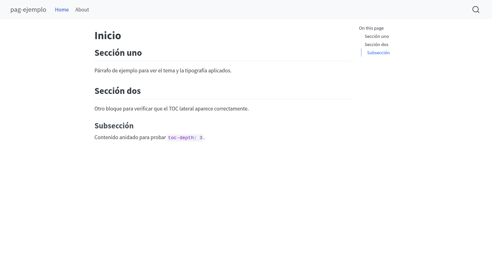
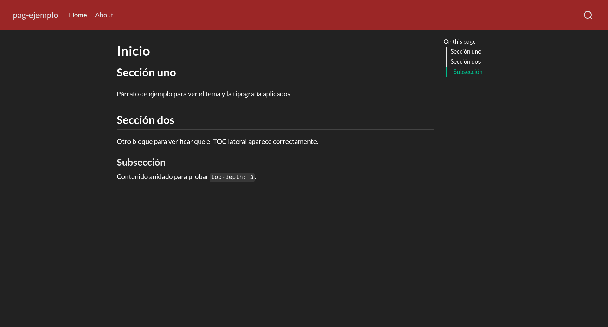
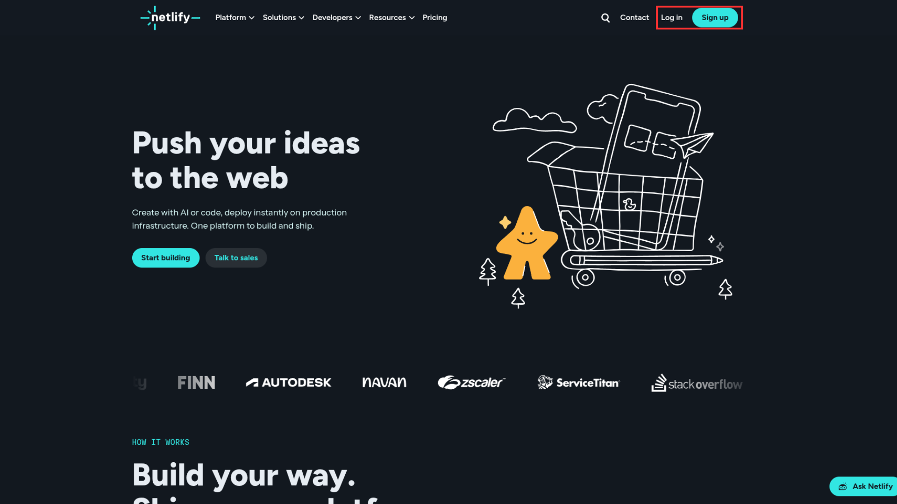
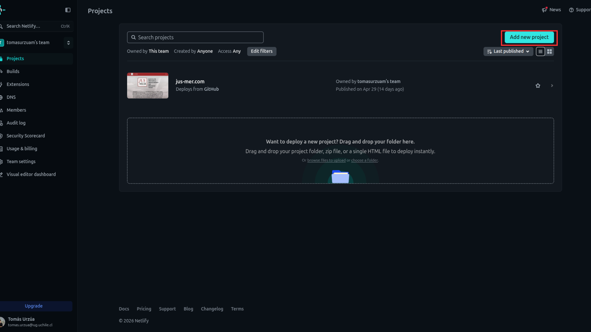
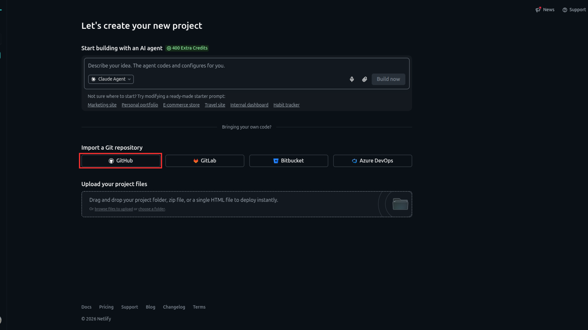
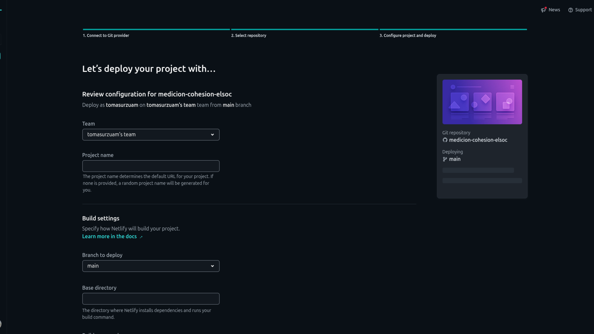
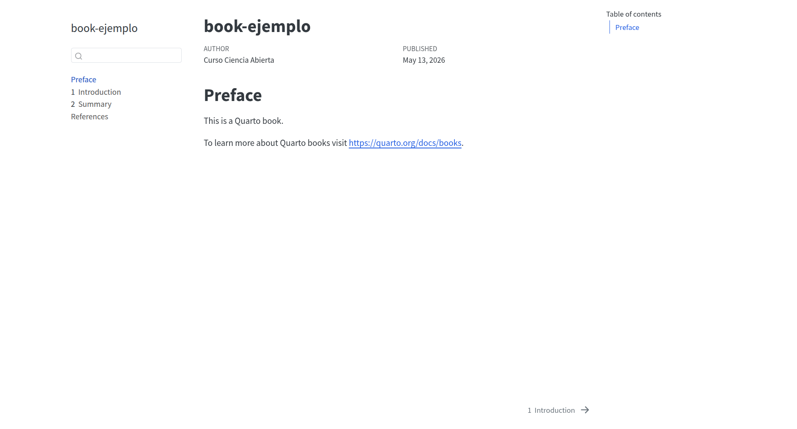
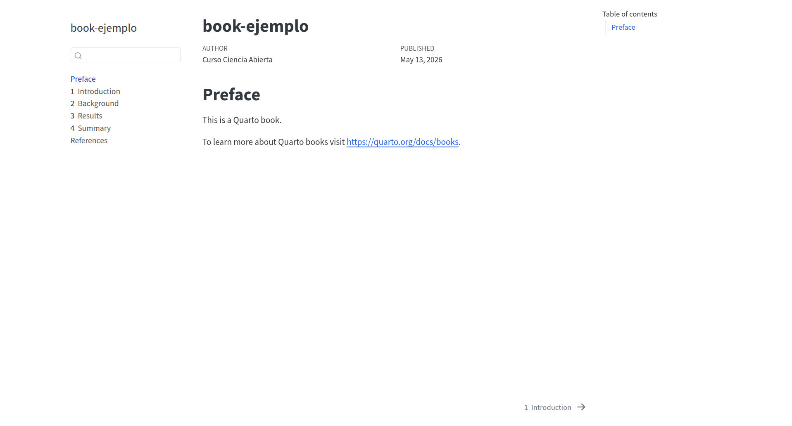

# Objetivo de la sesión {.unnumbered}

El objetivo de esta sesión es aprender cómo se construyen y funcionan dos formatos de salida que ofrece Quarto: (1) sitios web y (2) libros. Ambos son outputs muy útiles en cuanto a la difusión de contenido científico. Por ello, al final de este práctico podrán

- Comprender la estructura básica de un sitio web hecho con Quarto

- Entender la lógica de construcción de un Book en Quarto

- Generar el deploy de un website y/o un book mediante GitHub Pages

# Quarto Websites

Quarto ofrece la posibilidad de construir páginas web de manera gratuita y abierta. En la página oficial se pueden encontrar [algunas orientaciones](https://quarto.org/docs/websites/) sobre cómo empezar y [ejemplos de páginas hechas con Quarto](https://quarto.org/docs/gallery/#websites). 

Para crear un página en Quarto, debemos estar dentro de un repositorio ya creado y abrir la barra de comandos (`Ctrl` + `Shift` + `P`) para escribir: Create New Project > Website Project. Elegimos el nombre y su ubicación de almacenamiento. Con esto, se generará nuestro proyecto que contendrá tres archivos: `_quarto.yml`; `index.qmd` y `about.qmd`.

## Documentos fundamentales

### _quarto.yml

Es un archivo en formato YAML que opera separado del documento .qmd para asignar todas las opciones generales que queremos que tenga nuestra página. El YAML que viene por defecto se ve así:

```yaml
---
project:
  type: website

website:
  title: "pag-ejemplo"
  navbar:
    left:
      - href: index.qmd
        text: Home
      - about.qmd

format:
  html:
    theme:
      - cosmo
      - brand
    css: styles.css
    toc: true
---
```

`project`: se especifica el tipo de proyecto. En este caso, website
`website`: se incluyen las opciones que mostrará la página web
`navbar`: es la barra de navegación superior de la página
`format`: contiene el estilo de presentación de la página
`toc`: es la tabla de contenidos 

### index.qmd

El archivo index.qmd es una suerte de documento madre de la página, ya que cada vez que rendericemos este .qmd, se renderizarán todos los archivos de la página. Todo lo que esté escrito en él será contenido que se mostrará en el website. Utilicemos este contenido de ejemplo:

```{r}
#| eval: false

---
title: "Inicio"
---

## Sección uno

Párrafo de ejemplo para ver el tema y la tipografía aplicados.

## Sección dos

Otro bloque para verificar que el TOC lateral aparece correctamente.

### Subsección

Contenido anidado para probar `toc-depth: 3`.
```

Al renderizarlo, se debería ver algo así:



Como se ve en la imagen, `about.qmd` es una subsección dentro de `index.qmd`. Tal como la ya existente, se pueden generar infinidad de subsecciones dentro de un sitio web con el objetivo de organizar de mejor manera el contenido. 

## Personalización 

Como las páginas web funcionan con salida HTML, podemos utilizar los temas predeterminados que ofrece Quarto para estilizar nuestro sitio, y además incluir opciones adicionales a nuestro YAML. 

Probemos aplicando 2 modificaciones: (1) cambiemos la opción `theme` en nuestro `_quarto.yml` a darkly y (2) añadamos la opción `background` dentro de `navbar`: 

```yaml
---
project:
  type: website

website:
  title: "pag-ejemplo"
  navbar:
    left:
      - href: index.qmd
        text: Home
      - about.qmd
    background: "#9b2626"

format:
  html:
    theme:
      - darkly
    css: styles.css
    toc: true
---
```

Si guardamos estos cambios en nuestro `_quarto.yml` y volvemos a renderizar `index.qmd`, se vería algo así:



::: callout-note
Para conocer más opciones de estilización y presentación de contenido: [revisar este link](https://quarto.org/docs/reference/projects/websites.html)
:::

## Deployment del sitio web

### GitHub Pages

Para que nuestro sitio web pueda ser visible en la web podemos utilizar las funcionalidades que nos ofrece GitHub Pages.

Para ello, primero debemos habilitar GitHub Pages en nuestro repositorio y seleccionar desde dónde queremos publicar nuestra página.

Una vez esté configurado GitHub Pages en el repositorio de aloja nuestra página, solamente debemos escribir su link a partir del **enlace que genera nuestro repositorio** + **la ubicación del archivo index.html**. 

::: callout-tip
Práctico de publicación con GitHub Pages: [aquí](https://cienciasocialabierta.netlify.app/assignment/06-practico)
:::

### Netlify

Netlify es una plataforma profesional de publicación web que admite numerosas funciones avanzadas, como dominios personalizados, autenticación, vistas previas de ramas y reversiones instantáneas que funciona de manera tanto gratuita como pagada. 

En esta plataforma podemos hacer el deployment de nuestra página web de manera sencilla, volviéndola un poco más accesible en comparación a GitHub Pages debido a los ajustes que permite realizar.

Primero debemos entrar a [Netlify](https://www.netlify.com/) e ingresar con nuestra cuenta; en caso que no tengan una, tienen que crearla (se puede vincular la cuenta GitHub).



Una vez dentro, tenemos que ir a la sección Projects y clickear en New Project.



Ahora seleccionamos Import a Git repository



Eligen el repositorio en donde tienen alojada su página web y, al entrar a la pestaña que se ve a continuación, deben elegir el nombre de su proyecto. Este nombre será el que aparecerá en la URL, es decir, el link.



Al igual que con el deployment en GitHub Pages, deben elegir la misma branch y ubicación del archivo que lleve a la página web para que el deploy se logre sin problemas.

Una vez que estén segur_s con la ubicación del archivo a renderizar, clickean en el botón del final `Deploy 'nombre del repositorio'` y se comenzará a ejecutar su lanzamiento a la web. Al finalizar, la página debería entregarles la URL correspondiente de su nuevo sito web.


# Actividad intermedia

Considerando lo visto hasta ahora en el práctico, realice las siguientes tareas:

1) Cree un repositorio y clónelo en su local

2) Abra el repositorio y cree un proyecto de página web

3) Modifique el contenido de `index.qmd` y renderice el archivo para visualizar los cambios

4) Añada o cambie alguna opción del `_quarto.yml` y renderice para estilizar su página web

5) Realice el deployment de su página web ya sea en GitHub Pages o Netlify


# Quarto Book

Además de la posibilidad de crear páginas web, Quarto ofrece un formato Book. Como su nombre lo dice, su estructura se asemeja a la de un libro, construyéndose a partir de la anidación de distintos documentos .qmd.

Para crear un Book en Quarto debemos abrir la barra de comandos (`Ctrl` + `Shift` + `P`) y escribir: Create New Project > Book Project. Elegimos el nombre y su ubicación de almacenamiento.

## Documentos fundamentales

Al igual que en el proyecto del sitio web, Quarto nos entrega por defecto un `_quarto.yml` y un `index.qmd`. Sin embargo, existen dos diferencias importantes: La primera es el formato del YAML en un Book Project.  

```{yaml}
project:
  type: book

book:
  title: "book-ejemplo"
  author: "Curso Ciencia Abierta"
  date: today
  chapters:
    - index.qmd
    - intro.qmd
    - summary.qmd
    - references.qmd

bibliography: references.bib

format:
  html:
    theme:
      - cosmo
      - brand
  pdf:
    documentclass: scrreprt
```

Al observar el formato llegamos a la segunda diferencia. Un projecto Quarto Book contiene .qmd adicionales, los cuales se agrupan en la opción `chapter` del YAML. En este marco, index.qmd sigue siendo el documento madre, el cual renderizará todo el book, mientras que los otros archivos.qmd son los capítulos que contendrá el libro. 

Si renderizamos `index.qmd` se vería algo así: 



## Personalización

En Quarto Book también tenemos la opción de modificar el estilo del documento, pero más allá de los detalles estéticos, su mayor potencial es el alto nivel de organización que nos permite alcanzar mediante la lógica de anidado.

Podemos crear cuantos archivos .qmd queramos, pero solamente se visualizarán en el Book aquellos que estén especificados dentro del YAML. Por ejemplo, creamos `background.qmd`, `results.qmd` y le cambiamos el nombre a `summary.qmd` por `conclusions.qmd`. Posterior a esto, reescribimos nuestos capítulos dentro del YAML del Book:

```{yaml}
project:
  type: book

book:
  title: "book-ejemplo"
  author: "Curso Ciencia Abierta"
  date: today
  chapters:
    - index.qmd
    - intro.qmd
    - background.qmd
    - results.qmd
    - conclusions.qmd
    - references.qmd

bibliography: references.bib

format:
  html:
    theme:
      - cosmo
      - brand
  pdf:
    documentclass: scrreprt

```

Al renderizarse esto se ve así:



Si bien se integraron todos los capítulos que creamos y/o editamos, sigue apareciendo uno llamado Summary. Esto ocurre porque solamente le cambiamos el nombre al archivo .qmd pero no al título dentro de él. Para que los cambios de los archivos se vean en la salida HTML, **en algunas ocasiones también debemos editar el documento .qmd desde dentro**.

## Deployment

Al utilizar la salida HTML, un Quarto Book puede ser publicado mediante GitHub Pages así como mediante Netlify. Se deben seguir los mismos pasos que en la sección de deployment anterior.

# Actividad práctica

Considerando todos los contenidos de hoy, realice las siguientes tareas:

1) Cree un repositorio, invite a colaborar a su grupo de trabajo de la evaluación 1 y clónelo en su local

2) Abra el repositorio y cree un proyecto Quarto Book

3) Cada integrante del grupo modifique y/o añada 1 capítulo del libro y renderice el archivo para visualizar los cambios (asegúrense que los capítulos nuevos se vean en la salida HTML). Después de aplicar los cambios, la persona responsable debe hacer un commit y push de estos cambios, y luego l_s demás integrantes hacen un pull para tener su repositorio actualizado.

4) Una vez que tod_s l_s integrantes realizaron un commit, ejecuten el deployment de su Quarto Book ya sea en GitHub Pages o Netlify.