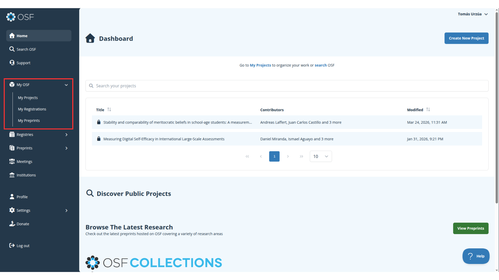
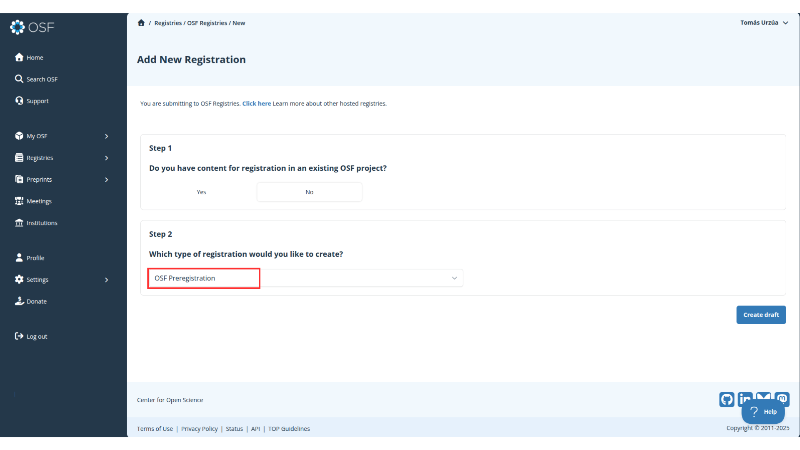
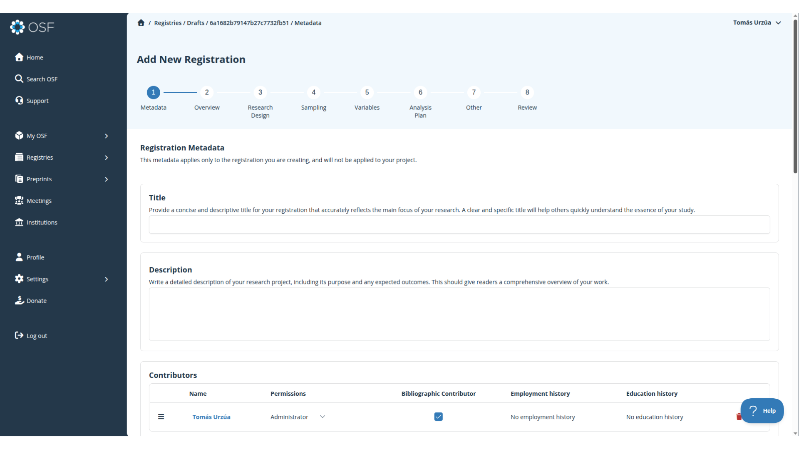
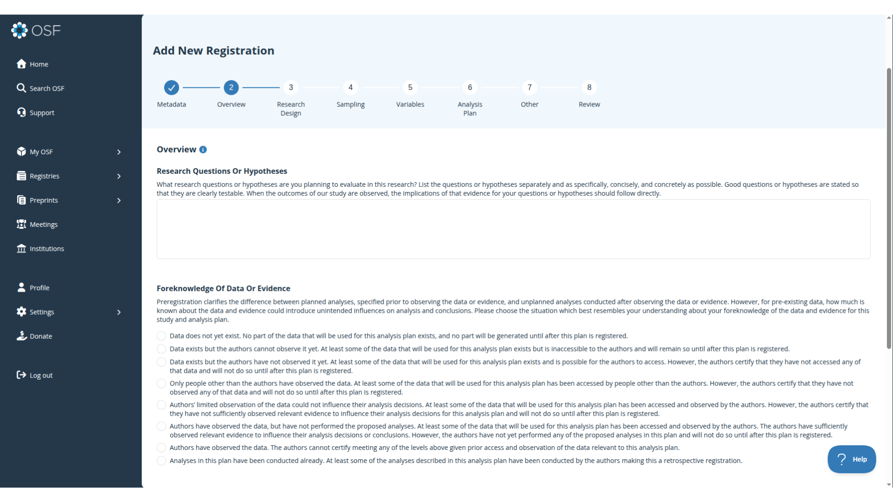
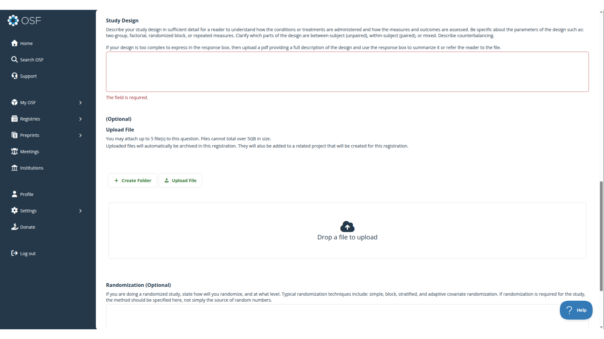
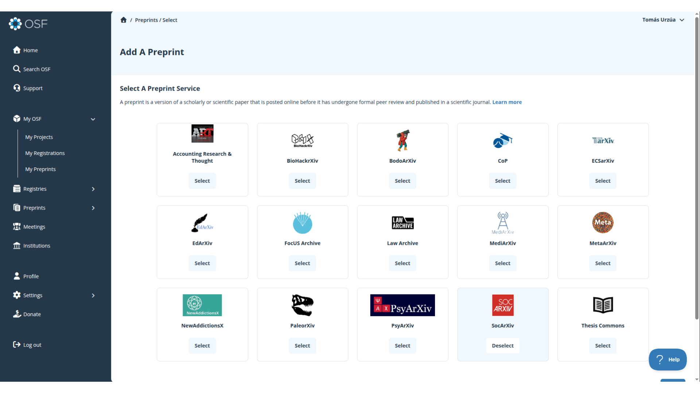
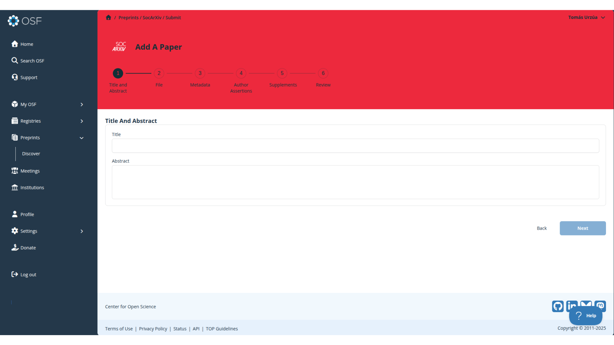

# Introducción {.unnumbered}

Existen diversas plataformas en las cuales podemos generar pre-registros y/o pre-prints, tales como OSF o AsPredicted. En este práctico nos centraremos en [OSF (Open Science Framework)](https://osf.io/), una plataforma de código abierto creada por el *Center of Open Science* que opera como una suerte de repositorio para que l_s investigadores organicen y documenten su trabajo científico en sus distintas etapas. En este marco, en OSF podemos crear tanto pre-registros como pre-prints para promover la apertura de nuestras investigaciones.

Para comenzar, deben entrar a la [página de OSF](https://osf.io/) e ingresar con su cuenta (en caso que no tengan una, tienen que crearla).

Una vez dentro, en la barra lateral izquierda encontrarán la sección **My OSF**. Aquí pueden ver que existen tres modos para documentar sus investigaciones: Proyecto, pre-registro y pre-print.

Los proyectos son el formato más general de almacenamiento. En esta sección se pueden visualizar los proyectos que han creado con su cuenta, pero además los pre-registros y los pre-prints. 

::: {.callout-note}

Desde la documentación alojada en los proyectos también se pueden desplegar pre-registros y pre-prints, llegando a operar como un todo articulado. Por ahora nos centraremos en pre-registros y pre-prints por fuera de un proyecto.

:::

# Pre-registros

Un pre-pregistro es una declaración abierta de lo que se espera encontrar en la investigación antes de trabajar con los datos. En términos concretos, es la publicación de las hipótesis de investigación previo al análisis, distinguiendo la parte exploratoria de nuestra investigación de la confirmatoria. Algunas ventajas que la publicación de pre-registros ofrece:

- **Transparencia del proceso investigativo**: Cuando se declaran las hipótesis antes de ver los datos, cualquier lector puede distinguir qué predijiste v/s qué descubriste después. Esto reduce drásticamente el riesgo de *HARKing* (Hypothesizing After Results are Known) y *p-hacking*.

- **Credibilidad ante la comunidad**: Un pre-registro con marca de tiempo es evidencia pública de que no se ajustaron las hipótesis retrospectivamente. Esto aumenta la confianza de revisores, editores y lectores en los resultados.

## ¿Cómo crear un pre-registro en OSF?

Para crear un pre-registro debemos ingresar a la sección **My Registrations** y hacer click en el boton superior derecho `Add a Registration`. 

Esto los dirigirá a los primeros pasos del pre-registro. Si no tienen un proyecto previo, en el Step 1 seleccionan la opción no. En el Step 2 deben asegurarse que elijan OSF Preregistration, o si no van a registrar otro tipo de documento y formato.

En este punto se encontrarán en el proceso de inscripción de su pre-registro. Deben llenar todos los campos con la información verídica de su investigación. 

Por ejemplo, en la sección de Overview es donde deben declarar la pregunta de investigación y las hipótesis asociadas a su trabajo. Además, OSF exige clarificar el grado de cercanía que han tenido con los datos. Las secciones posteriores presentan la misma lógica, en las cuales deberán ir detallando el muestreo, el tratado de variables, el plan de análisis, entre otras cosas.

Algunos apartados dan la opción de **subir documentos** en caso de que los espacios ofrecidos por la página no permitan completar el campo satisfactoriamente.

Una vez completado todos los pasos, el último apartado les mostrará un review de su pre-registro. Cuando confirmen que está todo correcto, deben hacer click en el botón inferior derecho `Register`, y su pre-registro comenzará a procesarse para ser publicado.

# Pre-prints 

A diferencia de un pre-registro, el pre-print es una versión preliminar de una investigación que es divulgada antes de ser publicada en una revista académica, por lo que es un paso post-investigación. En esta línea, un pre-print ofrece las siguientes ventajas:

- **Democratización del acceso**: un pre-print es subido a repositorios y/o plataformas públicas, por lo que cualquier persona puede leerlo.

- **Difusión inmediata**: al saltarse el proceso de revisión de pares de las revistas académicas (el cual puede demorarse meses o años) permiten compartir hallazgos rápidamente con la comunidad científica.

- **Identificación de la investigación**: Un pre-print puede tener DOI, lo que lo vuelve un documento rastreable y citable.

## ¿Cómo crear un pre-print en OSF?

Para crear un pre-print debemos ir a la sección **My Preprints** y hacer click en `Add a Preprint`. 

Aquí se les pedirá seleccionar un servicio de Pre-prints. Les recomendamos SocArXiv ya que está orientada a la investigación en ciencias sociales. 

Posterior a la selección de servicio ya se encontrarán dentro de la plataforma de registro. Esto sigue una lógica similar a la inscripción del pre-pregistro, donde deberán rellenar los campos con la información correspondiente. 

En el último paso podrán visualizar un preview de su pre-print, y una vez que estén seguros de subirlo, clickean en el botón inferior derecho `Submit`. Esto enviará su pre-print a un proceso de moderación por parte de SocArXiv, el cual será publicado una vez aceptado. 

::: {.callout-note}

El proceso de moderación es una revisión del documento pero que no es considerada como revisión par, por tanto, permite que el pre-print pueda ser enviado a revistas académicas y sometido a revisión par

:::

# Extensiones en OSF

OSF ofrece posibilidades de extensión dentro de la plataforma tales como:

- **Proyectos OSF**: Está la posibilidad de crear proyectos, donde se puede alojar toda la información asociada a una investigación. Con ello, un proyecto ofrece la utilidad de crear pre-registros y pre-prints a partir de los mismos elementos que se encuentran dentro del proyecto.

- **OSF y GitHub**: Se pueden crear repositorios GitHub desde los mismos proyectos de OSF, y la conexión entre GitHub y OSF se vuelve bidireccional, lo que significa que puedes agregar y actualizar archivos desde cualquiera de las dos plataformas y los cambios se sincronizan.

- **OSF y Zotero**: Los proyectos pueden vincularse a bibliotecas personales o grupales de Zotero, lo que permite visualizar todas las citas almacenadas en las bibliotecas vinculadas a la persona dueña del repositorio, sus colaboradores y cualquier persona que tenga acceso al proyecto.

