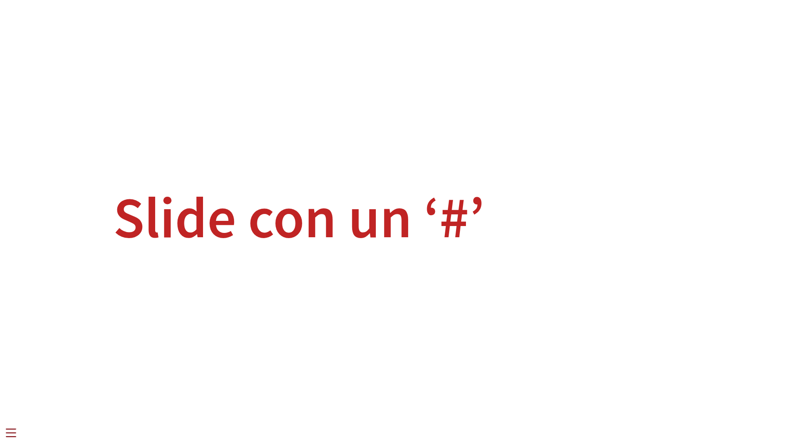
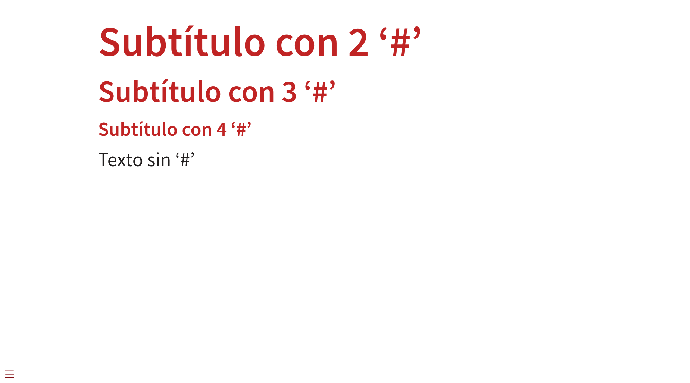
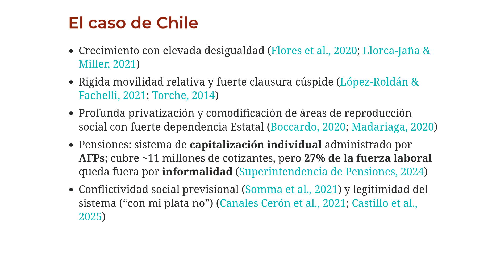
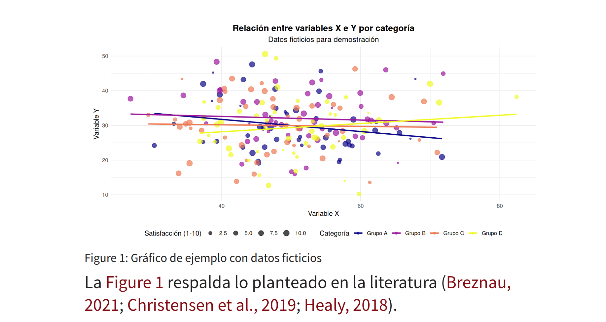
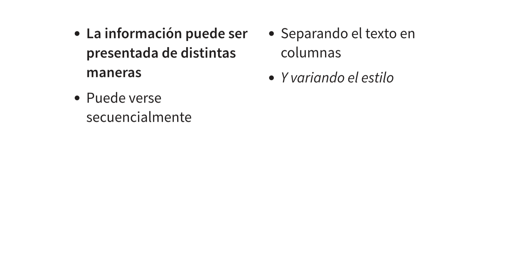
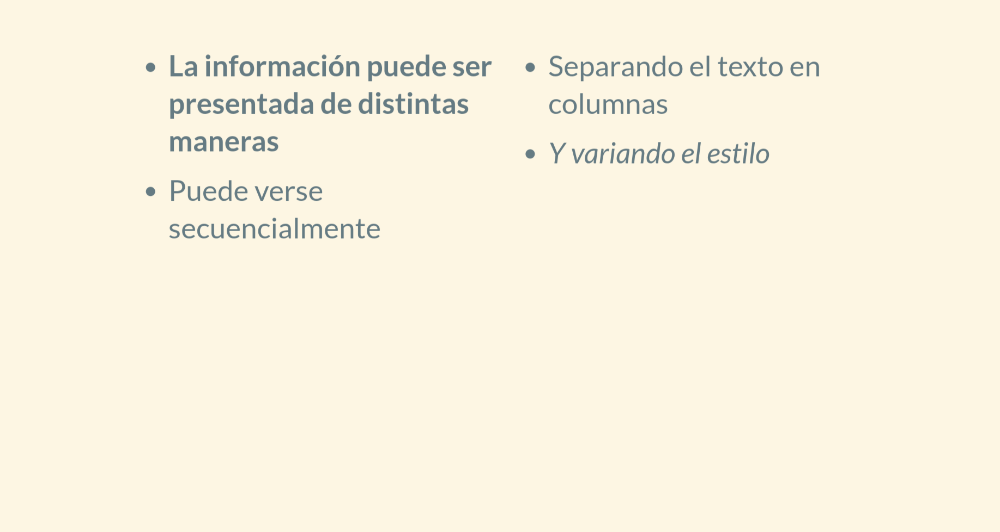
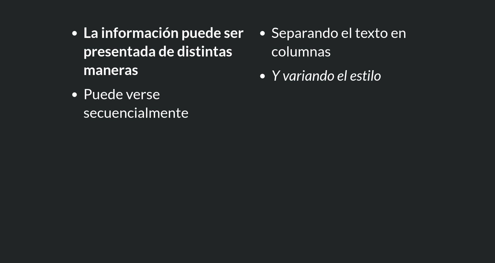

# Introducción {.unnumbered}

Para la divulgación científica en el marco de conferencias, ponencias y cátedras, Quarto ofrece el formato de salida de presentaciones. El objetivo de este práctico es entender la estructura general de una presentación en Quarto y las funcionalidades que ofrece.

**¿Por qué usar Quarto para presentaciones?**

- Permite controlar las versiones (Git)
  
- Facilita la difusión (GitHub Pages)

- Utiliza texto plano y todos los recursos de Quarto (markdown)

- Permite combinar texto y código (mantiene la esencia de documento dinámico)

- Es compatible con otras herramientas de acceso abierto (Zotero)

# Estructura de una presentación

## YAML

    --- # <1>
    format:
      revealjs:
        theme: 
          - cosmo
    editor: source
    --- # <1>

Una de las ventajas de Quarto es que todos sus formatos de salida se construyen a partir de un YAML. Como recordarán, en el YAML se señalan las opciones generales de su documento. Aquí pueden observar un ejemplo básico de un YAML para presentación. 

::: {.callout-important}
Dentro del YAML, el formato **debe especificarse** como **revealjs**. En cualquier otro caso, el documento no se renderizará como presentación.
:::

## Slides

Todo el contenido de su presentación se contiene dentro de slides.

- Cada slide se define a partir de un '#'

- Una slide puede ser indicada con '#' o '##'. Si se utilizan más numerales (#), estos serán leídos como subtítulos dentro de una slide (sigue la lógica de anidación de contenido ofrecida por markdown).


Por ejemplo, una slide como esta: 

```r
# Slide con un '#'
```


Se vería así renderizada:



Mientras que una slide así:

```r
## Subtítulo con 2 '#'

### Subtítulo con 3 '#'

#### Subtítulo con 4 '#'

Texto sin '#'
```

Al renderizarse, se vería como esto:



# Funcionalidades

## Referencias (Zotero)

Las presentaciones en Quarto también son compatibles con funcionalidades que hemos visto anteriormente. Dentro de una presentación se pueden integrar las referencias bibliográficas almacenadas en Zotero. Para ello, se debe agregar la carpeta `.bib` en el YAML de nuestro documento de presentación, y con ello ya se podrán utilizar las referencias exportadas.

::: {.callout-note}
Aquí pueden revisitar el [práctico de automatización de referencias bibliográficas](https://cienciasocialabierta.netlify.app/assignment/02-practico)
:::

Este es un ejemplo de una presentación utilizando referencias de Zotero:



## Figuras a partir de código

Además de las referencias, es posible ejecutar código y visualizar figuras en las presentaciones de Quarto. Esto sigue la misma lógica que los documentos dinámicos, solamente que debe localizarse el output de la tabla y/o gráfico dentro de una slide. Por ejemplo, tenemos este código en una slide:

```r
##

#| label: fig-ejemplo
#| fig-cap: "Gráfico de ejemplo con datos ficticios"
#| warning: false
#| message: false

# Cargar librerías necesarias
library(ggplot2)
library(dplyr)

# Crear datos ficticios
set.seed(123)  # Para reproducibilidad
datos_ejemplo <- data.frame(
  categoria = rep(c("Grupo A", "Grupo B", "Grupo C", "Grupo D"), each = 50),
  valor_x = rnorm(200, mean = 50, sd = 10),
  valor_y = rnorm(200, mean = 30, sd = 8),
  satisfaccion = sample(1:10, 200, replace = TRUE)
)

# Crear el gráfico
ggplot(datos_ejemplo, aes(x = valor_x, y = valor_y, color = categoria)) +
  geom_point(aes(size = satisfaccion), alpha = 0.7) +
  geom_smooth(method = "lm", se = FALSE) +
  labs(
    title = "Relación entre variables X e Y por categoría",
    subtitle = "Datos ficticios para demostración",
    x = "Variable X",
    y = "Variable Y",
    color = "Categoría",
    size = "Satisfacción (1-10)"
  ) +
  theme_minimal() +
  theme(
    plot.title = element_text(hjust = 0.5, size = 14, face = "bold"),
    plot.subtitle = element_text(hjust = 0.5, size = 12),
    legend.position = "bottom"
  ) +
  scale_color_viridis_d(option = "plasma") +
  scale_size_continuous(range = c(1, 4))

La @fig-ejemplo respalda lo planteado en la literatura [@breznau_does_2021; @healy_plain_2018; @christensen_transparent_2019].
```

Al renderizar, se verá de esta forma:



# Personalización

## Formato: columnas

Las presentaciones en Quarto tienen un gran margen de personalización, el cual puede ser aplicado a toda la presentación como a slides específicas. En temas de formato de contenido, el texto dentro de una slide puede ser presentado en columnas, las cuales ayudan a organizar de mejor manera la información. Este es un ejemplo de las columnas:

```r
## 

::::{.columns}
:::{.column width="50%"}
- **La información puede ser presentada de distintas maneras**

- Organizando los espacios
:::

:::{.column width="50%"}
- Separando el texto en columnas
  
- *Y variando el estilo*
:::
::::
```

Las columnas funcionan en bloques anidados, es decir, primero se señala un bloque general (`:::{.columns}`) y dentro de él se pueden generar múltiples columnas. En este caso, se generan dos columnas con el mismo ancho para que compartan un espacio uniforme en la slide. Al renderizar, esto se verá así:



## Temas

Las presentaciones en Quarto tienen distintos temas disponibles para personalizaciones estéticas, los cuales son propios de revealjs. Para integrar un tema a la presentación, solamente se debe ajustar la opción `theme` en el YAML:

    --- # <1>
    format:
      revealjs:
        theme: 
          - solarized
    editor: source
    --- # <1>

Después de renderizar, esto se verá así:



:::{.callout-note}
Aquí pueden revisar todos los [temas disponibles de presentaciones en Quarto](https://quarto.org/docs/presentations/revealjs/themes.html)
:::

Los temas se aplican a la totalidad del documento. Si se quisiera cambiar el color de una slide en específico, debe aplicarse `{background-color=""}` en la misma línea donde se define la slide:


```r
## {background-color="#212525"}

::::{.columns}
:::{.column width="50%"}
- **La información puede ser presentada de distintas maneras**

- Puede verse secuencialmente
:::

:::{.column width="50%"}
- Separando el texto en columnas
  
- *Y variando el estilo*
:::
::::
```

El resultado es el siguiente:



