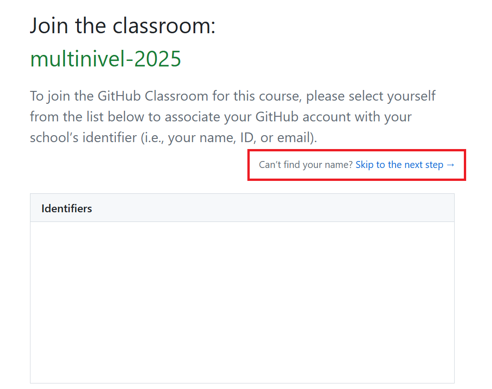
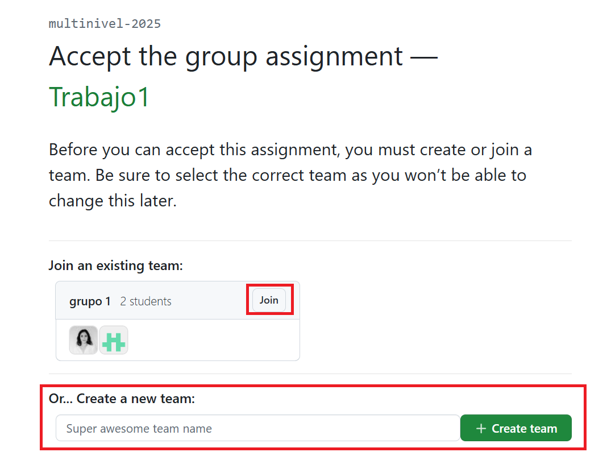
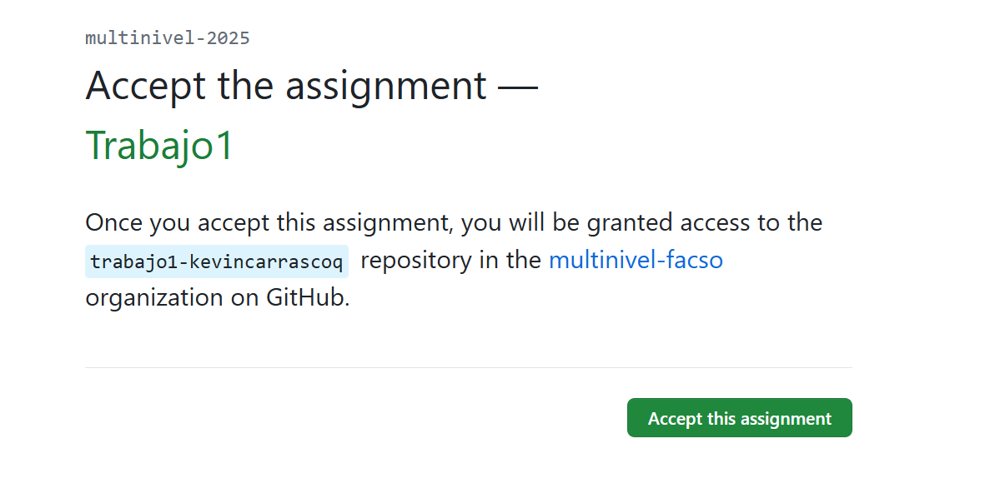
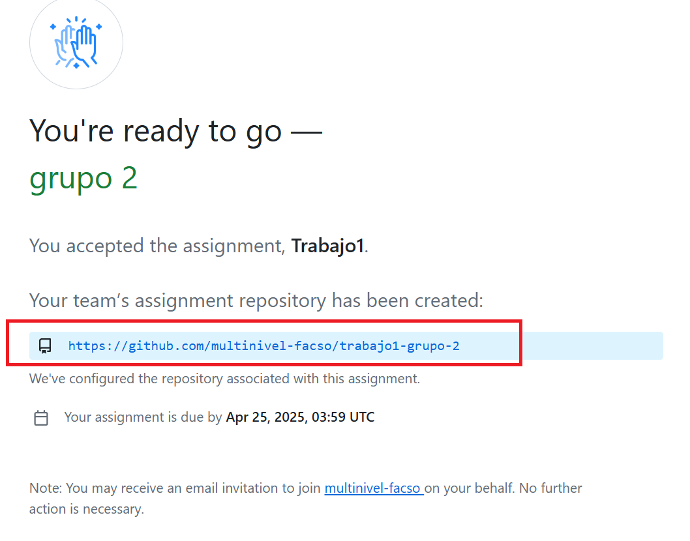

```{r setup, include=FALSE, cache = TRUE}
require("knitr")
opts_chunk$set(warning=FALSE,
             message=FALSE,
             echo=TRUE,
             cache = TRUE, fig.width=7, fig.height=5.2)
```


GitHub Classroom es una herramienta gratuita de GitHub diseñada especialmente para facilitar la gestión de tareas y proyectos de programación en cursos académicos. Permite a profesores y asistentes crear, distribuir, revisar y calificar tareas de programación directamente a través de GitHub.

¿Qué permite hacer GitHub Classroom?

1- Crear tareas automáticamente: Puedes crear una "tarea" que al ser aceptada por l-s estudiantes genera automáticamente un repositorio individual para cada un-, o bien un repositorio por grupo si se trabaja en equipo.

2- Distribuir código base: Puedes incluir archivos base, tests automáticos o instrucciones, que se copian automáticamente a los repositorios de l-s estudiantes.

3- Gestionar clases: Puedes organizar a l-s estudiantes en secciones, cursos o grupos, y hacer seguimiento de quién ha aceptado y entregado cada tarea.

4- Revisar código fácilmente: L-s profesores pueden acceder a cada repositorio, ver los commits, dar retroalimentación con issues o pull requests, y calificar el trabajo directamente desde GitHub.

## Para comenzar

Ir al siguiente enlace para unirse al Classroom preparado para el curso: [https://classroom.github.com/a/o5vnIO0L](https://classroom.github.com/a/o5vnIO0L)

Una vez dentro, iniciamos sesión con nuestra cuenta personal de Github. Nos unimos a Classroom y en la siguiente sección nos 'saltamos el paso' porque aún no l-s hemos agregado a Classroom.



En la siguiente sección deberán unirse a un grupo existente o crear un nuevo grupo con el siguiente número disponible:



Una vez que acepten su tarea, se les otorgará acceso al repositorio trabajo1-[nombre grupo] en la organización multinivel-facso en Github.



::: callout-note

## Organizaciones de Github

Una organización de GitHub es como una cuenta compartida que puede ser utilizada por un grupo de personas —por ejemplo, un curso, un laboratorio de investigación, una empresa o un grupo de desarrollo— para colaborar y gestionar proyectos juntos.

- Una organización es un contenedor de repositorios que puede tener muchos miembros, con diferentes roles y permisos.

:::


Una vez aceptada la tarea deberían poder acceder a su repositorio asignado a su grupo, dentro de la organización *multinivel-facso*



Una vez dentro del repositorio y añadidos tod-s los integrantes del grupo, deben clonar el repositorio cada un- en sus computadores y comenzar a desarrollar el trabajo.

## Video Tutorial

<iframe width="560" height="315" src="https://www.youtube.com/embed/p6fxxD8_VMw?si=EvgNvUf2yJrwbsxH" title="YouTube video player" frameborder="0" allow="accelerometer; autoplay; clipboard-write; encrypted-media; gyroscope; picture-in-picture; web-share" referrerpolicy="strict-origin-when-cross-origin" allowfullscreen></iframe>

Acá [link directo a youtube.](https://www.youtube.com/watch?v=p6fxxD8_VMw)

# Foro

<script src="https://giscus.app/client.js"
        data-repo="cursos-metodos-facso/multinivel"
        data-repo-id="MDEwOlJlcG9zaXRvcnkyMDA3MTE2MDk="
        data-category="Q&A"
        data-category-id="DIC_kwDOC_aduc4CYhjI"
        data-mapping="title"
        data-strict="0"
        data-reactions-enabled="1"
        data-emit-metadata="0"
        data-input-position="bottom"
        data-theme="light"
        data-lang="es"
        crossorigin="anonymous"
        async>
</script>


