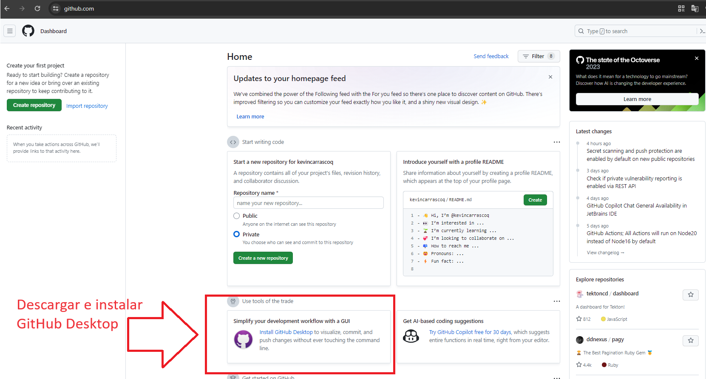
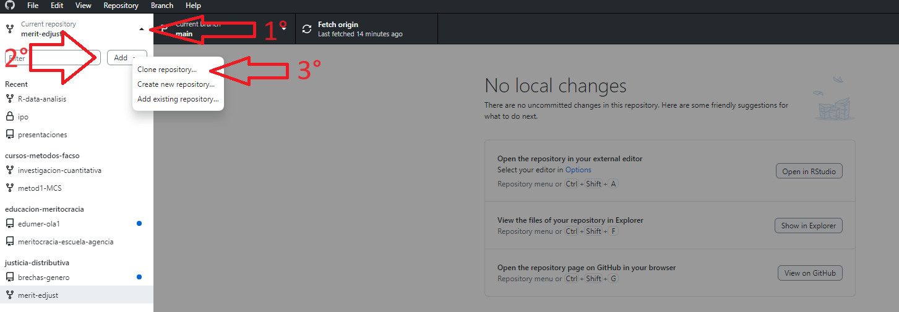
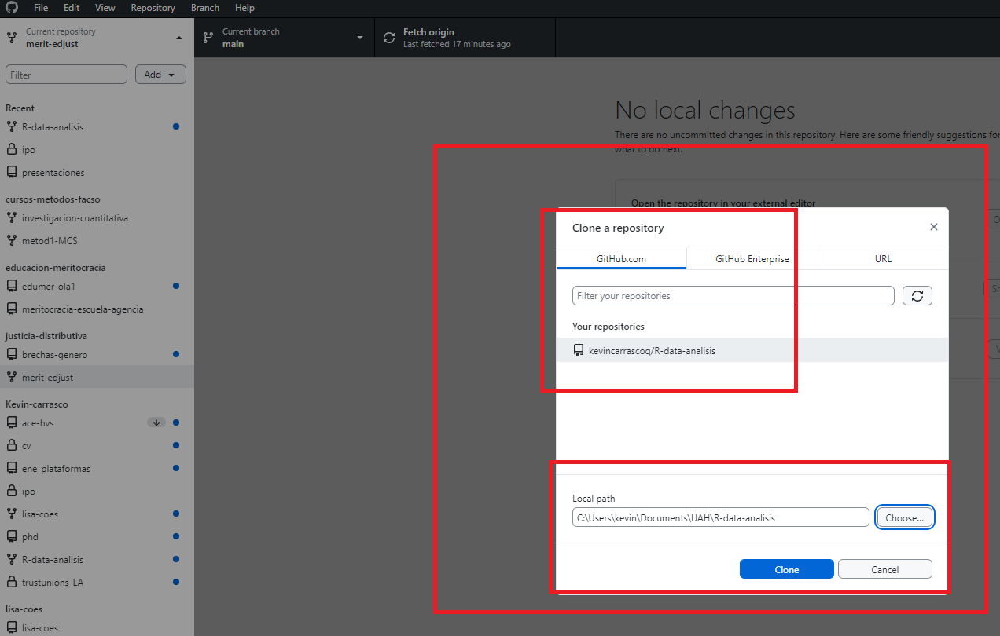
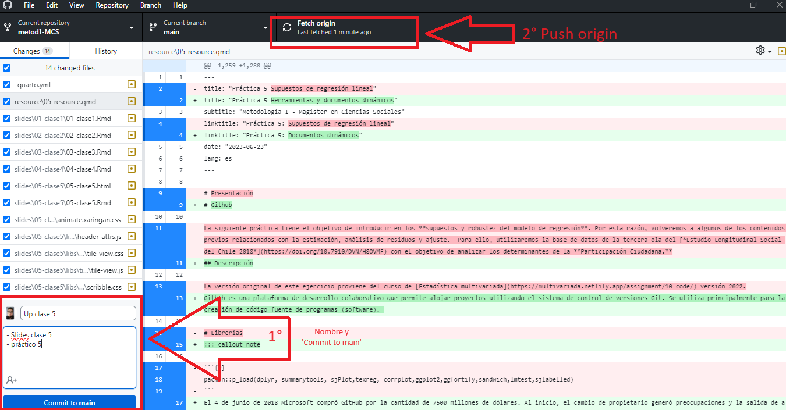
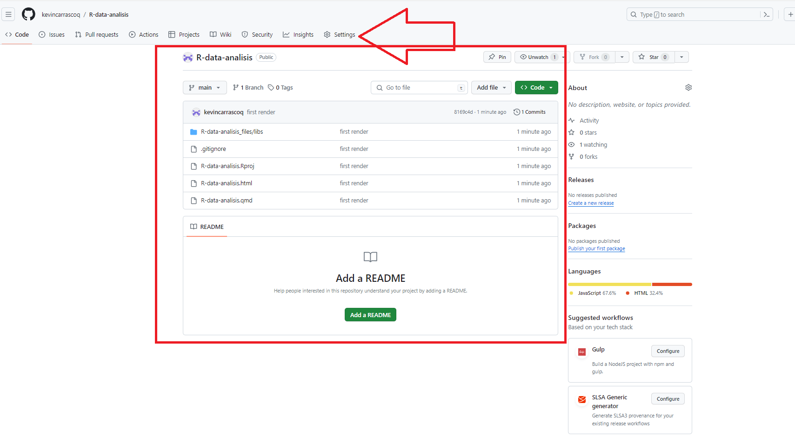
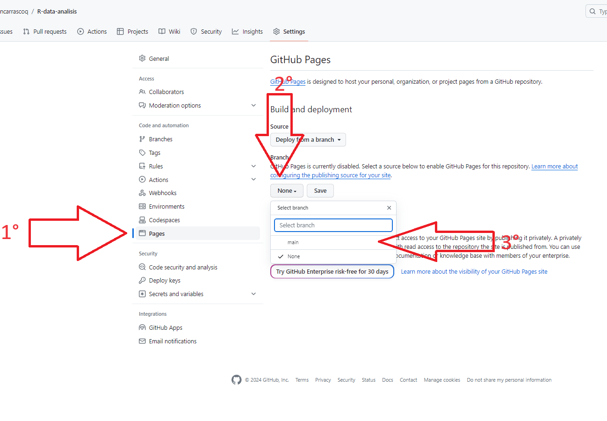
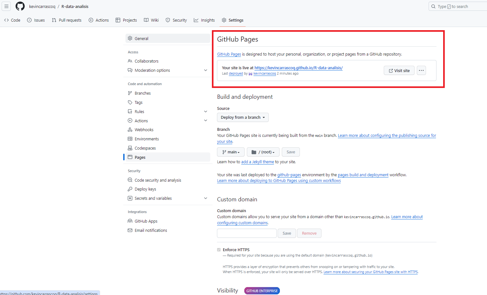
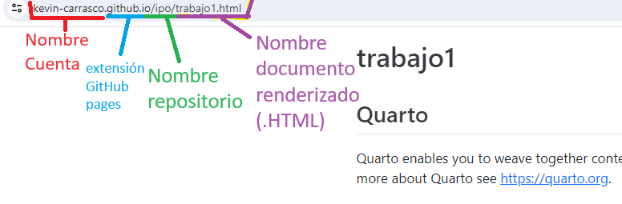

# Github Desktop

## Prerequisitos

- Crear cuenta en [www.github.com](www.github.com)

- Descargar Github Desktop

# Github

## Descripción

Github es una plataforma de desarrollo colaborativo que permite alojar proyectos utilizando el sistema de control de versiones Git. Se utiliza principalmente para la creación de código fuente de programas (software). 

::: callout-note

El 4 de junio de 2018 Microsoft compró GitHub por la cantidad de 7500 millones de dólares. Al inicio, el cambio de propietario generó preocupaciones y la salida de algunos proyectos de este sitio; sin embargo, no fueron representativos. GitHub continúa siendo la plataforma más importante de colaboración para proyectos de código abierto.

:::

## Repositorios

Un repositorio contiene todo el código, tus archivos y el historial de revisiones y cambios de cada uno de ellos. Es el elemento más básico de Github.

Los repositorios pueden contar con múltiples colaboradores y pueden ser públicos o privados.

## Principales términos

| Término          | Definición                                                                                           |
|---------------|------------------------------------------------------------------------------------------------------|
| Branch        | 	Una versión paralela del código contenido en el repositorio, pero que no afecta a la rama principal.|
| Clonar        |	Para descargar una copia completa de los datos de un repositorio de GitHub.com, incluidas todas las versiones de cada archivo y carpeta.                                                                                   |
| Fork          | Un nuevo repositorio que comparte la configuración de visibilidad y código con el repositorio «ascendente» original.|
| Merge         | Para aplicar los cambios de una rama y en otra.                                       |
| Pull request  | Una solicitud para combinar los cambios de una branch en otra.                                             |
| Remote        | Un repositorio almacenado en GitHub, no en el equipo.                                                 |
| Upstream      | La branch de un repositorio original que se ha *forkeado* o clonado. La branch correspondiente de la branch clonada o *forkeada* se denomina «descendente».                                            |

## Crear cuenta e instalación

1. Acceder a la página de [github](https://github.com/)

Registrarse ingresando correo electrónico y siguiendo los pasos descritos (crear contraseña y nombre de usuario)

La personalización de la cuenta se puede saltar haciendo click en **skip** abajo de la selección de opciones

2. Descargar e instalar Github Desktop

Una vez creado un repositorio en la organización de classroom, lo que nos interesa es descargarlo. Al abrir la aplicación de Github desktop por primera vez (descargada anteriormente), nos debería aparecer la opción de clonar nuestro repositorio en la pantalla de inicio. Lo clonamos y seleccionamos una carpeta de nuestro computador para almacenarlo.

Para todas las siguientes veces, las instrucciones son estas:

3- Apretamos Repositorio actual en la esquina superior izquierda

4- Apretamos añadir

5- Apretamos clonar repositorio...

6- Seleccionamos nuestro repositorio

7- seleccionamos la carpeta donde se almacenará. Siempre evitando tener tíldes, ñ y espacios en la dirección de almacenamiento y apretamos 'clone'.

8. Una vez clonado el repositorio en nuestros computadores, podemos comenzar a hacer las modificaciones necesarias en nuestros documentos para desarrollar nuestra investigación. Luego de hacer estas modificaciones, lo que debemos hacer es volver a subir estos cambios al repositorio remoto.

## Github pages

Ahora podemos ver los documentos modificados en nuestro repositorio online de github.

9. Vamos a settings

10. Dentro de Settings vamos a Pages, luego 'none' y seleccionamos 'main'. Luego apretamos Save

Luego de aproximadamente un minuto se actualiza la página y aparecerá un link en la parte superior, algo así como [kevin-carrasco.github.io/ipo](kevin-carrasco.github.io/ipo) que es nuestra página principal de nuestro sitio web de github.

El link para llegar a nuestro documento renderizado de quarto sigue la estructura del repositorio:

kevin-carrasco.github.io/ipo/trabajo.html

