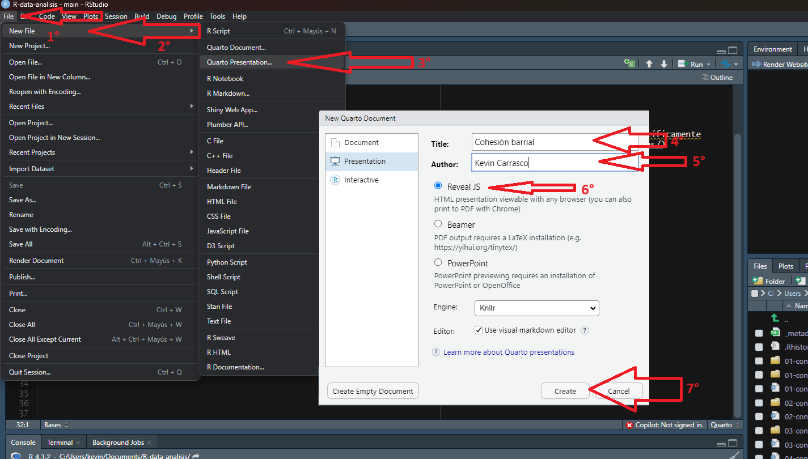
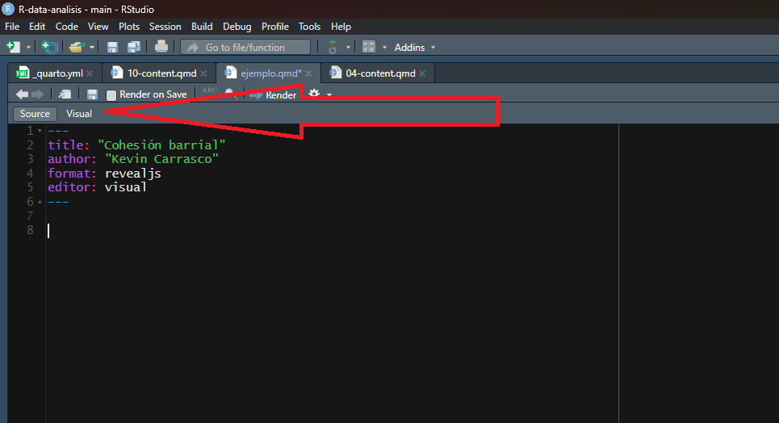
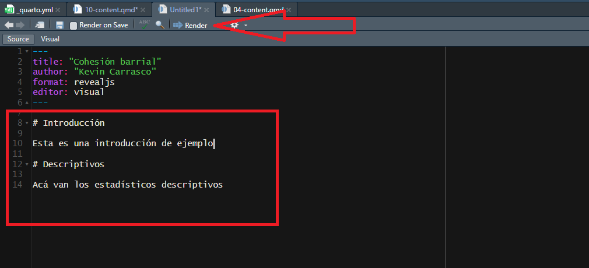
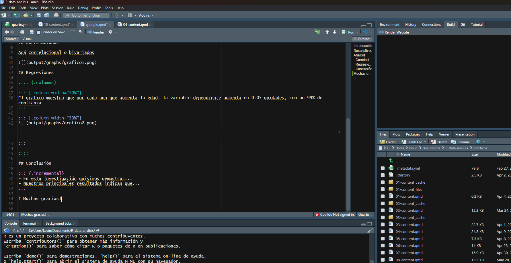

## Objetivo

El objetivo de esta práctica es revisar el proceso de elaboración de una presentación mediante documentos dinámicos, específicamente mediante Quarto. La guía oficial para elaborar este documento la puedes revisar [acá](https://quarto.org/docs/presentations/)

# Quarto presentations


## Ejemplo:

<iframe src="https://multinivel-facso.netlify.app/resource/presentacion-template.html" height="550" width="100%" allowfullscreen="true"></iframe>

## Bases

Las presentaciones elaboradas con Quarto se pueden exportar en tres 'output' o formatos diferentes: 

* revealjs = reveal.js (HTML)

* pptx = PowerPoint (MS Office)

* beamer = Beamer (LaTeX/PDF)

Para este caso nos enfocaremos en **revealjs** que nos permite posteriormente visualizar la presentación en Github Pages.

## Abrir un documento de Quarto presentations

1- file -> new file -> Quarto presentations



o copiamos/descargamos directamente el template de presentaciones desarrollado para este curso, disponible acá: [https://github.com/cursos-metodos-facso/multinivel-facso/blob/main/resource/presentacion-template.qmd](https://github.com/cursos-metodos-facso/multinivel-facso/blob/main/resource/presentacion-template.qmd)


2- Agregamos un título a la presentación y nuestro nombre como autores. Nos aseguramos que esté en formato revealjs y creamos el documento

3- Para facilitar la elaboración de una presentación el modo de visualización estará en 'source' (para ver el código fuente)



## Templates y otros

Podemos cambiar el estilo completo de la presentación cambiando el Tema ('theme') dentro del YAML del inicio. Por ejemplo:

```markdown

---
title: "Template para presentaciones"
author: "Kevin Carrasco"
format:
  revealjs: 
    theme: dark
editor: source
---

```

Otras opciones de temas son:

* beige

* blood

* dark

* default

* league

* moon

* night

* serif

* simple

* sky

* solarized

Para esta oportunidad, desarrollamos nuestro propio template para que sea usado en el curso. se puede descargar desde acá: [https://github.com/cursos-metodos-facso/multinivel-facso/blob/main/resource/multinivel.scss](https://github.com/cursos-metodos-facso/multinivel-facso/blob/main/resource/multinivel.scss)

debe estar en la misma dirección que el .qmd de la presentación y lo agregamos al yaml

```markdown
---
title: "Template para presentaciones con Quarto"
author: "Kevin Carrasco"
format:
  revealjs:
    theme: multinivel.scss
    incremental: true 
    slideNumber: true
editor: source
---
```

## Slides

Al igual que al trabajar en un documento de Quarto, cada sección se puede separar con # o ##. En este caso, cada separación o título representará una slide (lámina) diferente. Un # sirve para generar un título grande que aparece centrado y ## crean un título más pequeño que aparece al comienzo de la slide.

4- Probemos con las primeras dos slides para una presentación académica. Primero, una slide que tenga por título 'Planteamiento del problema' y una segunda slide que tenga por título 'Variables de nivel 1'.



5- Ya podemos renderizar el documento para ver cómo está quedando. Posiblemente nos pedirá guardar y lo almacenamos en la misma carpeta que tiene nuestro proyecto .Rproject

### Personalización de slides

Le podemos asignar distintas características a cada slide como, por ejemplo, separar una slide en dos columnas o dos espacios de tamaño personalizable.

```markdown
:::: {.columns}

::: {.column width="40%"}
Columna izquierda
:::

::: {.column width="60%"}
Columna derecha
:::

::::
```

Suponiendo que una slide tiene un 100% de tamaño, cada porcentaje luego de width representa la proporción que utilizará cada columna en la slide. Lo más fácil es tener dos columnas iguales de 50%, pero dependerá de nuestra presentación.


7- Agreguemos una tabla en la sección de descriptivos, así:

```markdown
## Descriptivos {.scrollable .smaller}

sjmisc::descr(mlm,
      show = c("label","range", "mean", "sd", "NA.prc", "n"))%>% # Selecciona estadísticos
      kable(.,"html")  %>%# Esto es para que se vea bien en quarto
  kable_styling()

```

8- Agreguemos un gráfico en la columna izquierda de la slide de interacciones y su interpretación en la columna izquierda:

```markdown

:::: columns
::: {.column width="70%"}


plot_model(results_4, type="int") +
  theme_bw()

:::

::: {.column width="30%"}

La interacción muestra que...

:::
:::

```


9- Agreguemos un incremento de puntos en la sección de conclusión:




Y podemos probar algunas otras cosas para personalizar aún más nuestras presentaciones:

```markdown
---
title: "Cohesión barrial en Chile"
author: "Kevin Carrasco"
format:
  revealjs:
    slideNumber: true # Número de slide abajo a la derecha
editor: source
title-slide-attributes:
    data-background-image: input/cohesion.jpg # Agregar una imagen al comienzo de la presentación
    data-background-size: contain
    data-background-opacity: "0.1" # Qué tan difuminada se ve la imagen (0.1 es lo menor)
bibliography: cohesion.bib # Agregar nuestra bibligrofía
link-citations: TRUE # Que la bibliografía tenga links automáticos
---

```

::: callout-note

Si guardamos el archivo de presentación en la carpeta raíz (junto al archivo .Rproject) y subimos todos los documentos a github, entonces el link estandar para visualizar la presentación debería ser:

[https://multinivel-facso.github.io/trabajo1-grupo-1/presentacion-template.html](https://multinivel-facso.github.io/trabajo1-grupo-1/presentacion-template.html)

:::
