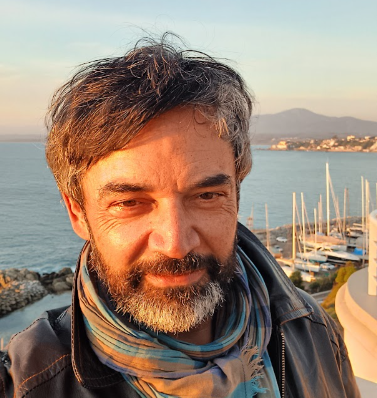
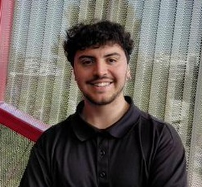

```{r set-dependencies, include=FALSE}
# Site-wide targets dependencies
#withr::with_dir(here::here(), {
#  targets::tar_load(project_zips)
#  targets::tar_load(xaringan_slides)
#  targets::tar_load(xaringan_pdfs)
#})
```


::: {.home}

::: {.grid .course-details}


::: {.g-col-12 .g-col-sm-6 .g-col-md-4}
### Profesor

<div class="image-cropper">
  
</div>

-  &nbsp; []()
-  &nbsp; 
-  &nbsp; <a href="mailto:juancastillov@uchile.cl">juancastillov@uchile.cl</a>
-  &nbsp; <a href="https://github.com/juancarloscastillo >}}">juancarloscastillo</a>
-  &nbsp; <a href="https://jc-castillo.com/">jc-castillo.com</a>
-  &nbsp; [Agendar reunión]()

:::

::: {.g-col-12 .g-col-sm-6 .g-col-md-4}
### Profesor colaborador

<div class="image-cropper">
  
</div>

-  &nbsp; Tomás Urzúa
-  &nbsp; 328 Sociología FACSO, Universidad de Chile
-  &nbsp; <a href="mailto:tomas.urzua@ug.uchile.cl ">tomas.urzua@ug.uchile.cl </a>
-  &nbsp; <a href="https://github.com/tomasurzuam">tomasurzuam</a>
-  &nbsp; <a href="https://www.linkedin.com/in/tom%C3%A1s-urz%C3%BAa-moreno-b65755375/">linkedin</a>
-  &nbsp; Agendar reunión vía correo


:::

::: {.g-col-12 .g-col-md-4 .contact-policy}


### Actividades

-  &nbsp; **Jueves 14:30-17:45**
-  &nbsp; **Sala 35 FACSO** (14:30:16:00)
-  &nbsp; **Sala 345 FACSO** (16:15-17:45)


### Contacto


:::

:::
:::

## Últimas informaciones

::: {#informaciones}
:::
