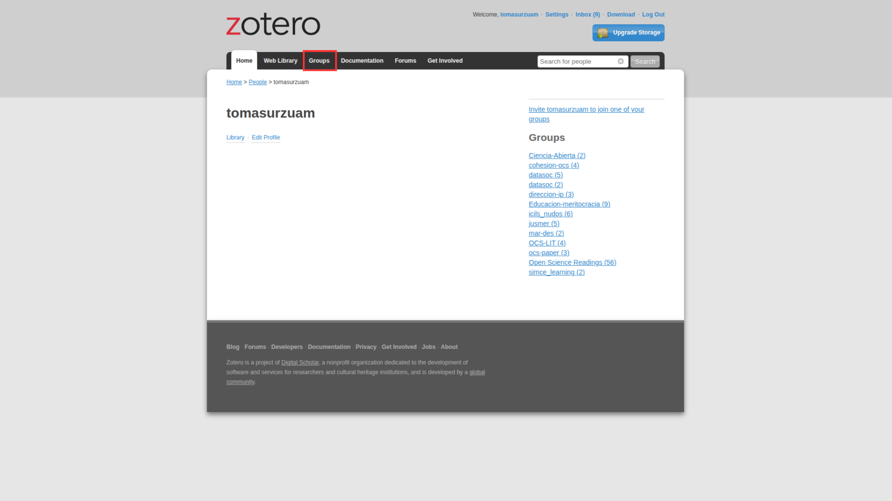
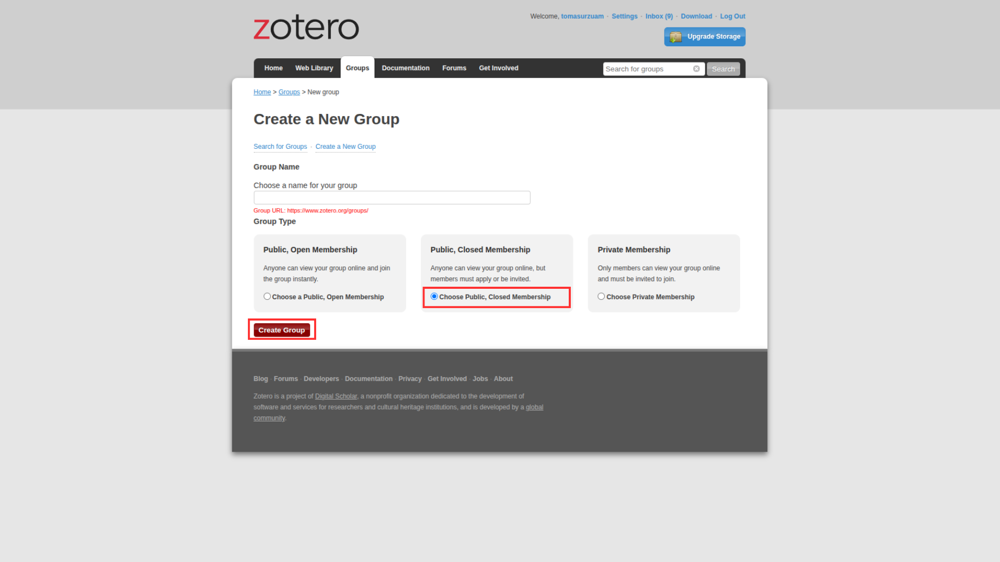
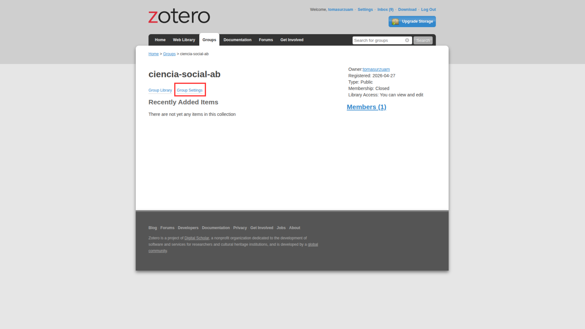

Este post tiene el objetivo de enseñar cómo crear bibliotecas compartidas en Zotero, las cuales están orientadas a organizar sus referencias de manera colaborativa sin la necesidad de estar enviando y reenviando bibliografía por correo u otros medios.

Primero, deben entrar a [zotero.org](https://www.zotero.org/) e ingresar con su cuenta. Una vez dentro, deben ir a "Grupos" y clickear en "Crear un nuevo grupo". 

Luego, eligen el nombre de su grupo y el tipo: este puede ser completamente público, público-cerrado o privado (recomendamos elegir la opción público-cerrado). Después de haberle dado un nombre y elegido el tipo de apertura, clickean en "Crear grupo". 

Ya han creado su biblioteca compartida en Zotero, ahora sólo falta invitar a las personas con quienes utilizarán este espacio. Dentro de la biblioteca ya creada, tienen que clickear "Group Settings" -> "Members Settings" -> "Send more invitations" y escribir el email o el username de quienes quieran añadir.

Una vez la persona acepte la invitación, aparecerá la biblioteca compartida en su Zotero local y podrán organizar sus referencias en conjunto.