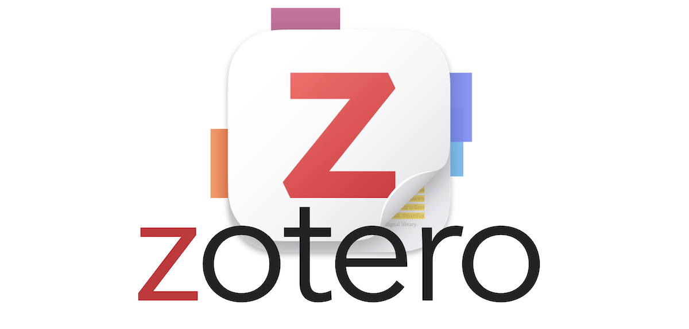
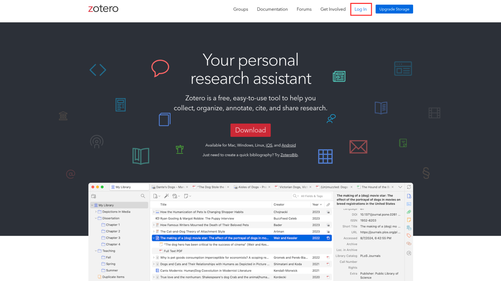
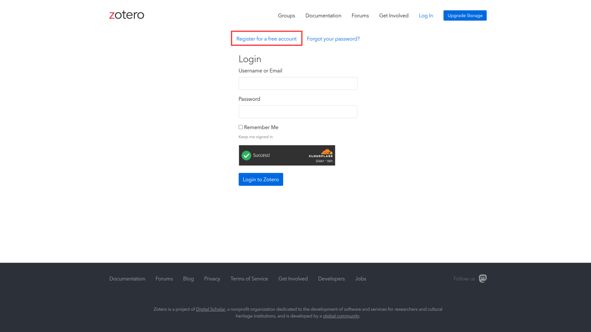

**Zotero** es un gestor de referencias bibliográficas con el que podemos organizar nuestro material y además  exportarlo para poder citar en texto plano a partir de las **citation keys**.

:::{.callout-note}
Revisitar práctico de Zotero: [aquí](https://cienciasocialabierta.netlify.app/assignment/02-practico)
::: 

Además de la organización de referencias y posibilidades de citación, **Zotero** también facilita el **trabajar colaborativamente**. Para esto veremos cómo sincronizar nuestro Zotero local con la nube  y luego cómo crear bibliotecas compartidas.

# Sincronización

## Web

Primero, debemos entrar a [zotero.org](https://www.zotero.org/) y clickear en "Log in" en la esquina superior derecha. 

Si ya tenemos una cuenta en Zotero, escribimos nuestros datos e ingresamos. Si no tenemos una cuenta, clickeamos en el apartado que señala el cuadro rojo en la imagen para crear una cuenta, y luego ingresamos.

## Local

Dentro de su aplicación Zotero de escritorio, en el menú superior deben ir a **"Edit" -> "Settings" -> "Sync"** y ahí ingresar su cuenta. Una vez hecho esto, la aplicación de escritorio sincronizará automáticamente sus bibliotecas. Si esto no ocurre, pueden forzar la sincronización apretando  en la esquina superior derecha de su aplicación.

## Comprobar

Para comprobar si la sincronización se realizó correctamente, pueden ir a su cuenta en la página web de Zotero e ingresar a la sección Web Library. Si tienen las mismas bibliotecas que en su aplicación de escritorio, significa que están sincronizadas.

# Bibliotecas grupales

En Zotero existen dos tipos de bibliotecas: **las bibliotecas individuales** (que hemos usado hasta ahora) y **las bibliotecas grupales**. Estas últimas nos permiten organizar las referencias de manera colaborativa sin la necesidad de estar enviando y reenviando bibliografía por correo u otros medios.

## Web

**¿Cómo crear bibliotecas grupales?**

Una vez con nuestra cuenta en la página web, debemos ir a "Groups" y seleccionamos "Create a New Group". 

Luego, eligen el nombre de su grupo y el tipo: este puede ser completamente público, público-cerrado o privado (recomendamos elegir la opción público-cerrado). Después de haberle dado un nombre y elegido el tipo de apertura, clickean en "Create Group". 

Ya han creado su biblioteca compartida en Zotero. Para que esta carpeta se visualice en su aplicación de escritorio, deben abrir la app e ingresar su cuenta. 

Ahora sólo falta invitar a las personas con quienes utilizarán este espacio. En la página web de Zotero deben ingresar en la biblioteca ya creada, clickear **"Group Settings" -> "Members Settings" -> "Send more invitations"** y escribir el email o el username de quienes quieran añadir.

Una vez la persona acepte la invitación, después de sincronizar su nube con la app de escritorio, aparecerá la biblioteca grupal en su Zotero local y podrán organizar sus referencias en conjunto.

## Local 

Zotero debería actualizarse automáticamente al haber añadido una biblioteca compartida. En caso que no se haya actualizado, pueden clickear  en la esquina superior derecha de su aplicación. En la biblioteca deberían encontrar todas las referencias que han añadido l_s integrantes de su grupo.

## Comprobar

Pueden comprobar que la biblioteca funciona correctamente si tienen las mismas referencias guardadas que l_s demás integrantes de su grupo.

:::{.callout-note}

Recuerden que para no generar conflictos en la citación en texto plano, deben asegurarse de que tod_s tengan la misma fórmula de **citation key** en Better BibTeX. Para esto, deben ir a **"Edit" -> "Settings" -> "Export"** y elegir la misma fórmula de **citation key**, se recomienda la siguiente:

`auth.lower + "_" + title.select(1,1).lower + "_" + year

En caso que no tengan la misma fórmula, pueden copiar y pegar la fórmula recomendada en el cuadro de texto y luego clickear "OK" para que se guarde.

Si en alguna de las bibliotecas locales existe otra citation key, después de actualizarla en las opciones de Better BibTeX, deben ir a la biblioteca compartida, seleccionar todas las referencias (ctrl + A) y luego clickear "Better BibTeX" -> "Refresh BibTeX key" para que se actualicen las citation keys de todas las referencias.

:::