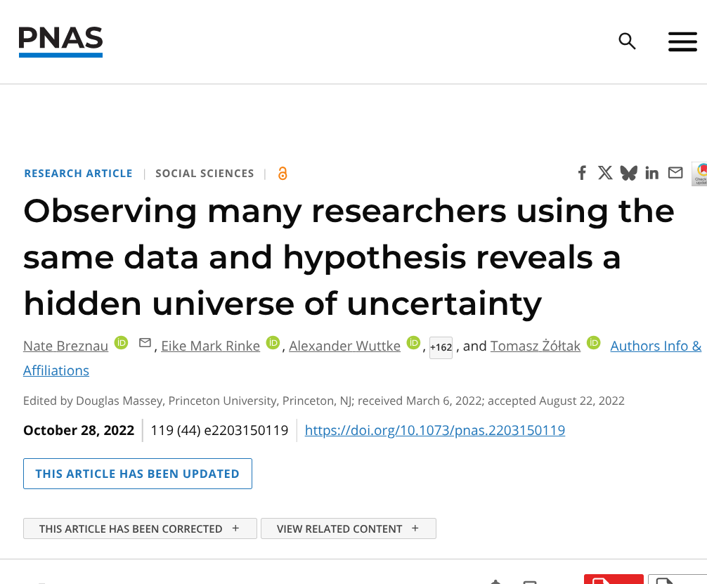
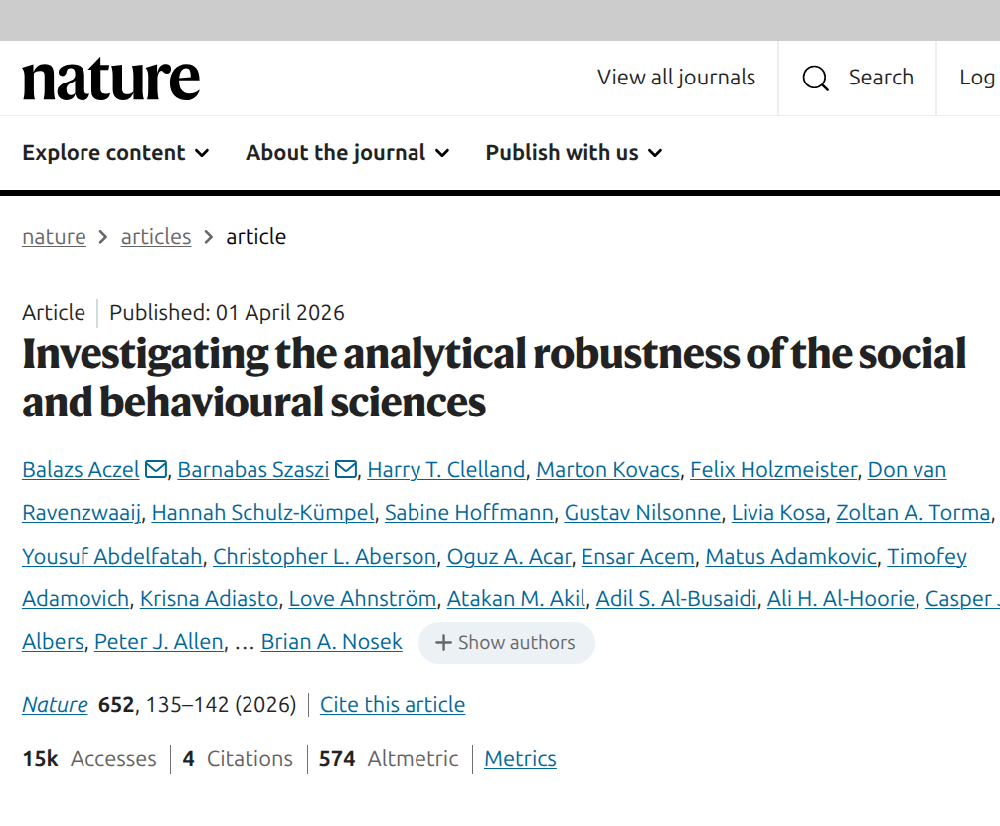
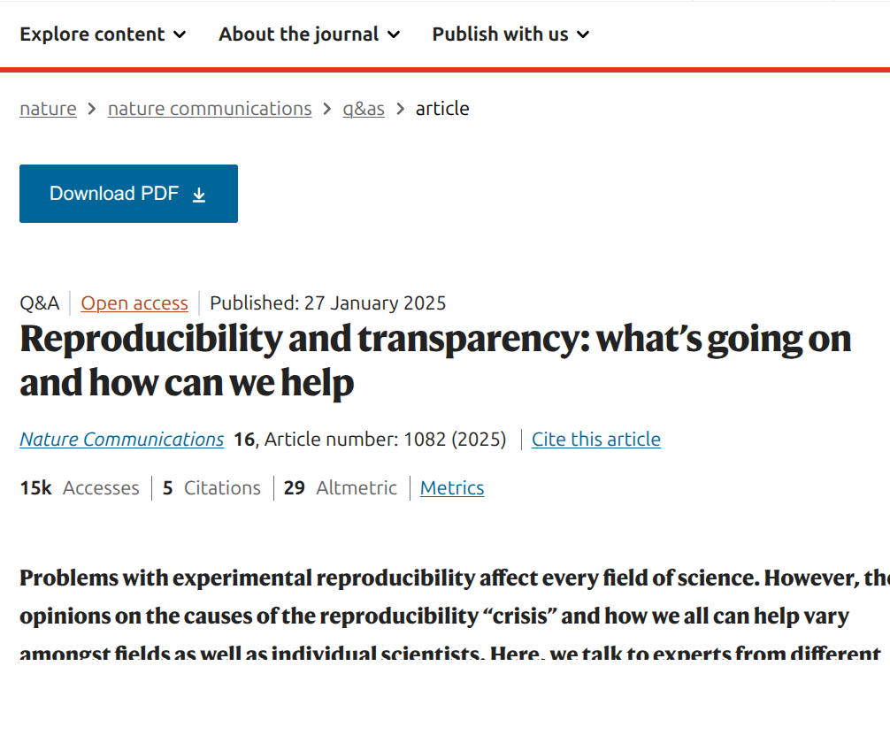

{fig-align="center"}

Este post reúne tres artículos sobre reproducibilidad, relacionados con las razones por las que distintos equipos de investigación pueden llegar a resultados diferentes aun trabajando sobre una misma pregunta. Es un tema clave porque afecta cómo interpretamos la evidencia, cuánta confianza depositamos en un hallazgo y cómo diseñamos investigaciones más transparentes que permitan un mejor avance del conocimiento.

1. **Breznau, N., et al. (2022). *Observing many researchers using the same data and hypothesis reveals a hidden universe of uncertainty*. *Proceedings of the National Academy of Sciences, 119*(44). [https://doi.org/10.1073/pnas.2203150119](https://doi.org/10.1073/pnas.2203150119)**. La reproducibilidad no es un tema "técnico" aislado: cambia cómo interpretamos evidencia y cuánta confianza podemos tener en los resultados. En este primer artículo (en el que tuve la oportunidad de participar), 73 equipos analizaron exactamente la misma hipótesis con los mismos datos y aun así llegaron a estimaciones y conclusiones bastante distintas. El hallazgo central es que muchas diferencias vienen de decisiones analíticas razonables, no necesariamente de mala práctica, lo que obliga a reportar mejor la incertidumbre y a ser más humildes al comunicar resultados.

{fig-align="center"}

2. **Aczel, B., et al. (2026). *Investigating the analytical robustness of the social and behavioural sciences*. *Nature, 652*(8108), 135-142. [https://doi.org/10.1038/s41586-025-09844-9](https://doi.org/10.1038/s41586-025-09844-9)**: El segundo artículo amplifica la idea del artículo anterior en una mayor escala: toma 100 estudios de ciencias sociales y del comportamiento, y hace que varios equipos reanalicen cada caso para medir cuán "robustos" son los resultados originales frente a decisiones analíticas alternativas. El resumen es claro: en muchos casos se mantiene la conclusión general, pero los tamaños de efecto y la fuerza de la evidencia cambian más de lo que solemos asumir cuando vemos un solo análisis publicado.

{fig-align="center"}

3. **Nature Communications. (2025). *Reproducibility and transparency: what’s going on and how can we help*. *Nature Communications, 16*, 1082. [https://doi.org/10.1038/s41467-024-54614-2](https://doi.org/10.1038/s41467-024-54614-2)**: El tercer texto, en formato de perspectiva y entrevista a especialistas de distintas disciplinas, ayuda a aterrizar el debate: la crisis de reproducibilidad no se vive igual en todas las áreas, pero hay un consenso transversal en que la transparencia (datos, código, decisiones y reportes) mejora la calidad acumulativa de la ciencia. Es una lectura muy útil para entender no solo el diagnóstico del problema, sino también qué prácticas concretas pueden ayudarnos desde nuestros propios proyectos.

{fig-align="center"}
