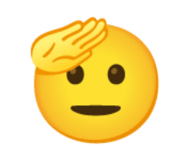

{fig-align="center"}

Estimad_s estudiantes, como saben, nos han tocado varias semanas de paro y desde hoy se interrumpen las actividades nuevamente, y de manera indefinida. No queremos que esta situación perjudique el avance del curso ni sus progresos de aprendizaje, por lo que hemos decidido pasar a un formato asincrónico para las semanas que vienen. Esto significa que no habrá clases en vivo ni actividades sincrónicas, pero el material del curso seguirá disponible en la plataforma y se irán publicando nuevos contenidos y actividades cada semana.

Y algunas informaciones importantes:

- Las sesiones que quedan de clases están orientadas a entregarles los conocimientos y herramientas para que puedan avanzar en la entrega del trabajo final, cuya pauta de elaboración se encuentra disponible en la sección de "[Trabajos](/trabajos/trabajos.qmd)" de este sitio.

- Como paso inicial les pedimos un breve [reporte de avance](https://forms.gle/QPUvCU6KZ2Pt2FX56) para poder darles feedback sobre su propuesta. La fecha para completar este reporte es el próximo viernes 5, y es opcional para los grupos que prefieran tener comentarios antes de la entrega final y asegurar una buena evaluación.

- La sesión correspondiente a hoy se enfocará en entregarles herramientas para la elaboración de **pre-registros y pre-prints**, que son dos prácticas clave para mejorar la transparencia y la calidad de la investigación social. El [material de esta clase](/content/07-content.qmd) ya está disponible, e incluye un video de un taller que dimos sobre este tema en 2022, que les recomendamos revisar para complementar el material de esta clase.

- El material de las clases se irá publicando cada semana en la sección de "[Contenido](/content/contenido.qmd)" de este sitio, asi como en la sección de "[Prácticos](/assignment/)"  y se irán anunciando por correo electrónico. La idea es que puedan avanzar a su propio ritmo, pero les recomendamos seguir el orden de los contenidos para no perderse ningún paso importante.

- Para cualquier duda o consulta, pueden escribirnos por correo electrónico o agendar una reunión a través de los enlaces respectivos en la página inicial de este sitio. También pueden usar el [foro de discusión](/trabajos/trabajos.html#foro) para compartir sus dudas y avances con sus compañeros y compañeras.

- Les recordamos que el trabajo final se entregará el próximo **25 de junio**, por lo que les recomendamos organizar su tiempo para poder avanzar con tranquilidad y sin contratiempos.

Sabemos que esta situación no es ideal, pero confiamos en que con su compromiso y dedicación podrán sacar el máximo provecho de este formato asincrónico. Estamos aquí para apoyarlos en lo que necesiten, así que no duden en contactarnos si tienen alguna pregunta o necesitan ayuda.

Equipo docente de Ciencia Social Abierta

