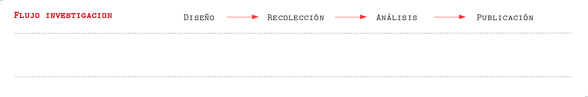
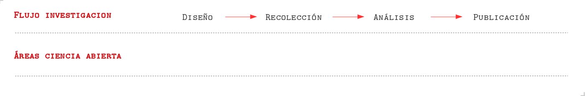
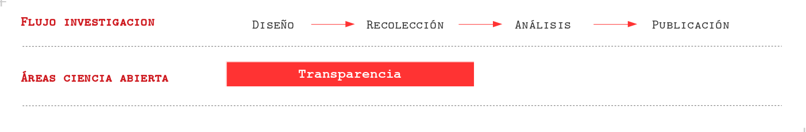
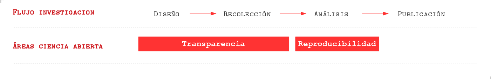
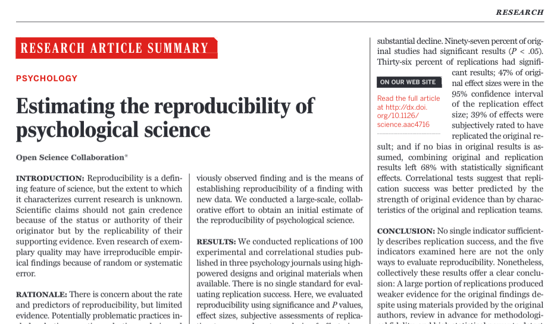
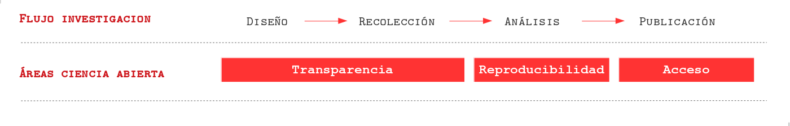
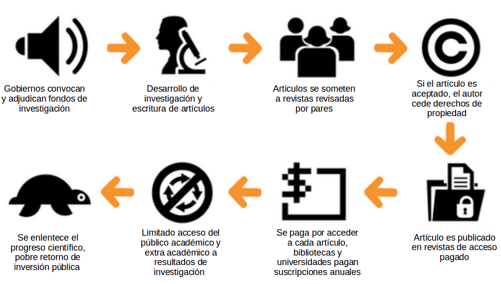
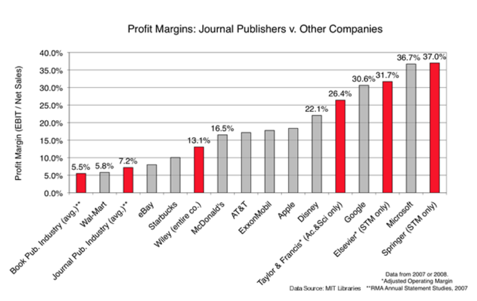
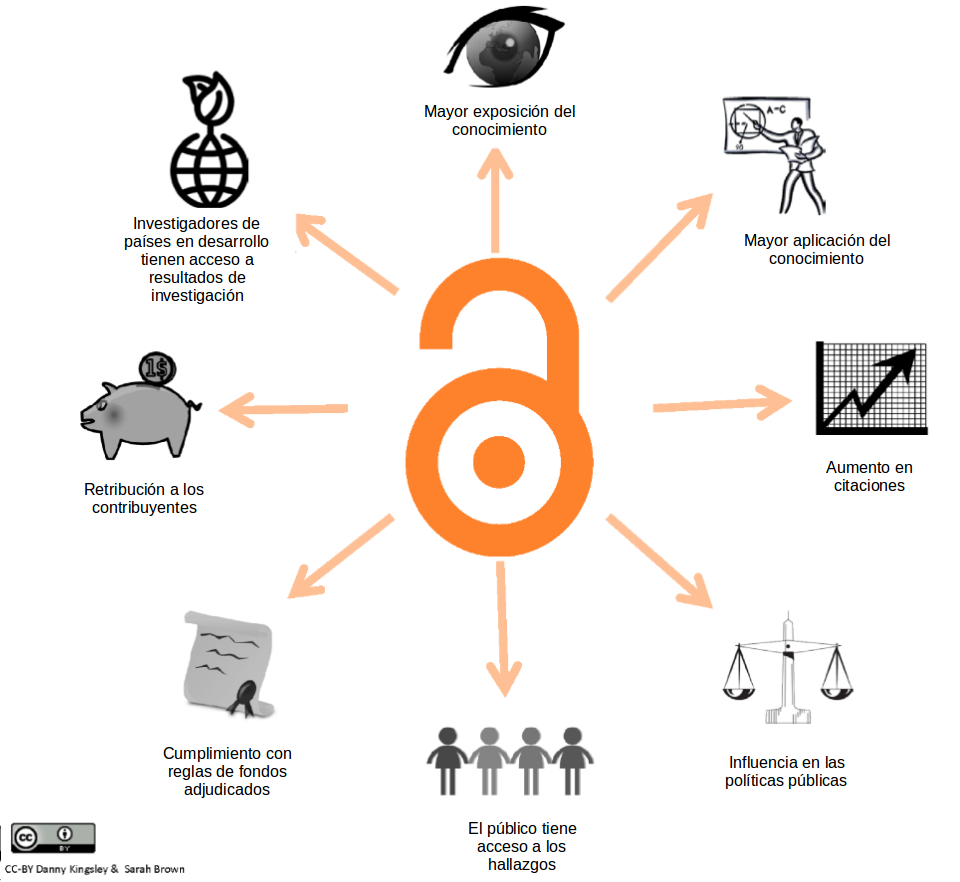
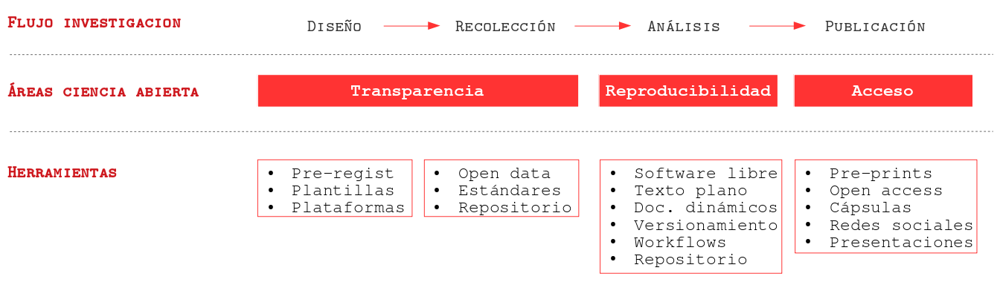

---
format:
  revealjs:
    logo: img/logo-ciencia-abierta.png
    theme: [css/custom_2025.scss]
    title-slide-attributes:
      visibility: false
    transition: slide
    transition-speed: slow
# data-background-image: images/cover.jpg
# data-background-size: cover
    auto-play-media: true
    title-slide-logo: false
editor: source
---

# {.hide-logo data-background-color="rgb(12, 53, 71)"}

::::: columns
::: {.column width="35%"}

 

{width="100%" fig-align="right"}
:::

:::{.column width="10%"}

:::

::: {.column width="55%" style="font-size: 25px; text-align: right; margin: 0 auto;"}

 

### 

Ciencia Social Abierta

Juan Carlos Castillo
Sociología FACSO UChile

Primer Semestre 2026

[cienciasocialabierta.netlify.app](https://cienciasocialabierta.netlify.app/)

:::
:::::

# ¿Crisis de reproducibilidad en ciencia?

1. Transparencia

2. Reproducibilidad

3. Acceso

## Flujo de investigación científica 

## Flujo de investigación científica y ciencia abierta

## Flujo de investigación científica y ciencia abierta

## Transparencia 1: Diseño

- Presión por publicar resultados "relevantes" (rechazar $H_0$ )

- HARKing: Hypothesis After the Results are Known

  - Se adaptan las hipótesis y teorías a los resultados
  
  - Barreras al avance del conocimiento ya que solo conocemos lo que "resulta"

## Transparencia 2: Datos

- Dificultades en el acceso y la documentación de la información levantada  en la investigación

- Barreras la reproducibilidad y al avance de investigaciones con datos muchas veces levantados con fondos públicos

# ¿Crisis de reproducibilidad en ciencia?

1. Transparencia

2. Reproducibilidad

3. Acceso

## Reproducibilidad

## ¿Qué porcentaje de los estudios publicados son reproducibles?

:::: {.columns}

::: {.column width="50%"}

:::

::: {.column width="50%"}

alrededor de un **40%!** (varía por disciplina)

:::
::::

## ¿Por qué se ocurre la crisis de reproducibilidad?

Algunas razones:

- pobre documentación metodológica

- sesgo hacia búsqueda y publicación de resultados significativos (p-hacking), atribuido a la presión por publicar

- en algunos casos, falseamiento de datos/análisis

# ¿Crisis de reproducibilidad en ciencia?

1. Transparencia

2. Reproducibilidad

3. Acceso

## Acceso

## El ciclo actual de publicación científica

(Adaptado de: [https://creativecommons.org/about/program-areas/open-access/](https://creativecommons.org/about/program-areas/open-access/))

## Barreras de pago

## Márgenes de ganancia 

## Beneficios acceso abierto

Adaptado de: [http://whyopenresearch.org/#](http://whyopenresearch.org/)

# Este curso

## Enfrentando la crisis

- tema de **ética** científica y también de **eficiencia**

- por ahora en Chile, la apertura depende de la **voluntad de los investigadores**, pero ... 

- crecientemente financistas y medios de publicación  se hacen **más exigentes**, gobiernos extranjeros ya han implementado políticas de transparencia, acceso y reproducibilidad.

- necesidad de **herramientas metodológicas** 

## Resumen

# {.hide-logo data-background-color="rgb(12, 53, 71)"}

::::: columns
::: {.column width="35%"}

 

{width="100%" fig-align="right"}
:::

:::{.column width="10%"}

:::

::: {.column width="55%" style="font-size: 25px; text-align: right; margin: 0 auto;"}

 

### 

Ciencia Social Abierta

Juan Carlos Castillo
Sociología FACSO UChile

Primer Semestre 2026

[cienciasocialabierta.netlify.app](https://cienciasocialabierta.netlify.app/)

:::
:::::