---
format:
  revealjs:
    logo: img/logo-ciencia-abierta.png
    theme: [css/custom_2025.scss]
    title-slide-attributes:
      visibility: false
    transition: none
    transition-speed: slow
# data-background-image: images/cover.jpg
# data-background-size: cover
    auto-play-media: true
    title-slide-logo: false
editor: source
---

# {.hide-logo data-background-color="#9B2626"}

::::: columns
::: {.column width="35%"}

 

{width="100%" fig-align="right"}
:::

:::{.column width="10%"}

:::

::: {.column width="55%" style="font-size: 25px; text-align: right; margin: 0 auto;"}

 

### 

Ciencia Social Abierta

Juan Carlos Castillo
Sociología FACSO UChile

Primer Semestre 2026

[cienciasocialabierta.netlify.app](https://cienciasocialabierta.netlify.app/)

:::
:::::

# Sesión 2: Antecedentes {data-background-color="#9B2626" style="text-align: right;"}

[**1. Resumen sesión anterior**]{style="color: #dfc117;"} 
[2. Principios de la ciencia]{style="color: #797b7d;"} 
[3. Problemas de apertura]{style="color: #797b7d;"}

## Flujo, ciencia abierta y herramientas

## Sobre película Paywall

:::: {.columns}
::: {.column width="70%" style="font-size: 34px;"}

 Modelo actual de publicación científica:

- las vacas hacen leche (se ordeñan solas)

- otras vacas revisan la leche (gratis)

- las vacas le pagan al granjero para distribuir la leche

- luego el granjero le vende la leche de vuelta a las vacas

:::
::: {.column width="30%" style="text-align: right;"}

:::
::::

# Sesión 2: Antecedentes {data-background-color="#9B2626" style="text-align: right;"}

[1. Resumen sesión anterior]{style="color: #797b7d;"} 
[**2. Principios de la ciencia**]{style="color: #dfc117;"} 
[3. Problemas de apertura]{style="color: #797b7d;"}

# Ciencia abierta: Vuelta a los principios de la ciencia (Merton)

##

:::{.incremental .highlight-last}
- **Universalismo**: cualquier persona puede contribuir al conocimiento científico, independiente de su origen.

- Comunalidad: los hallazgos de la ciencia pertenecen a la comunidad y no a quién los descubrió.

- Desinterés: la conducta de investigadores debe estar orientada por la búsqueda de la verdad, no con intereses personales ni monetarios.

- Escepticismo organizado: los hallazgos no se aceptan porque sí, se requieren pruebas.
:::

## ¿Se cumplen los principios de la ciencia?

:::{.incremental .highlight-last style="font-size: 38px;"}
- Investigación de Anderson et al. (2007), pregunta a más de 3000 investigadores sobre cumplimiento de principios de la ciencia Mertonianos (agregan dos más: gobernanza y calidad)

- Dos grupos de académicos: carrera temprana y carrera intermedia

- Para todos los principios identifica normas y contranormas:
:::

##

#### Normas y contra-normas de la ética científica (Anderson, 2007)

::: {style="text-align: center;"}
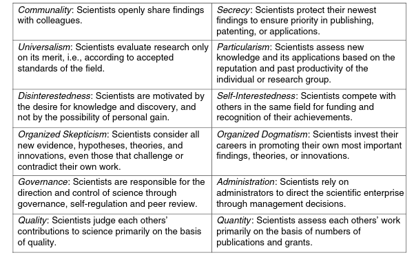{width="80%"}
:::

##

#### Normas y contra-normas de la ética científica (Anderson, 2007)

::: {style="text-align: center;"}
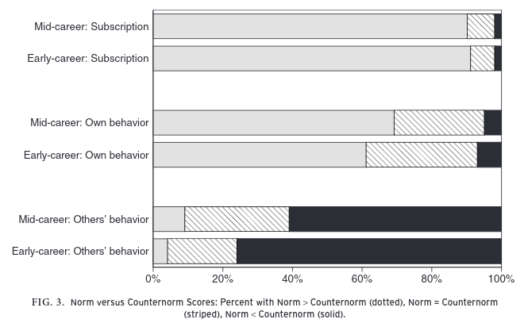{width="80%"}
:::

# Sesión 2: Antecedentes {data-background-color="#9B2626" style="text-align: right;"}

[1. Resumen sesión anterior]{style="color: #797b7d;"} 
[2. Principios de la ciencia]{style="color: #797b7d;"} 
[**3. Problemas de apertura**]{style="color: #dfc117;"}

##

::: {style="text-align: center;"}
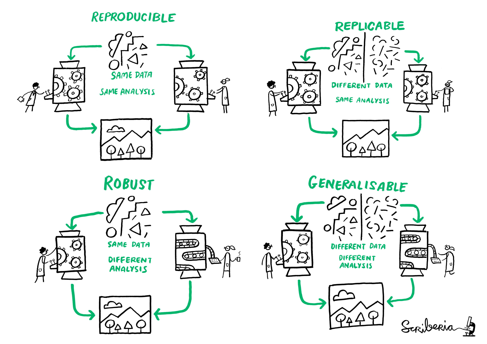{width="90%"}
:::

##

::: {style="text-align: center;"}
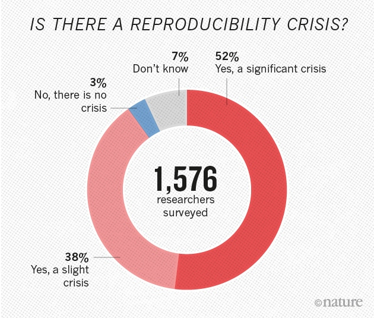
:::

::: {style="font-size: 0.7em; text-align: center;"}
Fuente: [Baker (2016) 1,500 scientists lift the lid on reproducibility - Nature](https://www.nature.com/news/1-500-scientists-lift-the-lid-on-reproducibility-1.19970)
:::

##

::: {style="text-align: center;"}
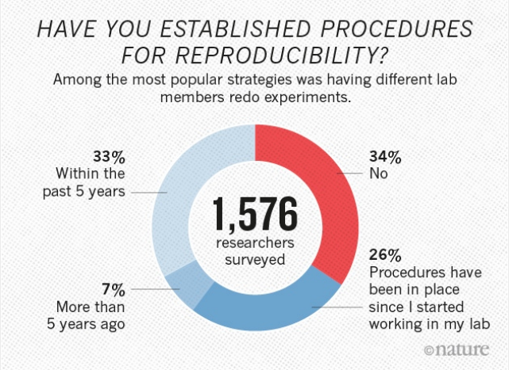{width="70%"}
:::

::: {style="font-size: 0.7em; text-align: center;"}
Fuente: [Baker (2016) 1,500 scientists lift the lid on reproducibility - Nature](https://www.nature.com/news/1-500-scientists-lift-the-lid-on-reproducibility-1.19970)
:::

##

:::: {.columns}
::: {.column width="75%"}
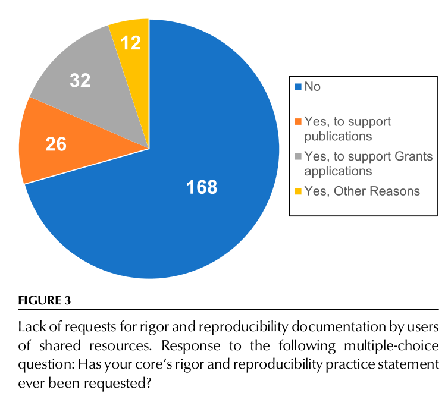{width="90%"}
:::
::: {.column width="25%"}
::: {style="font-size: 0.6em;"}
[Knudtson, K. L., et al (2019). Survey on Scientific Shared Resource Rigor and Reproducibility. Journal of Biomolecular Techniques : JBT, 30(3), 36–44. https://doi.org/10.7171/jbt.19-3003-001](https://pubmed.ncbi.nlm.nih.gov/31452645/)
:::
:::
::::

##

:::: {.columns}
::: {.column width="46%"}

:::
::: {.column width="54%"}

:::
::::

# Presión por publicar {data-background-color="#212525" style="text-align: right; vertical-align: bottom;"}

##

::: {style="text-align: center;"}
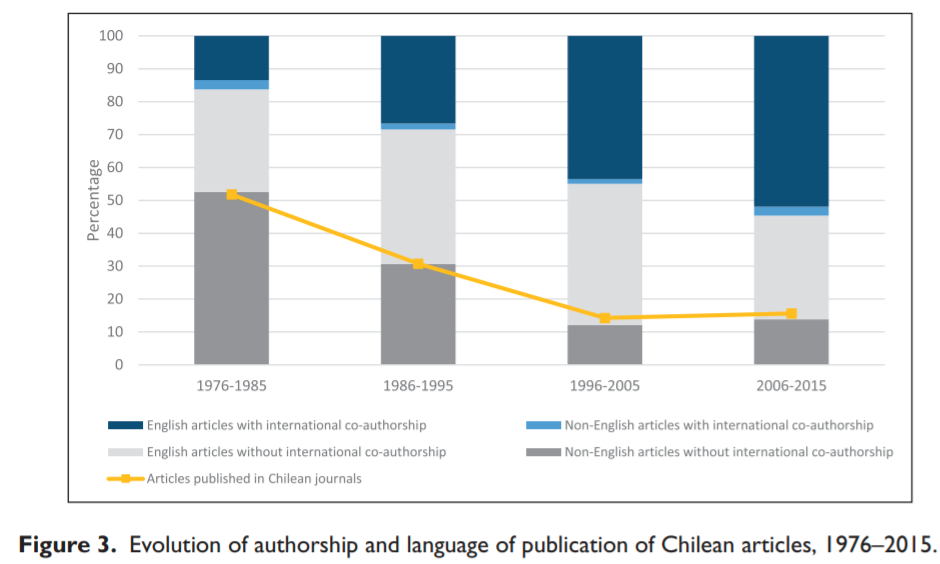{width="80%"}
:::

::: {style="font-size: 0.4em; text-align: center;"}
[Koch, T., & Vanderstraeten, R. (2019). Internationalizing a national scientific community? Changes in publication and citation practices in Chile, 1976–2015. Current Sociology, 67(5), 723–741. https://doi.org/10.1177/0011392118807514](https://journals.sagepub.com/doi/10.1177/0011392118807514)
:::

---

##

###  Cultura de "publica o perece" (publish or perish)

#### Posibles correlatos:

:::{.incremental .highlight-last}
- Temor a que "te roben la idea" → evitar poner datos/código a disposición de terceros

- p-hacking: "presionar los datos" para rechazar hipótesis nula

- falseamiento de datos
:::

##

::: {style="text-align: center;"}
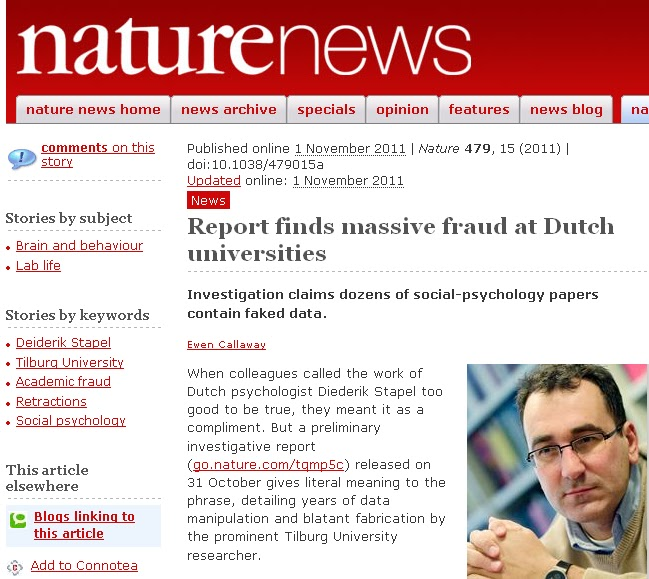
:::

##

### Franco et al. (2014) Sesgo de publicaciones

::: {style="text-align: center;"}
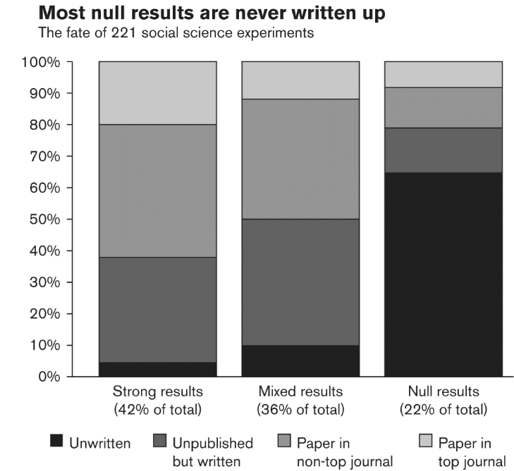{width="55%"}
:::

# ¿Alternativas? {data-background-color="#212525"}

- ### Estándares

- ### Herramientas

- ### Incentivos

##

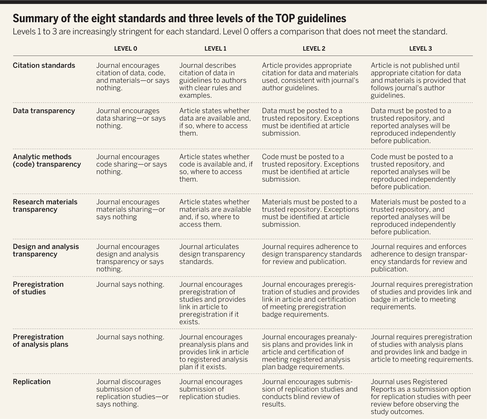{width="100%"}

::: {style="font-size: 0.6em;"}
[Nosek et al. (2015)](https://science.sciencemag.org/content/348/6242/1422)
:::

## [Resumen (I)]{style="color: #dfc117;"} {data-background-color="#212525"}

- Crisis de acceso <-> crisis de reproducibilidad

- Publica (alto impacto) o perece → fomento de la irreproducibilidad

- Escasa publicación de estudios con resultados nulos

- Dilemas de eficiencia y éticos

---

## [Resumen (II): Enfrentando la crisis]{style="color: #dfc117;"} {data-background-color="#212525"}

- Pre-registro de estudios

- Datos abiertos

- Análisis reproducible

- Publicación abierta y oportuna

---

## Próxima clase {data-background-color="#9B2626"}

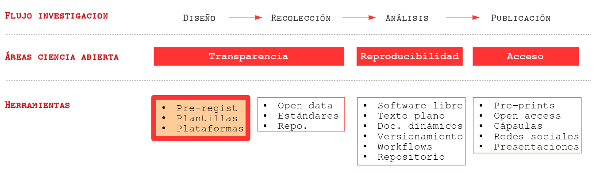

# {.hide-logo data-background-color="#9B2626"}

::::: columns
::: {.column width="35%"}

 

{width="100%" fig-align="right"}
:::

:::{.column width="10%"}

:::

::: {.column width="55%" style="font-size: 25px; text-align: right; margin: 0 auto;"}

 

### 

Ciencia Social Abierta

Juan Carlos Castillo
Sociología FACSO UChile

Primer Semestre 2026

[cienciasocialabierta.netlify.app](https://cienciasocialabierta.netlify.app/)

:::
:::::