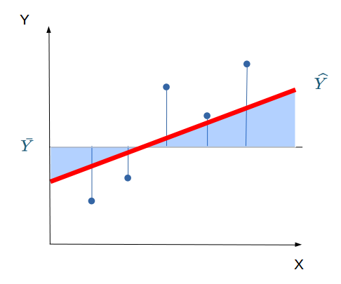

class: front


```{r setup, include=FALSE, cache = FALSE}
require("knitr")
pacman::p_load(RefManageR)
bib <- ReadBib("../files/bib/electivomultinivel.bib", check = FALSE)
opts_chunk$set(warning=FALSE,
             message=FALSE,
             echo=FALSE,
             cache = FALSE, fig.width=7, fig.height=5.2)
pacman::p_load(flipbookr, tidyverse)
```


 
```{r xaringanExtra, include=FALSE}
xaringanExtra::use_xaringan_extra(c("tile_view", "animate_css"))
xaringanExtra::use_scribble()
```

.pull-left-wide[
# Modelos multinivel]

.pull-right-narrow[]

## Unidades en contexto

----
.pull-left[

## Juan Carlos Castillo
## Sociología FACSO - UChile
## 1er Sem 2025
## [.yellow[multinivel-facso.netlify.app]](multinivel-facso.netlify.app)
]
    

.pull-right-narrow[
.center[
.content-block-gray[
## Sesión 2: 
# **.white[Regresión]**]
]
]
---

layout: true
class: animated, fadeIn

---
class: inverse
background-image: "images/universe.jpeg"

En un principio, había varianza ...


---
class: roja, bottom

# 1. Varianza, covarianza y correlación

---
.pull-left-narrow[
  # Dispersión:
  ## Varianza
]

.pull-right-wide[


]

---
# Dispersión


---
# Varianza & desviación estándar
.pull-left[
  
  .small[
    
    | ID   | Pje (x) | $$x-\bar{x}$$ | $$(x-\bar{x})^{2}$$ |
      |------|---------|----------|-----------|
      | 1    | 6       | 0.4      | 0.16      |
      | 2    | 4       | -1.6     | 2.56      |
      | 3    | 7       | 1.4      | 1.96      |
      | 4    | 2       | -3.6     | 12.96     |
      | 5    | 9       | 3.4      | 11.56     |
      | Sum  | 28      | 0        | 29.2      |
      | Prom | 5.6     |          |           |
      
  ]
]

.pull-right[

\begin{align*}
Varianza =\sigma^{2} &={\sum_{i=1}^{N}(x_{i}-\bar{x})^{2}\over {N - 1}}\\
\sigma^{2} &={(29.2)\over {5 - 1}}\\
\sigma^{2} &= 7.3 \\
Desv.est=\sigma &=\sqrt(7.3) \\
\sigma &= 2,7
\end{align*}
]

---
# Asociación: covarianza / correlación

.pull-left[
  _¿Se relaciona la variación de una variable, con la variación de otra variable?_
]

--

.pull-right[
.center[]
]
---
# Asociación: covarianza / correlación (II)

\begin{align*}
Covarianza = cov(x,y) &= \frac{\sum_{i=1}^{n}(x_i - \bar{x})(y_i - \bar{y})} {n-1}\\
\\
Correlación=r &= \frac{\sum_{i=1}^{n}(x_i - \bar{x})(y_i - \bar{y})} {(n-1)\sigma_x \sigma_y }\\ \\
alternativamente=r &= \frac{\sum(x-\bar{x})(y-\bar{y})}{\sqrt{\sum(x-\bar{x})^{2} \sum(y-\bar{y})^{2}}}
\end{align*}


---

.pull-left-narrow[
.left[
### Ejemplo de correlación
$r= \frac{\sum(x-\bar{x})(y-\bar{y})}{\sqrt{\sum(x-\bar{x})^{2} \sum(y-\bar{y})^{2}}}$
$$=\frac{-63}{\sqrt{210*68}}$$
$$=-0.5272$$
]
]


.pull-right-wide[
.tiny[
  <br>
    
| id| x  | y  | (A) $$x-\bar{x}$$ | (B) $$y-\bar{y}$$ | A*B | $$(x-\bar{x})^{2}$$ | $$(y-\bar{y})^{2}$$ |
|---:|---:|---:|--------:|--------:|---------:|---------:|---------:|
| 1    | 17 | 24 | -3      | 3       | -9       | 9        | 9        |
| 2    | 19 | 23 | -1      | 2       | -2       | 1        | 4        |
| 3    | 14 | 22 | -6      | 1       | -6       | 36       | 1        |
| 4    | 22 | 17 | 2       | -4      | -8       | 4        | 16       |
| 5    | 15 | 23 | -5      | 2       | -10      | 25       | 4        |
| 6    | 26 | 21 | 6       | 0       | 0        | 36       | 0        |
| 7    | 23 | 18 | 3       | -3      | -9       | 9        | 9        |
| 8    | 21 | 17 | 1       | -4      | -4       | 1        | 16       |
| 9    | 28 | 21 | 8       | 0       | 0        | 64       | 0        |
| 10   | 15 | 24 | -5      | 3       | -15      | 25       | 9        |
| **Sum**  |    |    |         |         | -63      | 210      | 68       |
| Prom | 20 | 21 |         |         |          |          |          |

]
]

---
# Nube de puntos (scatterplot) y correlación

.center[

]


---
class: roja, bottom

# 2. Modelo de regresión simple

---

.pull-left-narrow[


]

.pull-right-wide[

- Galton: "regresión" hacia el promedio de estatura 
  - 1886: "Regression towards mediocrity in hereditary stature", Journal of the Anthropological Institute.

- Pearson: desarrollo del modelo estadístico de regresión
  -  1903: "Mathematical Contributions to the Theory of Evolution" 

]
---

# Objetivos centrales del modelo de regresión:


1. **Conocer**: la variación de la variable dependiente de acuerdo a la variación de otra(s) variable(s) independiente(s)

2. **Predecir**: estimar el valor de una variable (dependiente) de acuerdo al valor de otra(s)

3. **Inferir**: Establecer en que medida esta asociación es estadísticamente significativa


---
# Objetivos centrales del modelo de regresión: Ejemplo

1. *Conocer*: Ej: En qué medida el puntaje PSU influye en el éxito académico en la universidad?

--

2. *Predecir*: Ej: Si una persona obtiene 600 puntos en la PSU, que promedio de notas en la universidad es probable que obtenga? (Atención: predicción no implica explicación)

--

3. *Inferir*: ¿Se puede generalizar a la población? ¿Con qué nivel de confianza?


---
# Terminología variables

.center[]

---
# Ejemplo

### _¿En qué medida la experiencia previa jugando un juego predice el número de puntos obtenidos (en juego posterior)?_


.center[]

```{r echo=FALSE, include=FALSE}
datos<- read.csv("tacataca.txt", sep="")
library(stargazer)
```

---
.left-column[
  # Datos
]
.pull-left-narrow[

]

.pull-right[
.small[
  
  ```{r, echo=FALSE}
  pacman::p_load(ggplot2,plotly)
  ```
  
  ```{r, fig.height = 5.5, fig.width = 5.5}
  ggplotly(ggplot(datos, aes(x=juegos_x, y=puntos_y)) +
             geom_point() +
             expand_limits(x=c(0,6), y=c(0,7)) + coord_fixed() +
             scale_x_continuous(breaks = seq(min(0), max(6), by = 1)) +
             scale_y_continuous(breaks = seq(min(0), max(6), by = 1)) )
  ```
]
]

---
# Descriptivos

```{r results='asis'}
stargazer(datos, type = "html")
```


---
.left-column[
  # **Medias condicionales**
]
.center[]

???
Ejemplo para los sujetos con 1 en X hay 3 valores de Y: 2, 3 y 4. Por lo tanto, la media condicional de Y dado X=1 es 3

---
.left-column[
  # Idea de distribución condicional
]
.center[]

---
.left-column[
  # La recta de regresión
]

.right-column[
.center[]

.small[
  La (co) variación general de Y respecto a X se puede expresar en una  ecuación de la recta = **modelo de regresión**
]
]
---
class: inverse, right

## Para obtener la “mejor recta” se utiliza la estimación de mínimos cuadrados (EMC, o **OLS** – Ordinary Least Squares)

--

## OLS minimiza la suma de los **residuos** = distancias entre las observaciones y la recta en el eje vertical

---
# Componentes de la ecuación de la recta de regresión

$$\widehat{Y}=b_{0} +b_{1}X$$

Donde

- $\widehat{Y}$ es el valor estimado de $Y$

- $b_{0}$ es el intercepto de la recta (el valor de Y cuando X es 0)

- $b_{1}$ es el coeficiente de regresión, que nos dice cuánto aumenta Y por cada punto que aumenta X


---
# Estimación de los coeficientes de la ecuación:

$$b_{1}=\frac{Cov(XY)}{VarX}$$

$$b_{1}=\frac{\frac{\sum_{i=1}^{n}(x_i - \bar{x})(y_i - \bar{y})} {n-1}}{\frac{\sum_{i=1}^{n}(x_i - \bar{x})(x_i - \bar{x})} {n-1}}$$

Y simplificando

$$b_{1}=\frac{\sum_{i=1}^{n}(x_i - \bar{x})(y_i - \bar{y})} {\sum_{i=1}^{n}(x_i - \bar{x})(x_i - \bar{x})}$$

---
# Estimación de los coeficientes de la ecuación:

Luego despejando el valor de $b_{0}$

$$b_{0}=\bar{Y}-b_{1}\bar{X}$$

---
# Cálculo de coeficientes

La base para todos estos calculos es la diferencia de cada valor menos su promedio. Para ello:

1. Vamos a crear los siguientes vectores (variables) en nuestra base de datos $$difx=x-\bar{x}$$ $$dify=y-\bar{y}$$


---
# Cálculo basado en el ejemplo

2.Con la información anterior podemos obtener la diferencia de productos cruzados
$$difcru=(x-\bar{x})*(y-\bar{y})$$
3.También obtenemos las diferencias del promedio al cuadrado de X= $$difx2=(x-\bar{x})^2$$

---

`r chunk_reveal(chunk_name="ejemplo", 
#  break_type = "auto",
#  display_type = "both", 
  left_assign = TRUE)`


```{r ejemplo, echo=FALSE}
datos_b <-datos
datos$p_x <- mean(datos$juegos_x)
datos$difx <-datos$juegos_x-datos$p_x
datos$p_y <- mean(datos$puntos_y)
datos$dify <-datos$puntos_y-datos$p_y
datos$dif_cru <-datos$difx*datos$dify
datos$difx2 <-datos$difx^2
datos$difx2 <-datos$difx^2
```

---
# Cálculo basado en el ejemplo


Y con esto podemos obtener la suma de productos cruzados y la suma de cuadrados de X

```{r}
sum(datos$dif_cru)
sum(datos$difx2)
```

---
# Reemplazando en la fórmula

$$b_{1}=\frac{\sum_{i=1}^{n}(x_i - \bar{x})(y_i - \bar{y})} {\sum_{i=1}^{n}(x_i - \bar{x})(x_i - \bar{x})}=\frac{34}{68}=0.5$$

---
# Cálculo basado en el ejemplo

Reemplazando podemos obtener el valor de $b_{0}$

$$b_{0}=\bar{Y}-b_{1}\bar{X}$$
$$b_{0}=4-(3 * 0.5)=2.5$$

Completando la ecuación:

$$\widehat{Y}=2.5+0.5X$$
Por cada unidad que aumenta la experiencia en juego (x), los puntos obtenidos(y) aumentan en 0.5.

---
# Cálculo basado en el ejemplo


$$\widehat{Y}=2.5+0.5X$$


Esto nos permite estimar el valor de $Y$ (o su media condicional) basado en el puntaje $X$.
Por ejemplo, cuál es el valor estimado de $Y$ dado $X=3$?


$$\widehat{Y}=2.5+(0.5*3)$$


$$\widehat{Y}=2.5+(3*0.5)=4$$

El valor estimado de puntos para una persona que ha jugado 3 veces es 4.

---

.left-column[
  ## Cálculo basado en el ejemplo
]
.small[
.center[
  ```{r, fig.height = 7, fig.width = 7}
  ggplot(datos, aes(x=juegos_x, y=puntos_y)) + geom_point() +
    geom_smooth(method=lm, se=FALSE)
  ```
]
]

---
class: inverse middle right

# Por cada punto que aumenta X, Y aumenta en $\beta$

----

(tatuar)


---
class: roja, bottom, right

# 3. Ajuste y residuos

---
.pull-left-wide[

]


.pull-right-narrow[
<br>
# El cuarteto de Anscombe (1973)
.small[
Podemos tener un mismo modelo de regresión para relaciones distintas entre datos
]
]

---
# ¿Qué tan bueno es nuestro modelo?

- El cálculo del $\beta$ busca minimizar los residuos (de ahí "mínimos cuadrados ordinarios")

--

- Una vez minimizados los residuos, se puede evaluar el ajuste
  - qué tan bien representa nuestro modelo la realidad
  
  - cuánto error (de predicción) estamos cometiendo con nuestro modelo


---
class: inverse, right

## Un modelo es mejor mientras **mejor refleje** lo que sucede con los datos

--

## En otras palabras, cuando se parece o **ajusta** mejor a los datos

--

## ... y en otras: cuando los **residuos** son menores
---
# Observado, estimado & residuo

.pull-left-wide[

]

.pull-right-narrow[


- observado: $Y$  

- estimado: $\widehat{Y}$

- residuo: $Y-\widehat{Y}$
]

---
# Varianza explicada de Y

¿Qué parte de la varianza de ingreso (Y) se asocia a educación? 

.center[]

---
# Varianza explicada de Y: $R^2$

- ¿Cuánto de los ingresos puedo predecir con educación (regresión) y cuánto me estoy equivocando (residuos)?

--

- el $R^2$
  - es la proporción de la varianza de Y que se asocia a X
  - varía entre 0 y 1, y se puede expresar en porcentaje

--

- Entonces, podemos descomponer la varianza de Y en 2: aquella asociada a X (regresión) y la que no se asocia a X (residuos) 


---
# ¿Cómo se calcula el $R^2$? 

- para saber qué porcentaje de $Y$ se asocia a $X$ vamos a considerar los siguientes valores de $Y$: 


$Y$ = Valor observado de Y

$\widehat{Y}$ = estimación de Y a partir de X

$\bar{Y}$ = promedio de Y

---
# Descomponiendo Y

Conceptualmente:

$$SS_{tot}=SS_{reg} + SS_{error}$$
.center[

]


---
.pull-left-wide[
]

.pull-right-narrow[
.right[
## Descomponiendo Y
]]

.pull-left-wide[
$$Y=\bar{Y}+(\widehat{Y}-\bar{Y}) + (Y-\widehat{Y})$$

$$ \Sigma(y_i - \bar{y})^2=\Sigma (\hat{y}_i-\bar{y})^2 +\Sigma(y_i-\hat{y}_i)^2$$
]

---
# Varianza explicada

Por lo tanto:

$$SS_{tot}=SS_{reg} + SS_{error}$$

--

$$\frac{SS_{tot}}{SS_{tot}}=\frac{SS_{reg}}{SS_{tot}} + \frac{SS_{error}}{SS_{tot}}$$

--

$$1=\frac{SS_{reg}}{SS_{tot}}+\frac{SS_{error}}{SS_{tot}}$$

$$\frac{SS_{reg}}{SS_{tot}}= 1- \frac{SS_{error}}{SS_{tot}}=R^2$$

---
.pull-left[
## Una parte de la variación de Y se relaciona con la variación de X: $R^2$ 
]

.pull-right[

]


---
# Sobre relación entre correlación y regresión (simple)


- La correlación entre X e Y es la misma que entre Y e X
  - peeero: La regresión entre X e Y **no** es la misma que entre Y y X

--

- Correlación de Pearson al cuadrado ( $r^2$ ) es $R^2$

--

- La correlación equivale al beta de regresión simple estandarizado

---
class: roja bottom right

# Regresión múltiple

---
# Regresión simple

.center[

]

$$\widehat{Y}=\beta_{0} +\beta_{1}X_{1}$$
- Modelo con pretensiones explicativas: cambios en Y en base a X (predictor) 

 
---
# ¿Qué pasa cuando hay más de un predictor/hipótesis?

.center[

]

- 


---
# ¿Qué pasa cuando hay más de un predictor/hipótesis?

.center[

]

$$\widehat{Y}=\beta_{0} +\beta_{1}X_{1} + \beta_{2}X_{2}+ \beta_{3}X_{3} + \beta_{i}X_{i}$$
---
class: inverse, middle, center

.large[
# El modelo de regresión es un modelo .red[SUMATIVO]
]

<br>
$$\widehat{Y}=\beta_{0} +\beta_{1}X_{1} + \beta_{2}X_{2}+ \beta_{3}X_{3} + \beta_{i}X_{i}$$
---

class: inverse, center


# entonces ... ¿simplemente agregar más predictores al modelo?

.medium[
$$\widehat{ingreso}=\beta_{0} +\beta_{1}educación + \beta_{2}edad+ \beta_{3}género + ... + \beta_{i}X_{i}$$
]

--

# si, .red[pero ...] 

---
# Posibilidad de predictores correlacionados 


.center[

]

--

.center[
.red[¿Qué implicancias puede tener para la estimación la correlación entre predictores?
]]

---
# Agregando predictores al modelo
.pull-left[
.center[]

$$\widehat{Ingreso}=b_0+b_1(Educ)$$

]

--

.pull-right[
.center[]

$$\widehat{Ingreso}=b_0+b_1(Educ)+b_2(Int)$$
]


???

- Tenemos un modelo teórico que relaciona ingreso con nivel educacional: a mayor ingreso, mayor nivel educacional.
- Esto puede expresarse en un modelo de regresión
- Qué sucede si nos surge la pregunta sobre la posibilidad de que otras variables también tienen que ver con ingreso?
- Se puede agregar una tercera variable al modelo, pero: ¿qué consecuencias teóricas y empíricas tiene esto?

---
# Agregando predictores al modelo

.pull-left-narrow[

.center[]

]

.pull-right-wide[

- Teóricamente el modelo asume covariación entre Ingreso y Educación, y entre _Ingreso_ e _Inteligencia_

{{content}}

]

--

- Pero ... también existe la posibilidad de covariación entre los predictores _Educación_ e _Inteligencia_

{{content}}

--

- Para poder sumar el efecto neto de cada predictor se debe **controlar** la covariación entre predictores


---
class:roja


# La regresión múltiple no es equivalente a regresiones simples estimadas por separado con distintos predictores


---
class: inverse, middle, center

# .large[.yellow[Concepto de .red[control]]]

---

.pull-left-narrow[
# 1. Control por diseño

<br>


]

.pull-right-wide[
- Característico de la metodología experimental

{{content}}

]

--

- El control se logra por diseño mediante **aleatorización** (distribución al azar) de sujetos a diferentes situaciones experimentales, generando **grupos equivalentes**

{{content}}

--

- La aleatorización intenta aislar el **efecto del tratamiento** de todas las otras variables que podrían afectar en la respuesta
]
---

## 2. Control estadístico

- En datos observacionales de encuestas en general no hay  control por diseño, por lo que se recurre al **control estadístico**

--

- En el **modelo de regresión** se logra incluyendo predictores que teóricamente podrían dar cuenta o afectar la relación entre X e Y.

--

- La inclusión de **otros predictores** despeja o "controla" la asociación de $X_1$ e $Y$, aislando el efecto conjunto de $X_1$ y $X_2$ (... y $X_n$)

---

.pull-left-wide[
## Control estadístico
- ¿Qué efecto posee el nivel educacional en ingreso, _controlando por_ inteligencia?
]

.pull-right-narrow[

]

----
**Conceptualmente:**
.small[
- aislar el efecto de educación en ingreso, manteniendo la inteligencia _constante_.

- estimar el efecto de educación en ingreso independiente del efecto de la inteligencia

- estimación del efecto de educación en ingreso _ceteris paribus_ (manteniendo el efecto del resto de los predictores constante)
]


---
class: inverse, center, middle, exclude

# POR LO TANTO

## Un aspecto **central** en regresión múltiple, tanto conceptual como estadísticamente, tiene que ver con el .yellow[control de la CORRELACION] ENTRE .red[PREDICTORES] O VARIABLES INDEPENDIENTES (X)

---
### Simulación 1: sin correlación relevante entre predictores
.pull-left-narrow[

.center[]
]

--

.pull-right_wide[.small[
```{r, echo=FALSE,results='hide'}
set.seed(23)
nobs = 100

# Matriz a simular
m<- matrix(c(1.0,0.4,0.2,
             0.4,1.0,0.0,
             0.2,0.0,1.0),nrow=3,ncol=3)

m

# Cholesky decomposition
l = chol(m)
nvars = dim(l)[1]
r = t(l) %*% matrix(rnorm(nvars*nobs), nrow=nvars, ncol=nobs)
r
r = t(r)

rdata1 = as.data.frame(r)
rdata1
names(rdata1) = c('ingreso', 'educacion', 'inteligencia')

cor(rdata1)

cor_rdata1 <-cor(rdata1)
```

```{r fig.width=8, fig.height=8, echo=FALSE}
library(corrplot)
corrplot.mixed(cor_rdata1, number.cex=2, tl.cex=1.5)

```

]
]

---
### Simulación 1: sin correlación relevante entre predictores
.small[
```{r, echo=FALSE, results="asis", message=FALSE }
r1dat1<-lm(ingreso ~ educacion, data=rdata1)
r2dat1<-lm(ingreso ~ inteligencia, data=rdata1)
r3dat1<-lm(ingreso ~ educacion + inteligencia, data=rdata1)

library(texreg)
htmlreg(list(r1dat1, r2dat1, r3dat1), booktabs = TRUE, dcolumn = TRUE, doctype = FALSE, caption=" ")
```
]
---
### Simulación 2: con correlación entre predictores

.pull-left-narrow[
.center[]
]

--

.pull-right-wide[.medium[
```{r, echo=FALSE,results='hide'}
set.seed(23)
nobs = 100

## Using a correlation matrix (let' assume that all variables
## have unit variance

m<- matrix(c(1.0,0.4,0.2,
             0.4,1.0,0.3,
             0.2,0.3,1.0),nrow=3,ncol=3)

# Cholesky decomposition
l = chol(m)
nvars = dim(l)[1]


r = t(l) %*% matrix(rnorm(nvars*nobs), nrow=nvars, ncol=nobs)
r = t(r)

rdata2 = as.data.frame(r)
names(rdata2) = c('ingreso', 'educacion', 'inteligencia')

m2=cor(rdata2)
round(m2, digits=2)
```

```{r fig.width=8, fig.height=8, echo=FALSE}
library(corrplot)
corrplot.mixed(m2, number.cex=2, tl.cex=2)
```
]
]

---
### Simulación 2: con correlación entre predictores

.small[
```{r, echo=FALSE, results="asis"}
r1dat2<-lm(ingreso ~ educacion, data=rdata2)
r2dat2<-lm(ingreso ~ inteligencia, data=rdata2)
r3dat2<-lm(ingreso ~ educacion + inteligencia, data=rdata2)

library(texreg)
htmlreg(list(r1dat2, r2dat1, r3dat2), booktabs = TRUE, dcolumn = TRUE, doctype = FALSE, caption=" ")
```
]

---
## Comparando

.pull-left[
.small[
```{r, echo=FALSE, results="asis", message=FALSE }
htmlreg(list(r1dat1, r2dat1, r3dat1), booktabs = TRUE, dcolumn = TRUE, doctype = FALSE, caption=" ")
```
]
]

.pull-right[
.small[
```{r, echo=FALSE, results="asis"}
htmlreg(list(r1dat2, r2dat1, r3dat2), booktabs = TRUE, dcolumn = TRUE, doctype = FALSE, caption=" ")
```
]

]

---
# Estimación de parámetros y control estadístico

- Los coeficientes de regresión $\beta$ no alteran su valor en los modelos en ausencia de correlación entre predictores $X$ (Ejemplo 1)

--

- Si hay correlación entre predictores, el valor de los coeficientes de regresión será distinto en modelos simples y en modelos múltiples -> **control estadístico**

--

- Por ello, en regresión múltiple se habla de coeficientes de regresión **parciales**


---
# Estimación de parámetros y control estadístico

- Ejemplo 2, modelo 3: El ingreso aumenta en 0.4 puntos por cada nivel adicional de educación, **controlando por inteligencia**. O también ...

      - manteniendo la inteligencia _constante_

      - _ceteris paribus_

---
class: inverse

## Resumen

- Regresión múltiple: más de un predictor / variable independiente en el modelo

- Permite

  - contrastar hipótesis de la **influencia simultánea** de más de una variable

  - **controlar** por la posible influencia de terceras variables (control estadístico)


---
class: front
.pull-left-wide[
# Modelos multinivel]

.pull-right-narrow[]

## Unidades en contexto

----
.pull-left[

## Juan Carlos Castillo
## Sociología FACSO - UChile
## 1er Sem 2025 
## [.yellow[multinivel-facso.netlify.app]](https://multinivel-facso.netlify.app)
]
    

]
