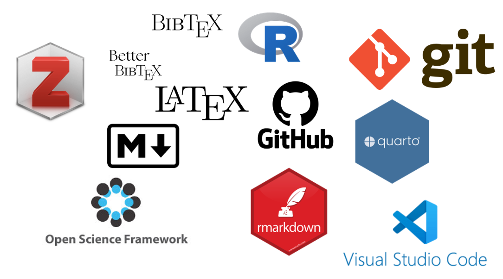
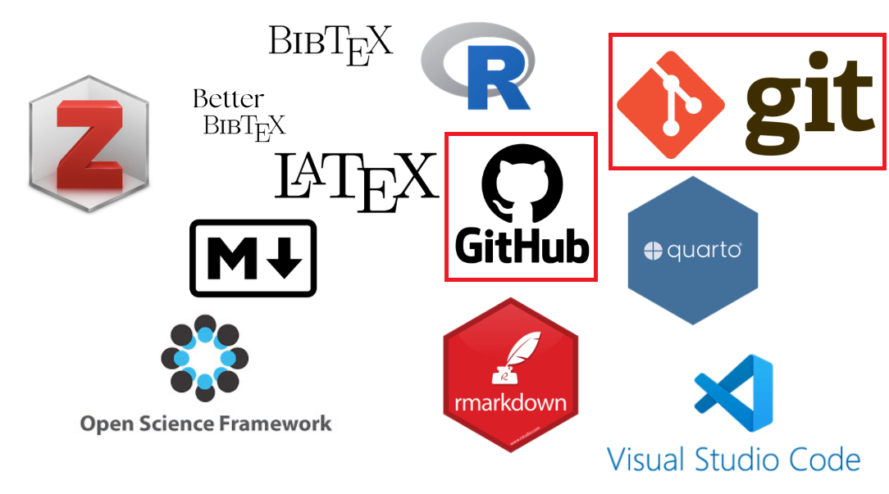
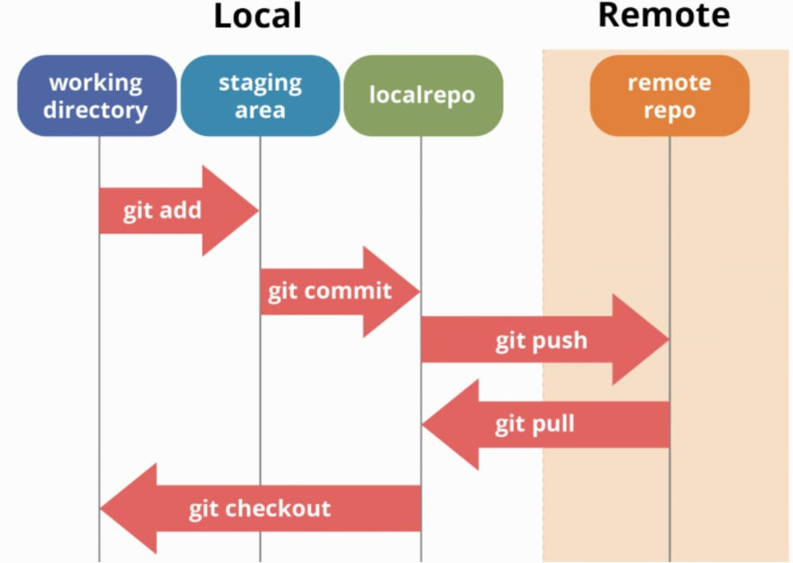
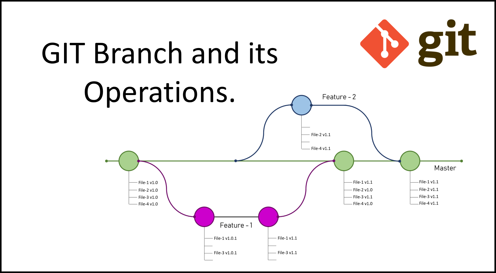
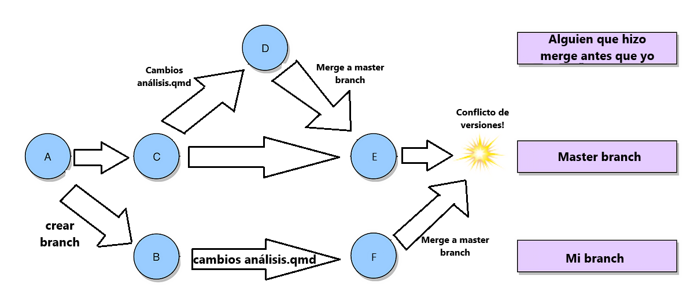
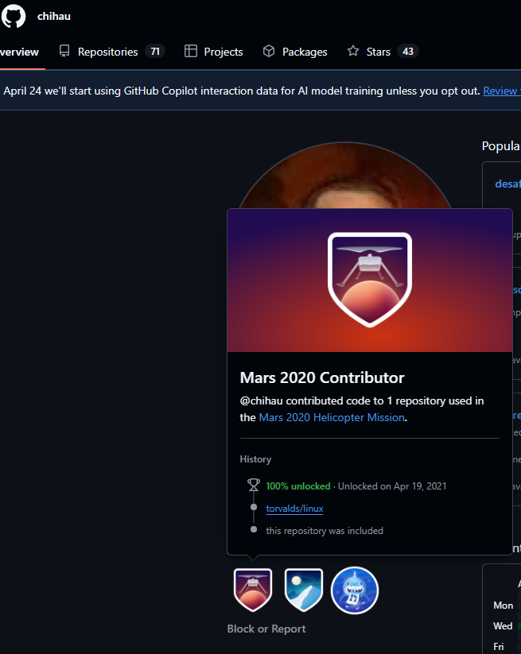

# {.hide-logo data-background-color="#9B2626"}

::::: columns
::: {.column width="35%"}

<br>

{width="100%" fig-align="right"}
:::

:::{.column width="2%"}

:::

::: {.column width="65%" style="font-size: 25px; text-align: right; margin: 0 auto;"}

<br>

### 

<span style="font-size: 2em; color: white;">Ciencia Social Abierta</span>

----
<span style="font-size: 1.5em; color: #dfc117;">Sesión 4: Control de versiones: Git & Github</span>

<br>

<span style="font-size: 1em; color: white;">Kevin Carrasco</span>

<span style="font-size: 1em; color: white;">Sociología FACSO UChile</span>

<br>

<span style="font-size: 1em; color: white;">Primer Semestre 2026</span>

[cienciasocialabierta.netlify.app](https://cienciasocialabierta.netlify.app/)

:::
:::::

# Contenidos {data-background-color="#9B2626" style="text-align: right;"}

<br>

:::{style="position: absolute; bottom: 60px; right: 1px; text-align: right;"}
### [**1. Resumen sesión anterior**]{style="color: #dfc117;"}
### [2. Control de versiones]{style="color: #797b7d;"}
:::

# Ciencia abierta: ¿Alternativas? {data-background-color="#212525"}

- ### Incentivos

- ### Estándares

- ### Herramientas


##
Herramientas para la reproducibilidad



##
Herramientas para la reproducibilidad




## 
#### Elementos para la [reproducibilidad]{style="color: red;"}

:::{.incremental}
- Carpeta de proyecto autocontenida y transferible

- Escritura abierta:
  - texto simple/plano
  - citas
  - documentos dinámicos

::: {.fragment .highlight-red}

- Repositorio con datos y código de análisis abierto

- Control de versiones

:::
:::

##


# Contenidos {data-background-color="#9B2626" style="text-align: right;"}

<br>

:::{style="position: absolute; bottom: 60px; right: 1px; text-align: right;"}
### [1. Resumen sesión anterior]{style="color: #797b7d;"}
### [**2. Control de versiones**]{style="color: #dfc117;"}
:::

#  {data-background-color="#9B2626"}

::: {style="font-size: 130%;"}
La escritura en texto simple (como Markdown o Quarto) permite implementar un sistema de control de versiones, además de herramientas de respaldo, colaboración y comunicación
:::

---

#### El origen: Abriendo un sistema operativo

::: columns
::: {.column width="40%"}

:::

::: {.column width="60%"}
-   Linus Torvalds, 1991 (21 años)

-   Crea sistema operativo libre (**Linux**) y lo abre a la colaboración. Postea:

    -   "I'm doing a (free) operating system (just a hobby, won't be big and professional...)"

-   [TED talk](https://www.youtube.com/watch?v=o8NPllzkFhE&ab_channel=TED)
:::
:::


# Git  {data-background-color="#9B2626"}

*Git es un sistema de control de versiones*

---

### Git

::: columns
::: {.column width="30%"}

:::

::: {.column width="70%"}

- Su propósito original era ayudar a grupos de desarrolladores a trabajar de forma colaborativa en grandes proyectos de software. 

- Git gestiona la evolución de un conjunto de archivos —llamado repositorio— de una manera lógica y altamente estructurada. 

- Similar a la función "Control de cambios" de Microsoft Word, pero mucho más avanzada.

:::
:::

---

### Git

::: columns
::: {.column width="30%"}

:::

::: {.column width="70%"}
-   es una especie de memoria local que registra:

    -   quién hizo un cambio
    -   cuándo lo hizo
    -   qué hizo

-   mantiene la información de todos los cambios en la historia de la carpeta

-   se puede sincronizar con un repositorio remoto (ej. Github)
:::
:::

---

#### Git/github

:::: {style="font-size: 80%;"}

::: columns
::: {.column width="30%"}

:::

::: {.column width="70%"}

- Espacio para tus proyectos basados ​​en Git en internet. 

- Similar a Dropbox, pero mejor. 

- El servidor remoto actúa como un canal de distribución o centro de intercambio para tu proyecto vinculado a Git. Permite que otras personas vean tu trabajo, se sincronicen contigo e incluso realicen cambios.

:::
:::
::::

---

#### Git/github

:::: {style="font-size: 80%;"}

::: columns
::: {.column width="30%"}

:::

::: {.column width="70%"}

- Incluso para proyectos personales, es buena idea guardar tu trabajo en una ubicación remota para tener un respaldo

- Si has subido tu trabajo a GitHub, es fácil obtener una copia nueva, corregir los cambios que solo existen localmente y seguir trabajando.

:::
:::
::::

---

#### Git/github

:::: {style="font-size: 80%;"}

::: columns
::: {.column width="30%"}

:::

::: {.column width="70%"}
-   actualmente, Git / Github posee más de 100 millones de repositorios

-   mayor fuente de código en el mundo

-   ha transitado desde el mundo de desarrollo de software hacia distintos ámbitos de trabajo colaborativo y abierto

-   entorno de trabajo que favorece la ciencia abierta

-   En 2018 Microsoft compró GitHub por la cantidad de 7500 millones de dólares. Al inicio, el cambio de propietario generó preocupaciones y la salida de algunos proyectos de este sitio; sin embargo, no fueron representativos.
:::
:::
::::

---

#### Git/github

:::: {style="font-size: 80%;"}

::: columns
::: {.column width="30%"}

:::

::: {.column width="70%"}

- Debemos instalar Git y vincular Git con VSCode. Esto es un proceso que solo se realiza una vez o una vez por computador.

- Un repositorio puede ser público o privado (todos los visibles son públicos y clonable)

- cualquier repositorio remoto de Github que es clonado localmente quedará **vinculado al repositorio remoto** 

- si se clona un repositorio **de otra cuenta** no se puede sincronizar luego con cambios locales (a menos que ese repositorio  lo incluya como colaborador)

:::
:::
::::

#  {data-background-color="#9B2626"}

::: {style="font-size: 130%;"}

-   Git no es un registro de versiones de archivos específicos, sino de una carpeta completa

-   Guarda *"fotos"* de momentos específicos de la carpeta, y esta foto se *saca* mediante un [commit]{.red}

:::

## 




---

### Commits

-   El commit es el procedimiento fundamental del control de versiones

-   Git no registra cualquier cambio que se "guarda", sino los que se "comprometen" (*commit*).

-   En un commit

    -   se seleccionan los archivos cuyo cambio se desea registrar (*stage*)
    -   se registra lo que se está comprometiendo en el cambio (mensaje de commit)

---

### ¿Cuándo hacer un commit?

-   según conveniencia

-   sugerencias:

    -   que sea un momento que requiera registro (momento de foto)

    -   no para cambios menores

    -   no esperar muchos cambios distintos que puedan hacer perder el sentido del commit

    -  no esperar a tener todo el proyecto listo para hacer un commit

---

### Algunos términos

::: {style="font-size: 75%;"}

| Término | Definición                                                                                                                                      |
|----|---------------|
| Remote  | Un repositorio almacenado en Github, no en el equipo                                                                                            |
| Clonar       | Para descargar una copia completa de los datos de un repositorio de Github.com, incluidas todas las versiones de cada archivo y carpeta.        |
| Branch       | Una versión paralela de los archivos contenidos en el repositorio, pero que no afecta a la rama principal.                                      |
| Fork         | Un nuevo repositorio que comparte la configuración de visibilidad y código con el repositorio "ascendente" original.                            |
| Upstream     | La branch de un repositorio original que se ha *forkeado* o clonado. La branch correspondiente de la branch clonada se denomina "descendiente". |
| Merge        | Para aplicar los cambios de una branch en otra.                                                                                                 |
| Pull request | Una solicitud para combinar los cambios de una branch en otra.                                                                                  |
:::

---

### Branch

-   Una **branch** es una versión paralela de los archivos contenidos en el repositorio, pero que no afecta a la rama principal.

-   Permite el trabajo paralelo en distintos archivos.


##



---

### Conflicted branch

-   Cuando trabajamos en el mismo archivo -y los modificamos- podemos generar un **conflicto de versiones** de un archivo cuando otra persona quiera hacer modificaciones



---

### ¿Cómo evitar los conflictos de versiones?

- Lo mejor es trabajar coordinadamente en tareas separadas (en momentos o archivos diferentes)

- Mediante *pull request*, donde una persona a cargo decide qué modificaciones aceptar y cuando.

---

### Ventajas

::: {.incremental}

- **Visibilidad**: Si alguien necesita ver tu trabajo o si quieres que pruebe tu código, puede acceder fácilmente a él desde GitHub.

- **Colaboración**: Para analizar datos en conjunto. Usar GitHub permite que cada persona trabaje de forma independiente y luego envía su trabajo a revisión al resto del equipo.

- **Seguimiento**: Si te interesa mucho el proyecto de otra persona, como un paquete de R, puedes seguir su desarrollo en GitHub.

:::

---

### Anécdota

[Ingeniero chileno aportó código a helicóptero en Marte y recibió una insignia](https://www.las3claves.com/innovacion/ingeniero-chileno-aporto-codigo-a-helicoptero-en-marte-y-recibio-una)

```{=html}
<iframe src="https://www.las3claves.com/innovacion/ingeniero-chileno-aporto-codigo-a-helicoptero-en-marte-y-recibio-una" width="1000" height="800"></iframe>

```

---

### Anécdota




# {.hide-logo data-background-color="#9B2626"}

::::: columns
::: {.column width="35%"}

<br>

{width="100%" fig-align="right"}
:::

:::{.column width="2%"}

:::

::: {.column width="55%" style="font-size: 25px; text-align: right; margin: 0 auto;"}

<br>

### 

<span style="font-size: 2em; color: white;">Ciencia Social Abierta</span>

----


<br>

<span style="font-size: 1em; color: white;">Kevin Carrasco</span>

<span style="font-size: 1em; color: white;">Sociología FACSO UChile</span>

<br>

<span style="font-size: 1em; color: white;">Primer Semestre 2026</span>

[cienciasocialabierta.netlify.app](https://cienciasocialabierta.netlify.app/)

:::
:::::