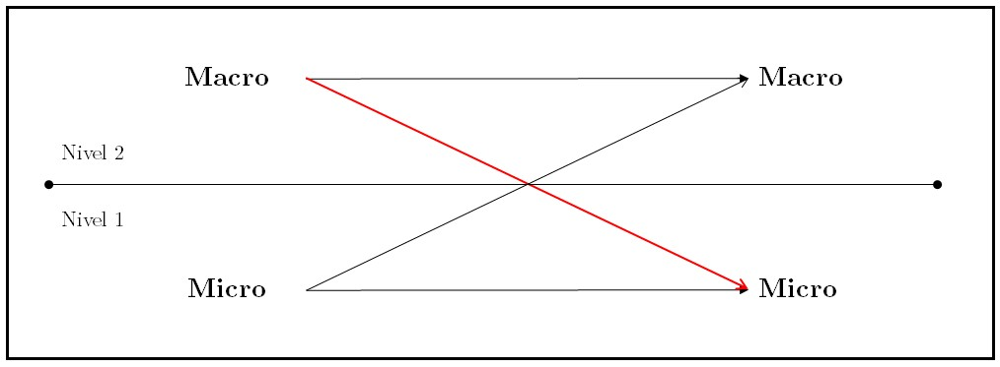
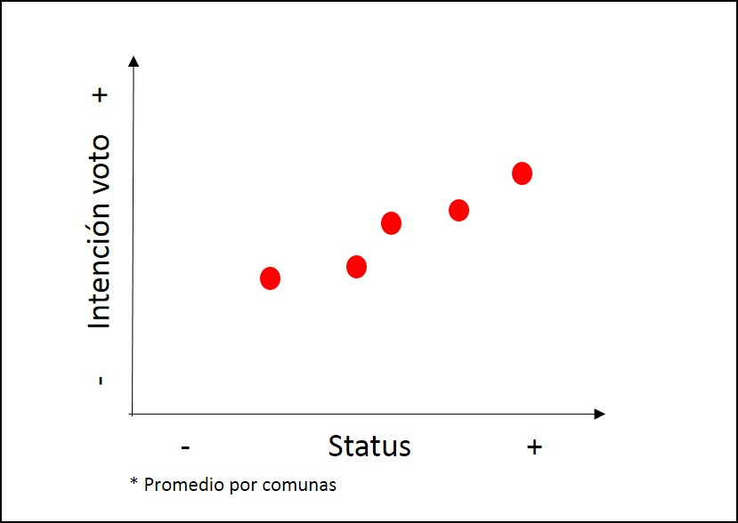
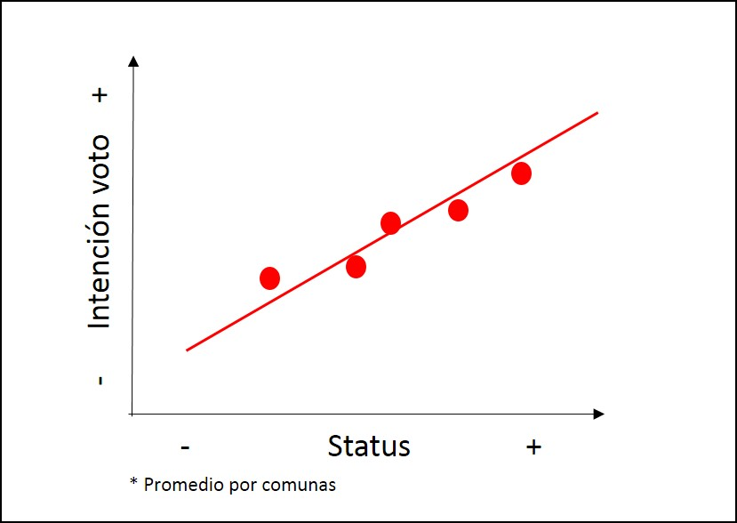
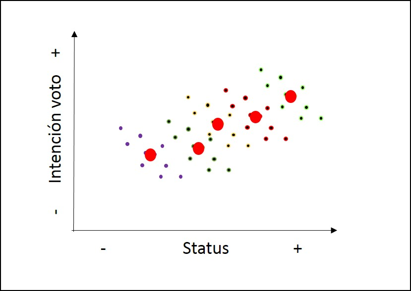
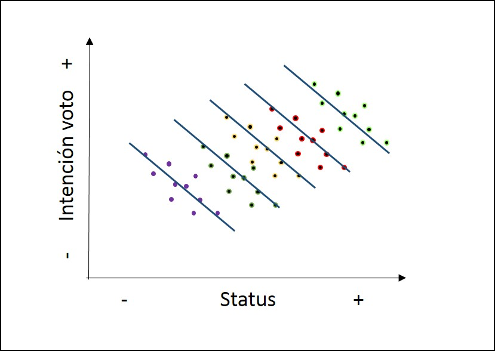
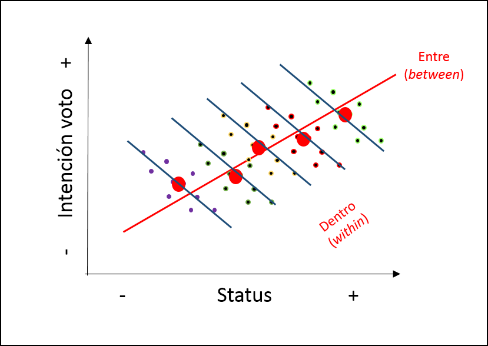
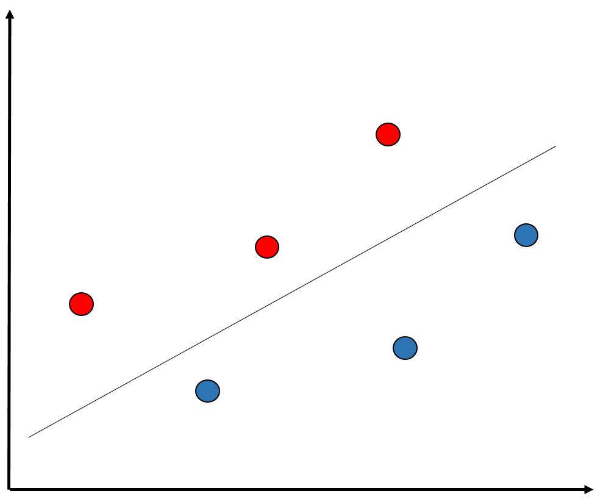
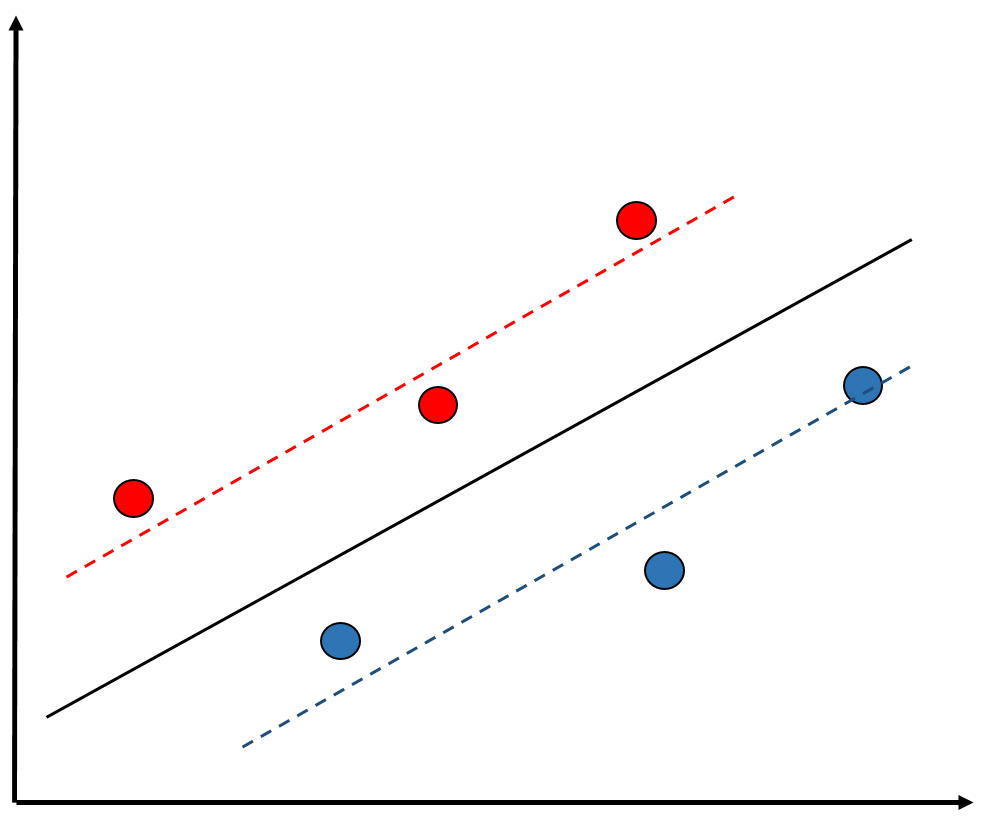
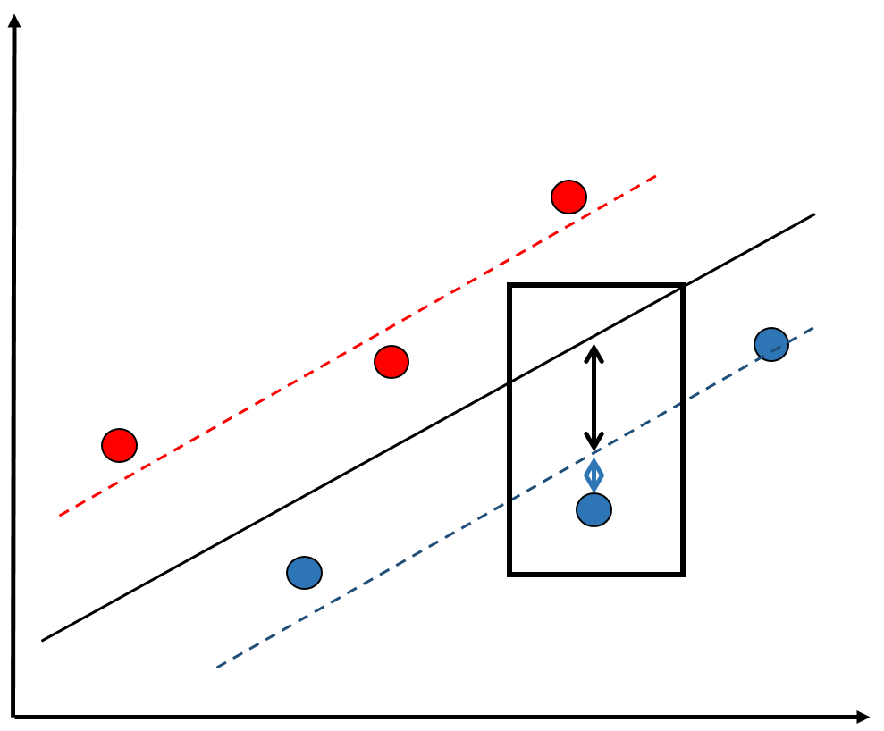
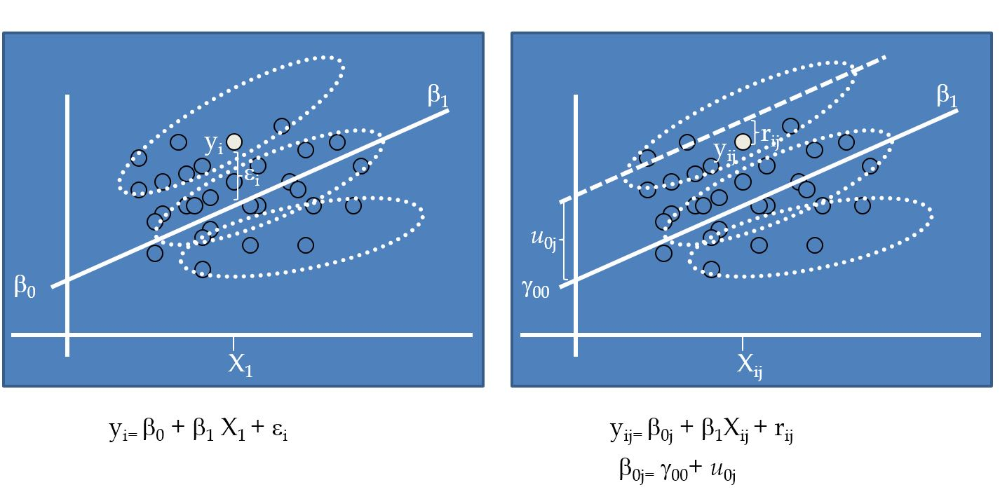

class: front


```{r setup, include=FALSE, cache = FALSE}
require("knitr")
opts_chunk$set(warning=FALSE,
             message=FALSE,
             echo=TRUE,
             cache = TRUE, fig.width=7, fig.height=5.2)
pacman::p_load(flipbookr, tidyverse)
```


```{r xaringanExtra, include=FALSE}
xaringanExtra::use_xaringan_extra(c("tile_view", "animate_css"))
xaringanExtra::use_scribble()
```

.pull-left-wide[
# Modelos multinivel]

.pull-right-narrow[]

## Unidades en contexto

----
.pull-left[

## Juan Carlos Castillo
## Sociología FACSO - UChile
## 1er Sem 2025
## [.yellow[multinivel-facso.netlify.app]](https://multinivel-facso.netlify.app/)
]
    

.pull-right-narrow[
.center[
.content-block-gray[
## Sesión 4: 
## **.yellow[Estimación en distintos niveles]**]
]
]
---

layout: true
class: animated, fadeIn

---
class: middle

#  - Lectura: Finch cap. 2: Introduction to Multilevel Data Structure
<br>
# - [Práctica 3. Estimación modelos multinivel con lmer en R](https://multinivel-facso.netlify.app/assignment/03-practico)

---
class: roja

# Sobre el CONTEXTO

---
# Investigación sociológica y contexto


.right[
(adaptado de Coleman, 1986)]

---
# Datos anidados / con estructura jerárquica
----

| IDi | IDg | var_i1 | var_i2 | var_g1 | var_g2 |
|-----|-----|--------|--------|--------|--------|
| 1   | 1   | 8      | 7      | 4      | 1      |
| 2   | 1   | 5      | 5      | 4      | 1      |
| 3   | 1   | 3      | 1      | 4      | 1      |
| 4   | 2   | 3      | 2      | 6      | 8      |
| 5   | 2   | 1      | 4      | 6      | 8      |
| 6   | 2   | 7      | 5      | 6      | 8      |


---
class: roja, middle, center

# Posibles problemas de inferencia con datos jerarquicos

---
# Problemas asociados a la inferencia y el contexto

--

## Falacia ecológica:

- Conclusiones erradas acerca de individuos basados en datos de contexto

--

## Falacia individualista:

-   Conclusiones erradas acerca de contextos basados en datos de individuos


---
# Ejemplo falacia ecológica

Relación entre estatus socioeconómico e intención de voto




---
# Falacia ecológica



---
# Falacia ecológica



---
# Falacia ecológica



---
# Falacia ecológica



---
# Implicancias falacia ecológica

-   Relaciones individuales y contextuales no necesariamente van en la misma dirección (lineal)

--

-   Falacias también pueden ocurrir en la otra dirección (falacia individualista)

--

-   Por lo tanto la inferencia ecológica (contextual) no se corresponde necesariamente con la inferencia individual

--

-   Distinguir ambos niveles es clave para estimación multinivel

---
# Referencias 


-   Blakely, T. A., & Woodward, A. J. (2000). Ecological effects in multi-level studies. Journal of Epidemiology and Community Health, 54(5), 367–374.

-   Robinson W S 1950. Ecological correlations and the behavior of individuals. American Sociological Review 15: 351–57

---
# Contexto e implicancias teóricas

.pull-left-narrow[
En el planteamiento de una investigación con hipótesis multinivel, es
relevante definir:]

.pull-right-wide[
.content-box-red[
-   Qué es el contexto

-   Cuáles son los elementos principales del contexto a considerar en las hipótesis

-   Cómo se relacionan variables del contexto con variables individuales (hipótesis)
]]
---
# Contexto e implicancias estadísticas

.pull-left-narrow[
Los modelos multinivel tienen dos sentidos principales a nivel estadístico:
]

.pull-right-wide[
.content-box-green[
1. .red[Corregir estimaciones] con variables individuales cuando existe dependencia contextual (disminuye el error)

2.  Hacen posible .red[contrastar hipótesis que abarcan relaciones entre niveles], e incluir el contexto en el modelamiento estadístico
]]
---
class:roja, center, middle

# Modelos multinivel

---
## Modelos multinivel

-   **Definición minimalista**: modelos de regresión que incluyen variables individuales y contextuales

-   Otras versiones/denominaciones: 
  - modelos jerárquicos
  - modelos mixtos
  - modelos contextuales
  - modelos con efectos aleatorios

---
## Tipos generales de problemas multinivel

Tres tipos de preguntas básicas, ejemplo educación:

1.  ¿Existen diferencias de rendimiento académico de los alumnos entre escuelas?

2.  ¿Tienen estas diferencias relación con variables de la escuela?

3.  Las características de los estudiantes, ¿poseen un efecto distinto en rendimiento de acuerdo a características de las escuelas?

---
# Formas de estimación multinivel

Base: modelo de regresión simple (no multinivel)


---
# Formas de estimación multinivel

Predictor(es) individual(es) - (asumiendo contexto)


---
# Formas de estimación multinivel

Predictor(es) contextual(es)


---
# Formas de estimación multinivel

Modelo multinivel con predictores individuales y contextuales


---
# Formas de estimación multinivel

Modelo multinivel con interacción entre niveles


---

## De la Práctica 2: [Datos y estimación en 2 niveles](https://multinivel-facso.netlify.app/assignment/02-practico)

- concepto de datos individuales y datos agregados

- regresión en cada nivel de manera independiente

---

.medium[
  -   High School & Beyond (HSB) es una muestra representativa nacional de educación secundaria publica y católica de USA implementada por el National Center for Education Statistics (NCES).

-   Más información en [https://nces.ed.gov/surveys/hsb/](http://nces.ed.gov/surveys/hsb)

-   Level 1 variables:
  -   minority, etnicidad (1 = minority, 0 =other)
  -   female, student gender (1 = female, 0 = male)
  -   ses, (medida estandarizada de nivel socioeconómico en base a variables como educación de los padres, ocupación e ingreso)
  -   **mathach**, logro en matemática (_math achievement_)
]
---
## Práctica: High School & Beyond (HSB) data

-   Level 2 variables:

  -   size (matricula)

  -   sector (1 = Catholic, 0 = public)

  -   pracad (proportion of students in the academic track)

  -   disclim (a scale measuring disciplinary climate)

  -   himnty (1 = more than 40% minority enrollment, 0 = less than 40%)

  -   meanses (mean of the SES values for the students in this school who are included in the level-1 file)

-  **Cluster variable**= id (school id)


---
## Librerías y datos

```{r}
pacman::p_load(
haven,  # lectura de datos formato externo
car, # varias funciones, ej scatterplot
dplyr, # varios gestión de datos
stargazer, # tablas
corrplot, # correlaciones
ggplot2, # gráficos
lme4) # multilevel
```

.medium[
```{r, echo=TRUE}
mlm <-read_dta("http://www.stata-press.com/data/mlmus3/hsb.dta") # datos
```
]

---
## Ajuste datos

.medium[
```{r}
dim(mlm)
names(mlm)
```
]

---

# Seleccionar variables de interés

```{r}
mlm=mlm %>% select(
  minority,female,ses,mathach, # nivel 1
  size, sector,mnses,schoolid) %>%  # nivel 2
  as.data.frame()
```


---
## Nota: sobre `%>%`

- `%>%` es conocido como "pipe operator", operador pipa o simplemente pipa

- proviene de la librería `magrittr`, que es utilizada en `dplyr`

- objetivo: hacer más fácil y eficiente el código, incorporando varias funciones en una sola línea / comando

- avanza desde lo más general a lo más específico


---
## Descriptivos generales

.pull-left-narrow[
.medium[
```{r, eval=FALSE}
stargazer(
  as.data.frame(mlm),
  title = "Descriptivos generales", 
  type='text')
```
]
]

.pull-right-wide[
.small[
```{r, echo=FALSE}
stargazer(
  as.data.frame(mlm),
  title = "Descriptivos generales", 
  type='text')
```

]
]
---
## Descriptivos generales

```{r}
hist(mlm$mathach, xlim = c(0,30))
```

---
## Descriptivos generales

.pull-left[
```{r eval=FALSE}
scatterplot(mlm$mathach ~ 
  mlm$ses,
  data=mlm, 
  xlab="SES", 
  ylab="Math Score",
  main="Math on SES", 
  smooth=FALSE)
```
]

.pull-right[
```{r echo=FALSE}
scatterplot(mlm$mathach ~ mlm$ses,
  data=mlm, xlab="SES", ylab="Math Score",
  main="Math on SES", smooth=FALSE)
```
]
---
## Descriptivos generales

.medium[
```{r}
cormat=mlm %>%
  select(mathach,ses,sector,size, mnses) %>%
  cor()
round(cormat, digits=2)
```
]
---
## Descriptivos generales

```{r}
corrplot.mixed(cormat)
```

---
## Datos agregados

- Se procede a "agregar", generando una base de datos a nivel 2

- Usando la funcion `group_by` (agrupar por) de la librería `dplyr`

- Se agrupa por la variable **cluster**, que identifica a las unidades de nivel 2 (en este caso, `schoolid`)
- Por defecto se hace con el promedio, pero se pueden hacer otras funciones como contar, porcentajes, mediana, etc.


---
# Generando base de datos agregados

```{r}
agg_mlm=mlm %>% group_by(schoolid) %>%
  summarise_all(funs(mean)) %>% as.data.frame()

```

  - generamos el objeto `agg_mlm` desde el objeto `mlm`

  - agrupando por la variable cluster `schoolid`

  - agregamos (colapsamos) todas `summarise_all` por el promedio `funs(mean)`

---
## Datos agregados

.medium[
```{r}
stargazer(agg_mlm, type = "text")
```
]

---
## Comparación Modelos

- Modelo con datos individuales

```{r}
reg<- lm(mathach~ses+female+sector, data=mlm)
```

- Modelo con datos agregados

```{r}
reg_agg<- lm(mathach~ses+female+sector, data=agg_mlm)
```

---

- Generación tabla

```{r eval=FALSE}
stargazer(reg,reg_agg,
  column.labels=c("Individual","Agregado"),
  type ='text')
```

---
## Comparación Modelos
.small[
```{r, echo=T}
pacman::p_load(sjPlot,sjmisc,sjlabelled)
tab_model(reg, reg_agg, show.ci=F, show.se = T, dv.labels = c("Individual", "Agregado"))

```
]

---
class: roja, middle, center

# ¿Qué problema puede haber al estimar un mismo modelo para variables individuales y agregadas?


---
class: roja, middle, center

# Regresión con más de 1 nivel


---
## Residuos y dependencia contextual


---
## Residuos y dependencia contextual


---
## Residuos y dependencia contextual



---
## Residuos y dependencia contextual



---
# Implicancias para el modelo de regresión:

-   Situaciones en que los residuos son distintos de manera sistemática de acuerdo a variables contextuales: .red[dependencia (contextual) de los residuos]

- Si un modelo de regresión de 1 nivel se aplica en situaciones de dependiencia contextual, entonces puede aumentar el error en la estimación

---
# Alternativas

-   Descomposición de la varianza de los residuos *entre* y
*dentro* los grupos= en distintos niveles = **multinivel**.

-   En concreto, se agrega un término de error adicional al modelo:
$\mu_{0j}$

-   Este término de error se expresa como un **efecto aleatorio** (como opuesto a *efecto fijo*)


---
## Regresión a distintos niveles



---
## Modelo con coeficientes aleatorios (RCM)

-   Random Coefficients Models (RCM) o Mixed (effects) Models

-   Forma de estimación de modelos multinivel

-   Idea base: se agrega un parámetro *aleatorio* al modelo, es decir, que posee variación en relación a unidades de nivel 2.


---
class: front
.pull-left-wide[
# Modelos multinivel
]

.pull-right-narrow[]

## Unidades en contexto

----
.pull-left[

## Juan Carlos Castillo
## Sociología FACSO - UChile
## 1er Sem 2025 
## [.yellow[multinivel-facso.netlify.app]](https://multinivel-facso.netlify.app)
]

