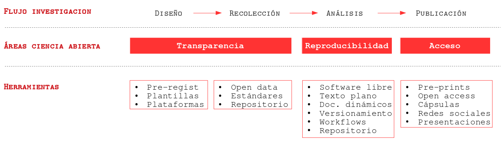
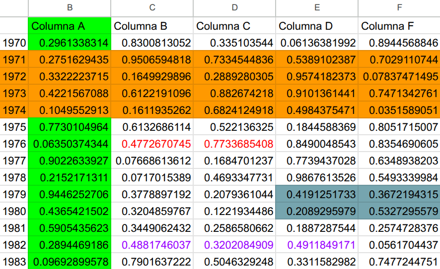
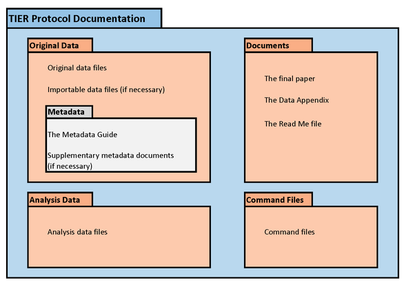

# {.hide-logo data-background-color="#9B2626"}

::::: columns
::: {.column width="35%"}

<br>

{width="100%" fig-align="right"}
:::

:::{.column width="2%"}

:::

::: {.column width="65%" style="font-size: 25px; text-align: right; margin: 0 auto;"}

<br>

### 

<span style="font-size: 2em; color: white;">Ciencia Social Abierta</span>

----
<span style="font-size: 1.5em; color: #dfc117;">Sesión 5: Flujo reproducible / Protocolo IPO</span>

<br>

<span style="font-size: 1em; color: white;">Juan Carlos Castillo & Tomás Urzúa</span>

<span style="font-size: 1em; color: white;">Sociología FACSO UChile</span>

<br>

<span style="font-size: 1em; color: white;">Primer Semestre 2026</span>

[cienciasocialabierta.netlify.app](https://cienciasocialabierta.netlify.app/)

:::
:::::

# Contenidos {data-background-color="#9B2626" style="text-align: right;"}


##



##


## Elementos para la reproducibilidad{style="color: red; font-size: 0.8em;"}

:::{.incremental .highlight-last}
- Carpeta de proyecto autocontenida y transferible

- Escritura abierta:
  - texto simple/plano, libre de software comercial
  - citas
  - documentos dinámicos

- Flujo de trabajo documentado y reproducible

- Repositorio con datos y código de análisis abierto

- Control de versiones
:::

# Contenidos {data-background-color="#9B2626" style="text-align: right;"}

<br>

[1. Barreras a la reproducibilidad]{style="color: #797b7d;"}<br>
[2. Carpeta de proyecto -  Protocolo IPO]{style="color: #797b7d;"}<br>
[3. Rutas relativas]{style="color: #797b7d;"}


## Barreras a la reproducibilidad

:::: columns

::: {.column width="25%"}

_"Al principio Dios vio un Excel lleno de colores"_

:::

::: {.column width="75%"}



:::

::::

## ¿Cómo organizar el flujo de trabajo?

::: {.box-inv-5 .sp-after .fragment color="#9B2626"}
### A. ad-hoc (menos reproducible) {style="color: white;"}
:::

::: {.incremental .highlight-last}
  - cada investigador define numero de archivos, nombres, carpetas y organización
  - explicar al resto cómo se organiza
  - documentar en un archivo cómo se organiza

:::

::: {.box-inv-4 .sp-after .fragment}
--> reproducibilidad y transparencia **LIMITADA**  
:::

##  ¿Cómo organizar el flujo de trabajo?

### B. *Protocolo* de trabajo reproducible

  - **estructura** de carpetas y archivos interconectados que refieren a reglas conocidas
  
  - **autocontenido**: toda la información necesaria para la reproducibilidad se encuentra en la carpeta raíz o directorio de trabajo.

## Protocolos reproducibles


## Ejemplo protocolo reproducible: [TIER](https://www.projecttier.org/)


## Protocolo TIER



## Protocolo IPO

### [I]nput
### [P]rocesamiento
### [O]utput

## Protocolo IPO 

Estructura de archivos y carpetas

```         
├── input: información externa como datos, imágenes, .bib:
|   ├── data-orig: archivos de datos originales y metadatos disponibles
|   ├── data-proc: archivos de datos procesados
│   ├── imagenes
│   ├── bib: archivos de bibliografía
│   ├── prereg: archivos de pre-registro si están disponibles
|
├── procesamiento:
│   - preparacion.qmd
│   - analisis.qmd
|
├── output: tablas, gráficos y otras salidas del procesamiento.
│   ├── graphs
│   ├── tables
|
- readme.md : archivo general de introducción
- paper.qmd / paper.html / paper.pdf: el artículo/paper
```

## Versiones de IPO

```{r}
#| echo: false
pacman::p_load(readxl, dplyr, kableExtra, cell_spec)
tab01 <- readxl::read_excel(path = "templates-ipo.xlsx")

tab01 <- tab01 %>%
  dplyr::mutate(nombre = cell_spec(nombre, "html", link = Enlace)) %>%
  select(-Enlace)

tab01 %>%
  kableExtra::kbl(
    full_width = TRUE, linesep = "", escape = FALSE,
    align = "lllccl",
    col.names = c("Plantilla", "Descripción", "Software", "Documentos dinámicos", "Control de versiones", "Enlace"),
    row.names = FALSE
  ) %>%
  kableExtra::kable_styling(
    full_width = FALSE,
    position = "center",
    font_size = 14,
    bootstrap_options = c("striped", "bordered", "condensed", "responsive")
  ) %>%
  column_spec(column = 2, width = "10cm") %>%
  column_spec(column = 4:5, width = "3cm")
```

## Principios básicos

-   **orden**: ¿podré comprender y reproducir esto en 5 años?

-   **comentar los códigos**: registrar brevemente los motivos de cualquier decisión

-   el código de preparación debería comenzar cargando los datos originales y terminar guardando los datos procesados en la carpeta correspondiente (proc).

## Flujo de trabajo reproducible

```{r}
#| out-width: "75%"
#| fig-align: "center"
knitr::include_graphics("https://multivariada.netlify.app/images/produccion2.png")
```

## Protocolo IPO en contexto Quarto

- Quarto tiene una lógica en sí reproducible, y puede simplificar el uso de protocolos.

- Si todo el procesamiento se hace en el mismo documento paper.qmd, entonces basta con la carpeta input de IPO.

- Recomendación: realizar la preparación en código externo (carpeta proc) y el análisis en el paper.qmd.

- Es solo una **propuesta**, el sentido último es la reproducibilidad más que el cumplimiento estricto


# Contenidos

##  Rutas relativas

- forma de "señalar el camino" para abrir y guardar archivos al interior de una carpeta de proyecto autocontenido (= sin referencias locales)

- este camino tiene básicamente 3 direcciones:

  - bajar -> hacia subcarpetas
  
  - subir -> hacia carpetas superiores
  
  - subir y bajar -> hacia otras subcarpetas 

## Rutas relativas: bajando

- para **"bajar"** hacia a una subcarpeta, simplemente damos la ruta de la carpeta/archivo

  - ej: si estoy en el archivo paper.Rmd (directorio raíz), y quiero incluir una imagen (directorio input/images/imagen.jpg), entonces la ruta es `input/images/imagen.jpg`
  
  - o para señalar la ruta al bib desde paper.Rmd (en raíz): `input/bib/referencias.bib`

## Rutas relativas: subiendo

- para **subir** se utilizan los caracteres `../` por cada nivel.

- Ej: si quiero guardar una tabla en el directorio raíz generada desde un archivo de código en la subcarpeta proc, entonces la ruta es `../tabla.html`

## Rutas relativas: subiendo y bajando 

- combinación de las anteriores

- Ej: para abrir la base de datos original en la subcarpeta input/data desde el código de procesamiento en la subcarpeta proc, entonces: `../input/data/original.dat`

