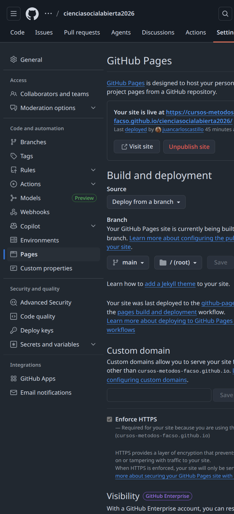
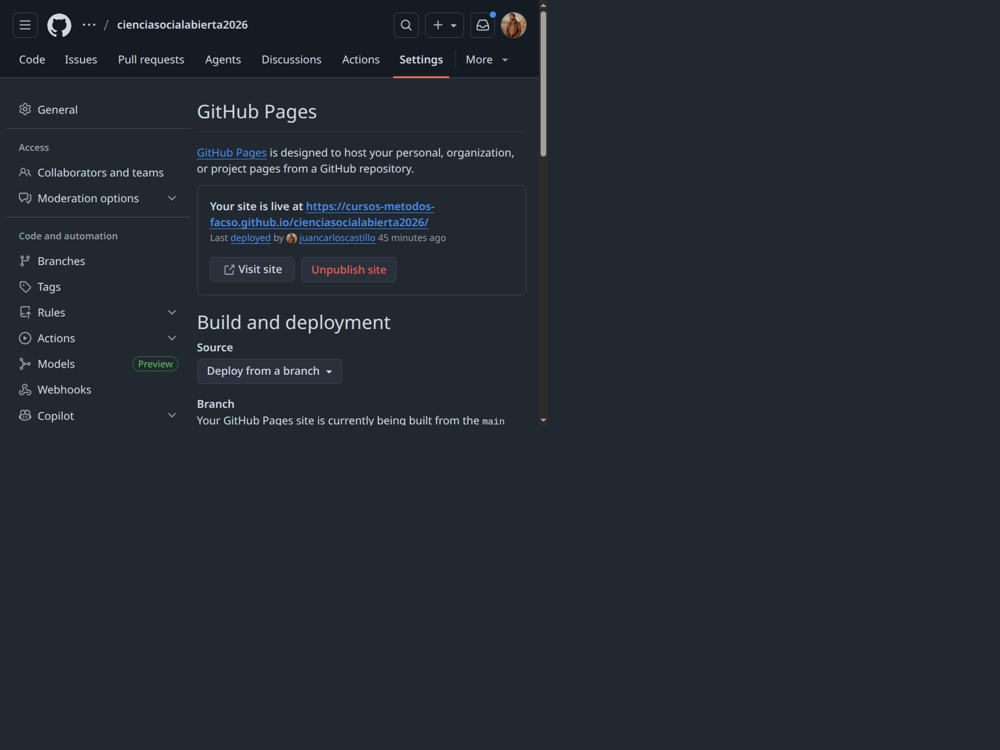
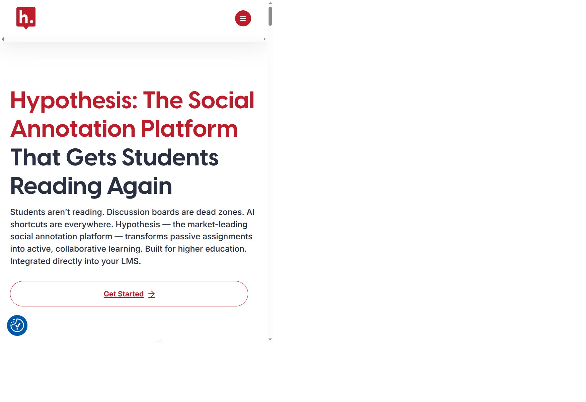
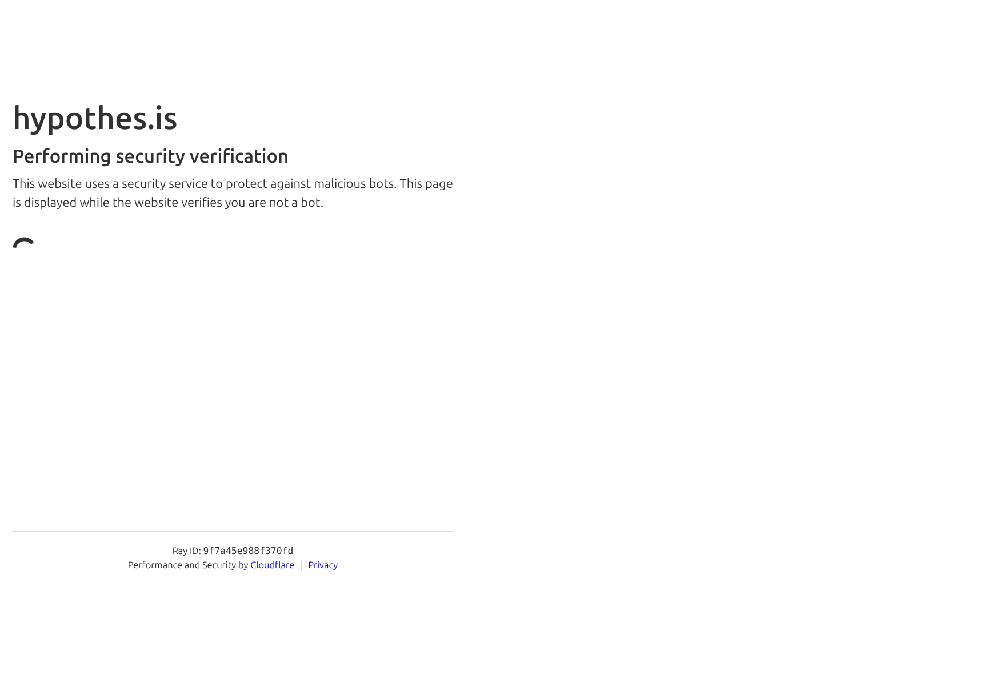

# {.hide-logo data-background-color="#9B2626"}

::::: columns
::: {.column width="33%"}

{width="100%" fig-align="right"}
:::

:::{.column width="2%"}

:::

::: {.column style="width: 65%; font-size: 22px; text-align: right; margin: 0 auto;"}

###

Ciencia Social Abierta

----
Sesión 6: Publicación de resultados con GitHub Pages

 

Juan Carlos Castillo & Tomás Urzúa

Sociología FACSO UChile

 

Primer Semestre 2026

[cienciasocialabierta.netlify.app](https://cienciasocialabierta.netlify.app/)

:::
:::::

# Objetivos de aprendizaje

Al final de esta clase podrán:

:::{.incremental .highlight-last}
- Entender qué es GitHub Pages y para qué sirve en investigación y docencia.
- Publicar un sitio estático desde un repositorio.
- Diferenciar un flujo manual y uno automatizado con GitHub Actions.
- Aplicar una lista mínima de control de calidad antes de publicar.
- Anotar sitios web con hypothes.is
:::

# Contenidos {data-background-color="#9B2626" style="text-align: right;"}

 

[1. Por qué publicar resultados en la web]{style="color: #f8fafb;"} 
[2. Fundamentos de GitHub Pages]{style="color: #f8fafb;"} 
[3. Flujos de publicación]{style="color: #f8fafb;"} 
[4. Buenas prácticas y errores frecuentes]{style="color: #f8fafb;"} 
[5. Anotación web con hypothes.is]{style="color: #f8fafb;"}

# Contenidos {data-background-color="#9B2626" style="text-align: right;"}

 

[1. Por qué publicar resultados en la web]{style="color: #f8fafb;"} 
[2. Fundamentos de GitHub Pages]{style="color: #686868;"} 
[3. Flujos de publicación]{style="color: #686868;"} 
[4. Buenas prácticas y errores frecuentes]{style="color: #686868;"} 
[5. Anotación web con hypothes.is]{style="color: #686868;"}

# 1) Por qué publicar resultados en la web

:::{.incremental .highlight-last}
- Transparencia: mostrar resultados, decisiones y actualizaciones.
- Reproducibilidad: vincular código, datos y documentos.
- Comunicación pública: acceso sencillo para estudiantes y colegas.
- Trazabilidad: cada cambio queda registrado en el historial.
- Revisión: facilita la revisión eficiente por pares en diferentes dispositivos
:::

## Casos de uso en ciencias sociales

:::{.incremental .highlight-last}
- Sitio del curso con programa, clases y recursos.
- Sitio de proyecto con reportes, tablas y visualizaciones.
- Documentación metodológica para equipos de investigación.
- Repositorio de resultados intermedios y versiones finales.
:::

# Contenidos {data-background-color="#9B2626" style="text-align: right;"}

 

[1. Por qué publicar resultados en la web]{style="color: #686868;"} 
[2. Fundamentos de GitHub Pages]{style="color: #ffffff;"} 
[3. Flujos de publicación]{style="color: #686868;"} 
[4. Buenas prácticas y errores frecuentes]{style="color: #686868;"} 
[5. Anotación web con hypothes.is]{style="color: #686868;"}

## Qué es GitHub Pages

- Servicio de hosting para sitios estáticos.
- Publica HTML, CSS, JS e imágenes directamente desde GitHub.
- La lógica es que se genera una acción automática (github action) cada vez que se actualiza el repositorio. 

-> Es decir, cada vez que se hace un commit/push, se ejecuta un proceso de construcción que genera la página web y la publica automáticamente.

# Contenidos {data-background-color="#9B2626" style="text-align: right;"}

 

[1. Por qué publicar resultados en la web]{style="color: #686868;"} 
[2. Fundamentos de GitHub Pages]{style="color: #686868;"} 
[3. Flujos de publicación]{style="color: #ffffff;"} 
[4. Buenas prácticas y errores frecuentes]{style="color: #686868;"} 
[5. Anotación web con hypothes.is]{style="color: #686868;"}

## Flujo

1. Editar contenido.
2. Renderizar sitio localmente.
3. Confirmar que carpeta docs se está actualizando correctamente.
4. Commit + push.
5. Verificar página publicada.

## Configuración visual en GitHub (paso a paso)

1. Ir a Settings -> Pages del repositorio.
2. Definir fuente de publicación (branch/carpeta o workflow).
3. Confirmar URL publicada y estado del deploy.

## Paso 1: Settings -> Pages

{fig-alt="Configuración de GitHub Pages en Settings" width="100%"}

## Paso 2: Build and deployment

{fig-alt="Sección Build and deployment de GitHub Pages" width="100%"}

## Paso 3: Verificación en Actions

{fig-alt="Panel de GitHub Actions para revisar despliegue" width="100%"}

# Contenidos {data-background-color="#9B2626" style="text-align: right;"}

 

[1. Por qué publicar resultados en la web]{style="color: #686868;"} 
[2. Fundamentos de GitHub Pages]{style="color: #686868;"} 
[3. Flujos de publicación]{style="color: #686868;"} 
[4. Buenas prácticas y errores frecuentes]{style="color: #ffffff;"} 
[5. Anotación web con hypothes.is]{style="color: #686868;"}

## Checklist antes de publicar

:::{.incremental .highlight-last}
- Título, menú y navegación correctos.
- Enlaces internos y externos funcionando.
- Gráficos/tablas visibles en móvil y escritorio.
- Metadatos básicos presentes (título, descripción, autor).
- Página principal actualizada y consistente con contenidos nuevos.
:::

## Errores frecuentes

:::{.incremental .highlight-last}
- El sitio no se actualiza: se editó fuente pero no se regeneró salida.
- Rutas rotas: se movieron archivos sin ajustar links.
- Fallo de permisos: workflow sin permisos para publicar.
- Caché del navegador: aparenta no actualizar, pero el deploy sí ocurrió.
:::

## Diagnóstico rápido

1. Revisar último commit en GitHub.
2. Revisar estado del workflow en Actions.
3. Abrir logs del paso que falla.
4. Confirmar carpeta de salida y rutas relativas.
5. Probar en modo incógnito para descartar caché.

# Contenidos {data-background-color="#9B2626" style="text-align: right;"}

 

[1. Por qué publicar resultados en la web]{style="color: #686868;"} 
[2. Fundamentos de GitHub Pages]{style="color: #686868;"} 
[3. Flujos de publicación]{style="color: #686868;"} 
[4. Buenas prácticas y errores frecuentes]{style="color: #686868;"} 
[5. Anotación web con hypothes.is]{style="color: #ffffff;"}

# Comentar sitios web con Hypothes.is

Hypothes.is permite anotar y discutir textos directamente sobre páginas web y PDFs.

:::{.incremental .highlight-last}
- Permite comentarios individuales o por grupos.
- Se puede hacer réplica a los comentarios
- Deja evidencia del proceso de lectura y argumentación.
- Gratuito y funciona desde el navegador sin necesidad de instalar software adicional.
:::

## Paso 1: Crear cuenta

1. Ir a [web.hypothes.is](https://web.hypothes.is/) y seleccionar la opción de registro.
2. Completar correo, usuario y contraseña.
3. Confirmar el correo para activar la cuenta.

{fig-alt="Portada de Hypothes.is" width="100%"}

## Paso 2: Registro en hypothes.is

{fig-alt="Pantalla de creación de cuenta en hypothes.is" width="100%"}

## Paso 3: Comentar una web

1. Instalar la extensión de navegador de Hypothes.is.
2. Abrir una página web y activar el panel de anotaciones.
3. Seleccionar texto, escribir comentario y etiquetar.
4. Elegir visibilidad: público o grupo privado

:::

# Cierre

:::{.incremental .highlight-last}
- GitHub Pages permite publicar rápido y con trazabilidad.
- La calidad final depende del flujo, no solo de la herramienta.
- Publicar bien es parte del método de investigación abierta.
- hypothes.is es una herramienta sencilla para obtener comentarios  discusión de resultados publicados en html
:::

