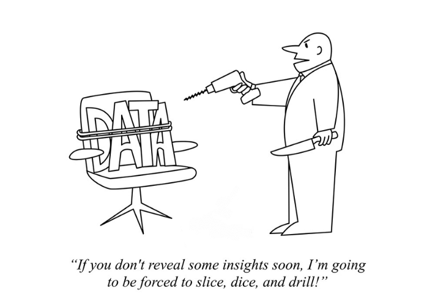
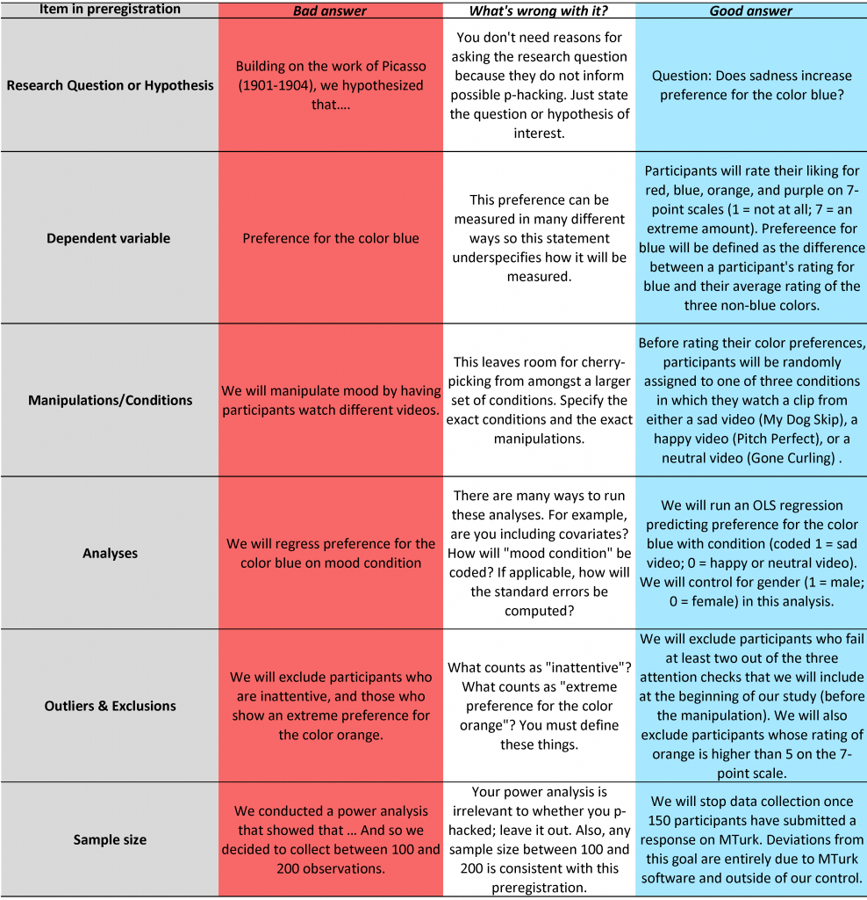
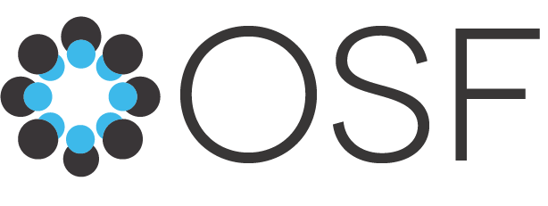
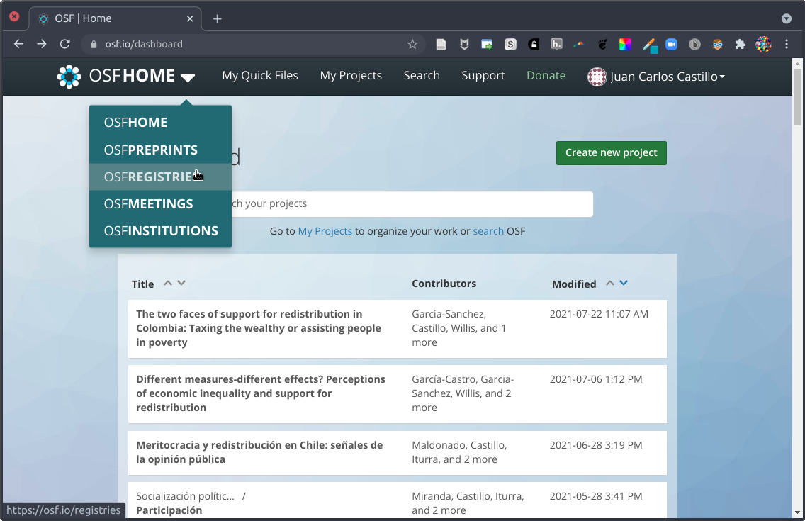
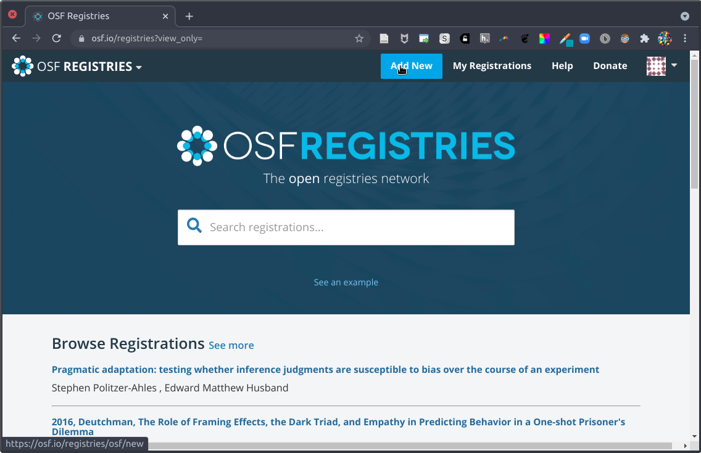
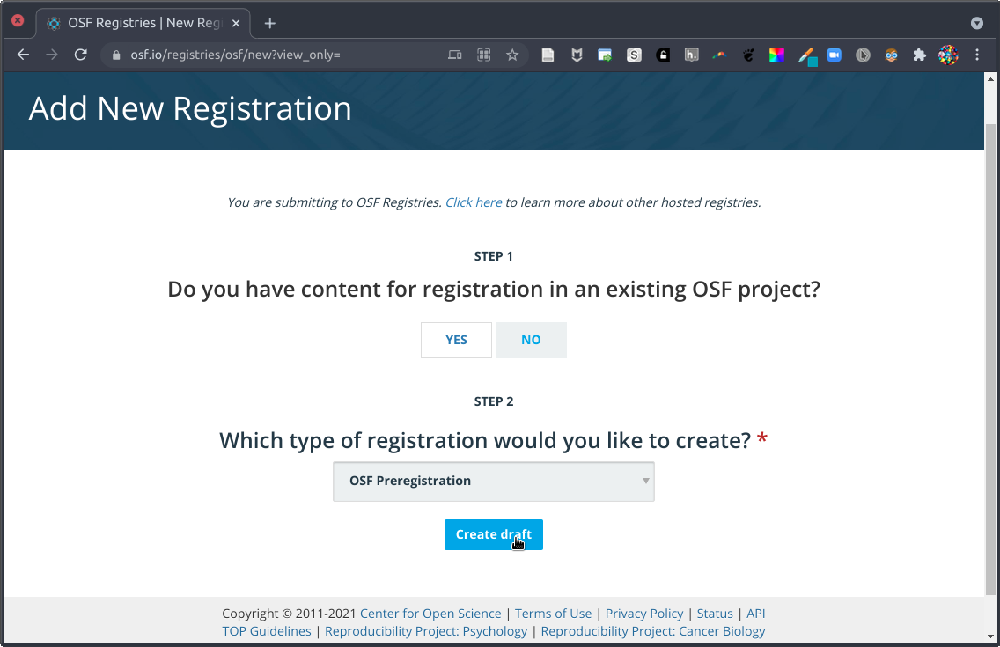

# {.hide-logo data-background-color="#9B2626"}

::::: columns
::: {.column width="33%"}

{width="100%" fig-align="right"}
:::

:::{.column width="2%"}

:::

::: {.column style="width: 65%; font-size: 22px; text-align: right; margin: 0 auto;"}

###

Ciencia Social Abierta

----
Sesión 7: Preregistros y Open Science Framework (OSF)

 

Juan Carlos Castillo & Tomás Urzúa

Sociología FACSO UChile

 

Primer Semestre 2026

[cienciasocialabierta.netlify.app](https://cienciasocialabierta.netlify.app/)

:::
:::::

# Objetivos de aprendizaje

Al final de esta clase podrán:

:::{.incremental .highlight-last}
- Explicar por qué los preregistros mejoran transparencia y credibilidad.
- Identificar componentes mínimos de un preregistro de investigación.
- Crear un preregistro básico en OSF usando una plantilla.
:::

# Contenidos {data-background-color="#9B2626" style="text-align: right;"}

 

[1. Resumen y conexión con la sesión anterior]{style="color: #f8fafb;"} 
[2. Reportes y exploración]{style="color: #f8fafb;"} 
[3. Preregistros]{style="color: #f8fafb;"} 
[4. Plantillas y OSF]{style="color: #f8fafb;"} 
[5. Anotación web con hypothes.is]{style="color: #f8fafb;"} 
[6. Actividad aplicada]{style="color: #f8fafb;"}

# Contenidos {data-background-color="#9B2626" style="text-align: right;"}

 

[1. Resumen y conexión con la sesión anterior]{style="color: #f8fafb;"} 
[2. Reportes y exploración]{style="color: #686868;"} 
[3. Preregistros]{style="color: #686868;"} 
[4. Plantillas y OSF]{style="color: #686868;"} 
[5. Anotación web con hypothes.is]{style="color: #686868;"} 
[6. Actividad aplicada]{style="color: #686868;"}

# 1) Resumen y conexión con la sesión anterior

## Resumen rápido

:::{.incremental .highlight-last}
- Ciencia abierta busca mejorar acceso, trazabilidad y reproducibilidad.
- Publicar resultados no basta: también importa cómo se generan.
- Necesitamos distinguir decisiones previas de decisiones post hoc.
- Preregistrar ayuda a transparentar el proceso analítico.
:::

## Pregunta guía de hoy

¿Cómo evitamos presentar análisis exploratorios como si fueran hipótesis definidas desde el inicio?

# Contenidos {data-background-color="#9B2626" style="text-align: right;"}

 

[1. Resumen y conexión con la sesión anterior]{style="color: #686868;"} 
[2. Reportes y exploración]{style="color: #ffffff;"} 
[3. Preregistros]{style="color: #686868;"} 
[4. Plantillas y OSF]{style="color: #686868;"} 
[5. Anotación web con hypothes.is]{style="color: #686868;"} 
[6. Actividad aplicada]{style="color: #686868;"}

## Caso de ejemplo

:::{.incremental .highlight-last}
- Se plantea hipótesis: mujeres obtienen menores ingresos.
- El resultado inicial no es significativo.
- Se recodifica ingreso, se eliminan outliers y luego aparecen resultados significativos.
- Después se excluye subgrupo de mujeres y la significación aumenta aún más.
:::

## ¿Cuál es el problema?

:::{.incremental .highlight-last}
- Cambios analíticos después de observar resultados.
- Riesgo de sesgo por decisiones oportunistas.
- Mayor probabilidad de falsos positivos.
:::

## Algunas malas prácticas

:::{.incremental .highlight-last}
- HARKing: formular hipótesis después de conocer resultados.
- p-hacking: probar múltiples especificaciones y reportar solo las favorables.
- Omisión de resultados nulos o inconsistentes.
:::

## Consecuencia metodológica

El problema no es explorar datos, sino no distinguir entre exploración y prueba de hipótesis.

Si realizamos muchas pruebas, la probabilidad acumulada de error tipo I aumenta: $P(error) = 1 - (1 - \alpha)^k$.

## Visualización del problema

{fig-alt="Ilustración sobre decisiones analíticas acumuladas" width="78%" fig-align="center"}

# Contenidos {data-background-color="#9B2626" style="text-align: right;"}

 

[1. Resumen y conexión con la sesión anterior]{style="color: #686868;"} 
[2. Reportes y exploración]{style="color: #686868;"} 
[3. Preregistros]{style="color: #ffffff;"} 
[4. Plantillas y OSF]{style="color: #686868;"} 
[5. Actividad aplicada]{style="color: #686868;"}

# 3) Preregistros

## ¿Qué es un preregistro?

:::{.incremental .highlight-last}
- Es un plan de estudio registrado antes de analizar los datos.
- Queda fechado y con historial de modificaciones.
- Permite separar decisiones a priori de decisiones exploratorias.
- Puede ser público inmediato o con embargo temporal.
:::

## Ventajas principales

::::: columns
::: {.column width="55%"}

:::{.incremental .highlight-last}
- Transparencia del proceso de investigación.
- Mayor credibilidad de hallazgos confirmatorios.
- Mejor planificación del análisis y del reporte.
- Facilita evaluación por pares y replicación.
:::

:::

::: {.column width="45%"}

{fig-alt="Insignia de preregistro" width="90%" fig-align="center"}

:::
:::::

## Lo clave: no prohíbe explorar

Preregistrar no impide explorar datos. Exige reportar con claridad qué parte es confirmatoria y qué parte es exploratoria.

## Metáfora de investigación

::::: columns
::: {.column width="50%"}

{width="32%"}

{width="85%"}

:::

::: {.column width="50%"}

{width="32%"}

{width="85%"}

:::
:::::

## Tipos de preregistro

:::{.incremental .highlight-last}
- Preregistro estándar (sin revisión): plan registrado en plataforma.
- Registered report: revisión previa al levantamiento/análisis con aceptación condicional.
- Preregistro de replicación: enfoque específico en reproducir estudios previos.
:::

# Contenidos {data-background-color="#9B2626" style="text-align: right;"}

 

[1. Resumen y conexión con la sesión anterior]{style="color: #686868;"} 
[2. Reportes y exploración]{style="color: #686868;"} 
[3. Preregistros]{style="color: #686868;"} 
[4. Plantillas y OSF]{style="color: #ffffff;"} 
[5. Anotación web con hypothes.is]{style="color: #686868;"} 
[6. Actividad aplicada]{style="color: #686868;"}

# 4) Plantillas y OSF

## ¿Para qué sirven las plantillas?

:::{.incremental .highlight-last}
- Estandarizan campos mínimos de información.
- Guían la formulación de hipótesis y análisis.
- Reducen ambiguedad y omisiones en el plan.
:::

## Campos típicos de un preregistro

:::{.incremental .highlight-last}
- Pregunta y justificación teórica.
- Hipótesis y operacionalización.
- Datos: muestra, criterios de inclusión/exclusión.
- Estrategia de análisis y manejo de datos faltantes.
- Resultados esperados y límites del diseño.
:::

## Ejemplo de estructura de plantilla

{fig-alt="Ejemplo de campos de preregistro" width="55%" fig-align="center"}

## Alternativa 1: AsPredicted

::::: columns
::: {.column width="45%"}

[{width="95%"}](https://aspredicted.org/)

:::

::: {.column width="55%"}

:::{.incremental .highlight-last}
- Formulario simple y rápido.
- Útil para proyectos de menor complejidad.
- Buen punto de inicio para incorporar práctica de preregistro.
:::

:::
:::::

## Alternativa 2: Open Science Framework (OSF)

::::: columns
::: {.column width="42%"}

[{width="90%"}](https://osf.io/)

:::

::: {.column width="58%"}

:::{.incremental .highlight-last}
- Plataforma integral para gestionar proyectos de investigación.
- Permite preregistros independientes o vinculados a proyectos existentes.
- Ofrece múltiples plantillas y opciones de visibilidad.
- Facilita organización de archivos, versiones y colaboración.
:::

:::
:::::

## Flujo básico de preregistro en OSF

1. Crear cuenta y proyecto en OSF.
2. Ir a la sección de preregistration.
3. Seleccionar plantilla acorde al estudio.
4. Completar campos y revisar coherencia interna.
5. Registrar con fecha y definir visibilidad/embargo.

## Interfaz OSF: ejemplo 1

{fig-alt="Vista de inicio de preregistro en OSF" width="90%"}

## Interfaz OSF: ejemplo 2

{fig-alt="Selección de plantilla de preregistro en OSF" width="90%"}

## Interfaz OSF: ejemplo 3

{fig-alt="Formulario de preregistro en OSF" width="90%"}

## Buenas prácticas al completar un preregistro

:::{.incremental .highlight-last}
- Escribir hipótesis observables y falsables.
- Justificar criterios de exclusión antes del análisis.
- Dejar explícita la estrategia de robustez.
- Registrar desviaciones del plan en el reporte final.
:::

# Contenidos {data-background-color="#9B2626" style="text-align: right;"}

 

[1. Resumen y conexión con la sesión anterior]{style="color: #686868;"} 
[2. Reportes y exploración]{style="color: #686868;"} 
[3. Preregistros]{style="color: #686868;"} 
[4. Plantillas y OSF]{style="color: #686868;"} 
[5. Anotación web con hypothes.is]{style="color: #ffffff;"} 
[6. Actividad aplicada]{style="color: #686868;"}

# 5) Anotación web con hypothes.is

## Comentar sitios web con Hypothes.is

Hypothes.is permite anotar y discutir textos directamente sobre páginas web y PDFs.

:::{.incremental .highlight-last}
- Útil para lectura guiada en clase.
- Permite comentarios individuales o por grupos.
- Deja evidencia del proceso de lectura y argumentación.
:::

## Paso 1: Crear cuenta

1. Ir a [web.hypothes.is](https://web.hypothes.is/) y seleccionar la opción de registro.
2. Completar correo, usuario y contraseña.
3. Confirmar el correo para activar la cuenta.

## Paso 2: Instalación y configuración

1. Instalar la extensión de navegador desde [hypothes.is](https://hypothes.is/).
2. Aceptar permisos de la extensión.
3. Crear o unirse a un grupo privado del curso si es necesario.

## Paso 3: Comentar una web

1. Abrir cualquier sitio web o PDF.
2. Activar el panel de Hypothes.is (icono en la barra).
3. Seleccionar texto, escribir comentario y etiquetar.
4. Elegir visibilidad: público o grupo privado del curso.

## Usos recomendados en docencia

:::{.incremental .highlight-last}
- Preguntas de lectura obligatoria sobre papers o noticias.
- Comentarios entre pares para discusión previa a clase.
- Marcado de conceptos clave, métodos y evidencia empírica.
- Revisión crítica de fuentes y trazabilidad de argumentos.
:::

# Contenidos {data-background-color="#9B2626" style="text-align: right;"}

 

[1. Resumen y conexión con la sesión anterior]{style="color: #686868;"} 
[2. Reportes y exploración]{style="color: #686868;"} 
[3. Preregistros]{style="color: #686868;"} 
[4. Plantillas y OSF]{style="color: #686868;"} 
[5. Anotación web con hypothes.is]{style="color: #686868;"} 
[6. Actividad aplicada]{style="color: #ffffff;"}

# 6) Actividad aplicada

## Trabajo en grupos (20 minutos)

Objetivo: crear un preregistro breve del proyecto grupal y dejarlo publicado en OSF (o en borrador con captura de avance).

1. Definir una pregunta de investigación concreta del proyecto.
2. Redactar una hipótesis principal y una secundaria.
3. Especificar muestra, variables y criterios de exclusión.
4. Escribir plan de análisis en 5-7 pasos.
5. Ingresar la información en plantilla OSF y compartir enlace/captura.

## Producto esperado

:::{.incremental .highlight-last}
- Enlace al proyecto o preregistro en OSF.
- Documento breve con hipótesis y plan analítico.
- Nota de 3-4 lineas: principal dificultad y solución adoptada.
:::

## Referencias recomendadas

- [How To Properly Preregister A Study](http://datacolada.org/64)
- [Research Preregistration 101 (Lindsay et al., 2016)](https://www.psychologicalscience.org/observer/research-preregistration-101)
- [The Preregistration Revolution (Nosek et al., 2018)](https://www.pnas.org/content/115/11/2600)
- [Recursos de preregistro en OSF](https://www.cos.io/initiatives/prereg)

## Cierre

:::{.incremental .highlight-last}
- Preregistrar no reemplaza teoría ni criterio: los hace visibles.
- Diferenciar exploración de confirmación mejora la calidad de evidencia.
- La transparencia metodológica es parte central de la ciencia social abierta.
:::

