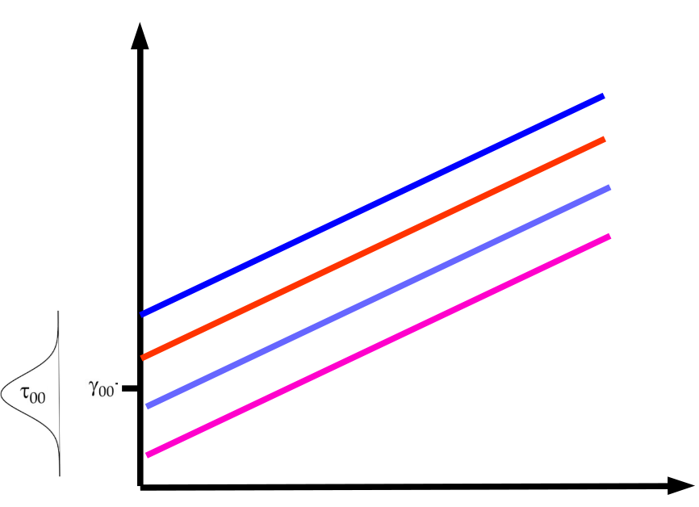
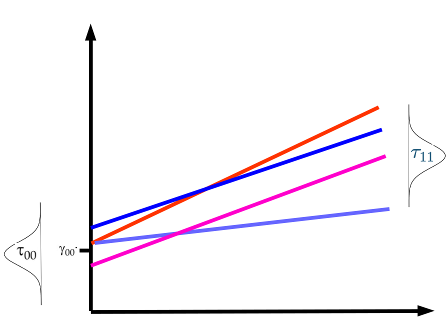
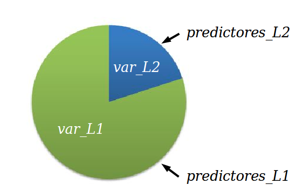
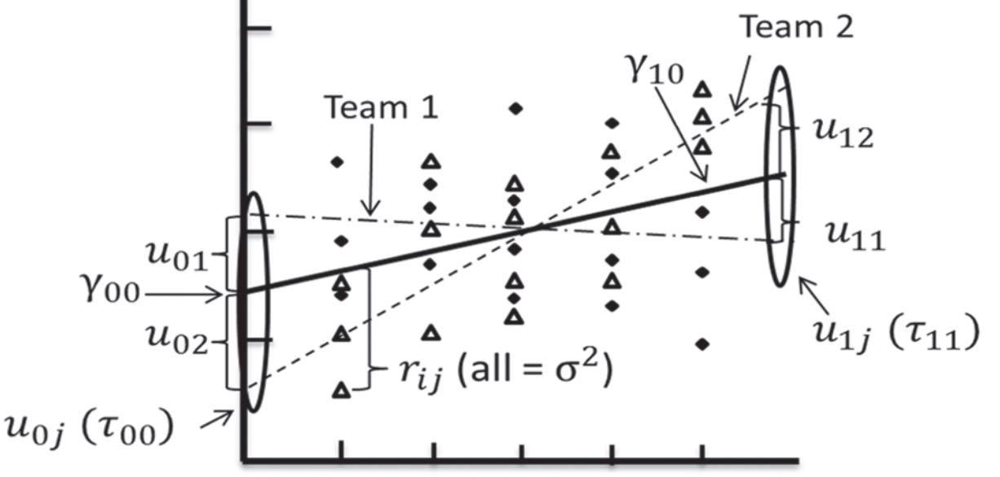
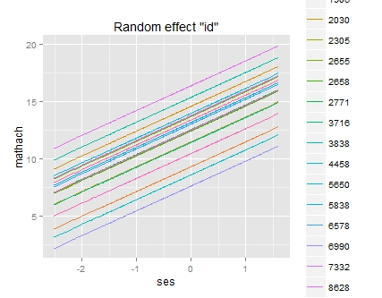
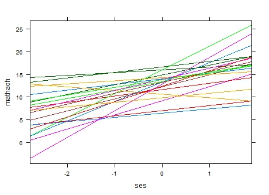
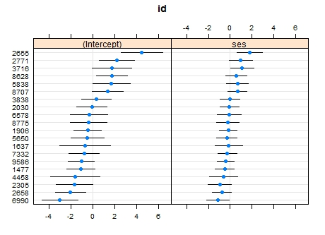

class: front


```{r setup, include=FALSE, cache = FALSE}
require("knitr")
opts_chunk$set(warning=FALSE,
             message=FALSE,
             echo=TRUE,
             cache = TRUE, fig.width=7, fig.height=5.2)
pacman::p_load(flipbookr, tidyverse)
```


```{r xaringanExtra, include=FALSE}
xaringanExtra::use_xaringan_extra(c("tile_view", "animate_css"))
xaringanExtra::use_scribble()
```

.pull-left-wide[
# Modelos multinivel]

.pull-right-narrow[]

## Unidades en contexto

----
.pull-left[

## Juan Carlos Castillo
## Sociología FACSO - UChile
## 1er Sem 2025
## [.yellow[multinivel-facso.netlify.app]](https://multinivel-facso.netlify.app/)
]
    

.pull-right-narrow[
.center[
.content-block-gray[
## Sesión 7: 
## **.yellow[Predicción de efectos aleatorios e interacción entre niveles]**]
]
]
---

layout: true
class: animated, fadeIn

---
class: roja right
# Contenidos


## .yellow[1- Resumen sesión anterior]

## 2- Predicción de efectos aleatorios

## 3- Interacción entre niveles


```{r echo=FALSE}
pacman::p_load(
haven,  # lectura de datos formato externo
car, # varias funciones, ej scatterplot
dplyr, # varios gestión de datos
stargazer, # tablas
corrplot, # correlaciones
ggplot2, # gráficos
lme4) # multilevel

mlm <-read_dta("http://www.stata-press.com/data/mlmus3/hsb.dta") # datos

mlm=mlm %>% select(
  minority,female,ses,mathach, # nivel 1
  size, sector,mnses,schoolid) %>%  # nivel 2
  as.data.frame()

agg_mlm=mlm %>% group_by(schoolid) %>%
  summarise_all(funs(mean)) %>% as.data.frame()
```
---
# Componentes de la varianza


---
# Componentes de la varianza




  
---
## Correlación intra clase: ICC

-   La correlación intra-clase ( $\rho$ ) indica qué porcentaje de la
    varianza de la variable dependiente se debe a pertenencia a unidades     de nivel 2

-   Descomposición de la varianza en modelo nulo=
    $Var\ y=\tau_{00} + \sigma^2$

-   Es decir, parte de la varianza se debe a los individuos ( $\sigma^2$ )
    y parte al grupo ( $\tau_{00}$ )

---
class: roja, middle, center

# Correlación intra-clase

## "Proporción de la varianza de la variable dependiente que se asocia a la pertenencia a unidades de nivel 2"


---
# librería lme4

-   función lmer (linear mixed effects)

-   forma general:

    -   `objeto <- lmer (depvar ~ predictor_1 + predictor_2 + predictor_n + (1 | cluster), data=data)`

    -   el objeto contiene la información de la estimación; para ver un resumen, `summary(objeto)`, y de manera más presentable,`screenreg(objeto)`


---
# Tipos de medidas de ajuste

1. Medidas relativas a la varianza de efectos aleatorios (tipo $R^2$)

2. Medidas de fit comparativo (deviance)

---
##  Ajuste por proporción de varianzas



---
## Bryck & Raudenbush R2 multinivel (1992)

- lógica general: calcular la diferencia entre componentes de la varianza entre los modelos estimados

- modelo base para la comparación: modelo nulo

- luego, a medida que se agregan modelos, se compara en que medida los componentes de la varianza van disminuyendo a medida que se agregan predictores


---
## Bryck & Raudenbush - R2 Nivel 2

.pull-left[

Para Nivel 2: 

<br>

$$\begin{split}
   R^2_{2B\&R}&=\frac{var_0(\mu_{0j})-var_f(\mu_{0j})}{var_0(\mu_{0j})} \\\\
    &=\frac{\tau_{00}(0)-\tau_{00}(f)}{\tau_{00}(0)}
    \end{split}$$
]

.pull-right[
<br>
Donde:

-   $0$ se refiere al modelo nulo

-   $f$ se refiere a un modelo posterior
]
---
## Bryck & Raudenbush - R2 Nivel 2
----
.medium[

  | $\sigma^2$   | $\tau_{00}$ |  $R^2_{L1}$ |  $R^2_{L2}$
--|----------|-----|-----|--
Modelo 0                   |  39.148   | 8.553 |   |
Modelo 1 (predict.ind.)    |  36.813   |  4.492 | 0.059 |   
Modelo 2 (predict.grup.)   |  39.161   |  2.314 |  0.00 |0.73 
]

Ej: $R^2_{L2}=(8.553-2.314)/8.553=6.239/8.553=0.73$

-   Recordar interpretación en relación a correlación intra-clase (para
    el caso de HSB data= 0.18): para el caso del R2 nivel 2 se está dando cuenta del 73% del 18%


---
## 2. Ajuste comparativo

### Deviance test

-   El test o estadístico de deviance **compara el ajuste** de dos modelos
    basado en la log verosimilitud de cada modelo

-   La hipótesis a contrastar es si predictores adicionales del modelo
    mejoran o no el ajuste

-   Asume que los **modelos son anidados**, es decir, que un modelo con
    menos predictores puede ser derivado del modelo mayor mediante la
    fijación de ciertos coeficientes como 0.

-   Deviance= $-2*LL$ (LL=Log Likelihood)

-   Deviance test= $deviance(anidado)-deviance(mayor)$


---
class: roja right
# Contenidos


## 1- Resumen sesión anterior

## .yellow[2- Predicción de efectos aleatorios]

## 3- Interacción entre niveles

---
# Modelo con coeficientes aleatorios

-   El modelo multinivel (con efectos aleatorios - random effects o mixed model) permite la estimación de coeficientes **.green[fijos]** y **.red[aleatorios]**

--

  -   **.green[Fijos]**: los mismos para todos los casos

  -   **.red[Aleatorios]**: distintos entre grupos, pero iguales dentro de cada grupo

---
# Modelo con coeficientes aleatorios (2)

- En general, se utiliza el termino .orange[efectos aleatorios] para el modelo nulo, y .blue[coeficientes aleatorios] para modelos con pendiente aleatoria.

-   En este curso, vamos a utilizar **“efecto”** para referirnos a las
    desviaciones de cada grupo, y “coeficientes” para la estimación
    total del grupo (coeficiente=efecto fijo + efecto aleatorio)

---
# Modelo con coeficienes aleatorios
<br>




---
# Modelo con coeficientes aleatorios

-   A partir de la estimación del modelo, es posible predecir el valor
    de los efectos aleatorios ( $\mu$ ) para cada unidad de nivel 2

-   Para el intercepto: $\mu_{01},\mu_{02},\mu_{03} ... \mu_{0N}$

-   Para la pendiente $\gamma_{10}$ : $\mu_{11},\mu_{12},\mu_{13} ... \mu_{1N}$

-   Para la pendiente $\gamma_{20}$ : $\mu_{21},\mu_{22},\mu_{23} ... \mu_{2N}$

---
# ¿Cómo se estima la varianza de los efectos aleatorios?

- el modelo multinivel no estima los coeficientes aleatorios, y a partir de ahí la varianza, sino que es al reves:

.center[
.content-box-red[
.red[El modelo multinivel estima los componentes de la varianza (por cada nivel), y a partir de esa estimación realiza una predicción de los efectos aleatorios]

]


Por lo tanto, el "intercepto" (y/o pendiente) para cada grupo es una .roja[estimación] posterior a la obtención de parámetros multinivel
]

---
# (Post) estimación de efectos aleatorios

.medium[
-   El valor de los efectos aleatorios se puede (pos)estimar mediante el
    método de **empirical bayes**, que produce las medias posteriores para cada efecto por unidad de nivel dos (ej:escuela, país)

-   **Bayesiano** quiere decir que utiliza conocimiento previo (prior) para la estimación, que se relaciona con los parámetros del modelo desde
    el cual se derivan las medias posteriores
    
-   El intercepto por grupo equivale a un promedio ponderado donde se
    consideran los componentes de la varianza, el N de la unidad 2 y el
    gran intercepto $\gamma_{00}$
    
  ]

---
## (Post) estimación de efectos aleatorios


-   $\hat{\beta}^{EB}_{0j}=\gamma_j\hat{\beta}_{0j}+(1-\gamma_j)\hat{\gamma}_{00}$

.small[
-   Donde:

    -   $\hat{\beta}^{EB}_{0j}$: estimador empirical bayes del
        intercepto para el grupo $j$

    -   $\gamma_j$ es un ponderador que se define como la confiabilidad
        del promedio del grupo, y que equivale a

        $$\gamma_j=\frac{\tau_{00}}{\tau_{00}+\sigma^2/n_j}$$

    -   $\hat{\beta}_{0j}$: es el promedio del grupo

    -   $\hat{\gamma}_{00}$: gran promedio (efecto fijo intercepto)
]
---
## (Post) estimación de efectos aleatorios

.medium[
-   En esta estimación subyace la idea del **“shrinkage”** (reducción)

-   Los coeficientes de regresión OLS de cada grupo son reducidos en la dirección del coeficiente promedio para todos los grupos

--

-   El grado de “reducción” depende del tamaño del grupo y de la
    distancia entre el promedio del grupo y el promedio general, es
    decir, de la *confiabilidad* del promedio del grupo

-   **Grupos más pequeños y que distan más del promedio serán "reducidos" de mayor manera hacia el promedio del grupo**
]
---
## Ej.Estimación de intercepto aleatorio (medias posteriores)

.small[

.pull-left[
```{r, echo=TRUE}
library(lme4)
mlm = read_dta("http://www.stata-press.com/data/mlmus3/hsb.dta")
results_0 <-lmer(mathach ~ 1 +  (1 | schoolid), data=mlm) 

```
]


.pull-right[

```{r}
sjPlot::tab_model(results_0)
```

]
]

---
.medium[

.pull-left[
```{r}
coef(results_0) 
```
]

.pull-right[
```{r}
ranef(results_0) 
```
]


]


---
# Ej: escuela 1224

- con `ranef` obtenemos su efecto aleatorio $\mu$ = -2.66, que equivale a su desviación del gran intercepto $\gamma_{00}$

- $\gamma_{00}$ = 12.64

- el valor predicho para el intercepto de la escuela 1224 es $\gamma{00} + \mu_j$

- 12.64 + (-2.66) = 9.98 , que es el valor que se obtiene para esta escuela con la función `coef`


---
## Coeficientes de regresión - predicción con intercepto aleatorio + efectos fijos predictores
.small[
```{r}
results_4 = lmer(mathach ~ 1 + ses + female + mnses + sector + (1 | schoolid), data=mlm)
coef(results_4) # coef: comando que muestra coeficientes por grupo $id
```
]


---
## Coeficientes regresión - predicción con pendiente aleatoria
.small[
```{r}
results_5 = lmer(mathach ~ 1 + ses + female + mnses + sector + (1 + ses | schoolid), data=mlm)
coef(results_5) # coef: comando que muestra coeficientes por grupo $id
```
]

---
.medium[
```{r}
ranef(results_5)
```
]

---
## Plots: intercepto aleatorio


---
## Plots: pendiente aleatoria



---
## Plots



---
# Resumen predicción efectos aleatorios

Usos

-   Pedagógico: para entender el sentido de la estimación con modelos
    mixtos (efectos fijos y aleatorios)

-   Diagnóstico: para analizar y visualizar la variación de unidades de
    nivel dos a nivel de intercepto y pendiente(s)

-   Informativo: para conocer los resultados de las unidades de nivel 2
    y sus variaciones

-   Contraste de hipótesis de investigación


---
class: roja right
# Contenidos


## 1- Resumen sesión anterior

## 2- Interacción entre niveles

## .yellow[3- Interacción entre niveles]
---
# Interacciones entre niveles: bases

¿Qué es una interacción en un modelo de regresión?

.pull-left[
.content-box-red[
-> en términos de .red[especificación]: un término multiplicativo entre predictores (ej: edad x sexo) que se suma a la ecuación 
]
]

.pull-right[
.content-box-green[
-> en términos de .red[hipótesis]: test de una relación de .red[moderación].
]
]
---
# Ejemplo:

- hipótesis 1: mujeres se identifican más con la izquierda que los hombres

- hipótesis 2: a medida que aumenta la edad, aumenta la identificación con la derecha

- hipótesis de interacción: el efecto de la edad en la identificación con la derecha es **moderado** por el sexo 

---
class: middle center


Si la interacción es significativa quiere decir que las **diferencias entre pendientes** son distintas de cero

---
# Interacción en regresión OLS (un nivel)

$$
y(izq-der)_i = \beta_0 + \beta_1 \cdot \text{sexo}_i + \beta_2 \cdot \text{edad}_i + \beta_3 \cdot (\text{sexo}_i \cdot \text{edad}_i) + \varepsilon_i
$$
--

donde,

.medium[
- $y(izq-dir)_i$: posición ideológica izquierda-derecha del individuo $i$.
- $\beta_0$: intercepto del modelo.
- $\text{sexo}_i$: variable indicadora del sexo del individuo $i$ (por ejemplo, $0 = \text{mujer},\ 1 = \text{hombre}$).
- $\text{edad}_i$: edad del individuo $i$.
- $\text{sexo}_i \cdot \text{edad}_i$: interacción entre sexo y edad.
- $\beta_1$, $\beta_2$, $\beta_3$: coeficientes de regresión que indican el efecto de cada variable sobre $y_i$.
- $\varepsilon_i$: término de error aleatorio para el individuo $i$.
]

---
# Modelo con pendiente aleatoria


---
# Pendiente aleatoria


---
# Interacción entre niveles


---
# Interacciones entre niveles en MLM

.pull-left[

- Modelo multinivel con predictores individuales y contextuales

.center[]
]
--

.pull-right[
- 	Modelo multinivel con interacción entre niveles

.center[

.red[¿Existen cambios en la relación entre x e y en función de una variable Z?]
]
]

---
# Interacciones entre niveles en MLM

- la variable nivel 2 (Z) modera la relación entre x e y

- se especifica multiplicando x*Z:
.medium[

```{r, eval=FALSE}
reg_mlm <-lmer (y ~ 1 + x + Z  # efectos principales
                  + x*Z  # interacción
                  + (1 + x | cluster), # pendiente aleatoria
                  data=datosmlm)
```
]

.center[
.red[Interpretación: por cada unidad de aumento en Z, la relación entre x e y se modifica en $\gamma_{11}$ (coeficiente de interacción)
]]
---
# Interacciones entre niveles y pendiente aleatoria

- al .red[aleatorizar una pendiente] se puede evaluar mediante un test de devianza si la varianza de la pendiente es significativa o no

--

- si hay evidencia de variación, .red[se procede con la interacción entre niveles]

--


- si la .red[interacción es significativa], entonces parte de la varianza de la pendiente se asocia al predictor de nivel 2

--

- y por lo tanto, el efecto aleatorio asociado a la pendiente .red[disminuye significativamente] en el modelo con interacción

---
class: inverse, middle, center

# Interacciones entre niveles

## Ejemplo 1 HSB data

¿En qué medida el carácter público o privado de la escuela afectan la relación entre nivel socioeconómico y desempeño en matemáticas?

---
## Datos e inspección de variables

```{r}
pacman::p_load(lme4,sjPlot,haven, texreg, summarytools)
mlm = read_dta("http://www.stata-press.com/data/mlmus3/hsb.dta")
```

### Variables principales:

- y = mathach, puntaje en matemática

- x = ses, nivel socioeconómico individual

- Z = sector, tipo de escuela (pública - privada)

---
- Selección de variables

```{r}
mlm_int <- mlm %>% select(mathach, 
                          ses, 
                          sector, 
                          schoolid) %>% 
                   as.data.frame()
```

---
# Exploración inicial
.small[
```{r}
sjmisc::descr(mlm_int,show = c("label","range", "mean", "sd", "NA.prc", "n")) %>% kable(.,digits =2,"markdown")
```
]

---
# Descriptivos con gtsummary

- vamos a probar la función .red[`tbl_summary`] de la librería .blue[`gtsummary`] para descriptivos
.medium[
  - ventajas:

      - output resumido
      - customizable
      - permite distinguir en una misma tabla entre variables categóricas y continuas
    


  - desventaja:

      - sintaxis algo críptica, requiere costumbre ... pero una vez que se establecen opciones básicas solo se reemplazan la(s) variable(s)
  ]

---
# Descriptivos nivel 1

.medium[
.pull-left[
```{r results='hide'}
pacman::p_load(gtsummary)
mlm_int %>% select(mathach,ses) %>% 
  tbl_summary(.,
    statistic = list(all_continuous() ~ "{mean} ({sd}) [{min}, {max}]",
                     all_categorical() ~ "{n} / {N} ({p}%)"),
     type   = all_categorical() ~ "categorical",
     digits = all_continuous() ~ 1,   ) %>% 
  modify_header(label = "**Variable**")
```
]
]

.pull-right[
<br>
```{r echo=FALSE}
pacman::p_load(gtsummary)
mlm_int %>% select(mathach,ses) %>% 
  tbl_summary(.,
    statistic = list(all_continuous() ~ "{mean} ({sd}) [{min}, {max}]",
                     all_categorical() ~ "{n} / {N} ({p}%)"),
     type   = all_categorical() ~ "categorical",
     digits = all_continuous() ~ 1,   ) %>% 
  modify_header(label = "**Variable**")  %>% 
  as_kable_extra(booktabs = TRUE) %>%
  kableExtra::kable_styling(font_size = 30)
```
]


---
## Descriptivos nivel 2 con tbl_summary (gtsummary)

```{r results='hide'}
mlm_int %>% group_by(schoolid) %>%  summarise_all(funs(mean)) %>%
  select(sector) %>% 
  sjlabelled::set_labels(sector,labels=c ("Publico"=0,
                      "Privado"=1)) %>%   
  sjlabelled::as_character(sector) %>% 
  tbl_summary(.,
    statistic = list(all_continuous() ~ "{mean} ({sd}) [{min}, {max}]",
                     all_categorical() ~ "{n} ({p}%)"),
     type   = all_categorical() ~ "categorical",
     digits = all_continuous() ~ 1,   ) %>% 
  modify_header(label = "**Variable**")
```
---
## Descriptivos nivel 2 con tbl_summary (gtsummary)

<br>
```{r echo=FALSE}
mlm_int %>% group_by(schoolid) %>%  summarise_all(funs(mean)) %>%
  select(sector) %>% 
  sjlabelled::set_labels(sector,labels=c ("Publico"=0,
                      "Privado"=1)) %>%   
  sjlabelled::as_character(sector) %>% 
  tbl_summary(.,
    statistic = list(all_continuous() ~ "{mean} ({sd}) [{min}, {max}]",
                     all_categorical() ~ "{n} ({p}%)"),
     type   = all_categorical() ~ "categorical",
     digits = all_continuous() ~ 1,   ) %>% 
  modify_header(label = "**Variable**") %>% 
  as_kable_extra(booktabs = TRUE) %>%
  kableExtra::kable_styling(font_size = 30)
```

---
## 1. Evaluar ajuste modelo pendiente aleatoria


```{r}
# Modelo con pendiente fija

reg_mlm_a = lmer(mathach ~ 1 + ses + sector + 
                   (1 | schoolid), data=mlm_int)


# Modelo con pendiente aleatoria
reg_mlm_b = lmer(mathach ~ 1 + ses + sector + 
                    (1 + ses | schoolid), data=mlm_int)

```

---

.small[
```{r, results='asis', echo=FALSE}
htmlreg(c(reg_mlm_a,reg_mlm_b), doctype = FALSE)

```
]

---
## Devianza

.small[
```{r}
anova(reg_mlm_a,reg_mlm_b)
```
]

-> Modelo con pendiente aleatoria es distinto al modelo sin pendiente aleatoria  (p<0.05)

---
# Estimación de modelo con interacción entre niveles

```{r}
reg_mlm_c = lmer(mathach ~ 1 + ses + sector +
                   ses*sector +
                   (1 + ses | schoolid), data=mlm)

```

---

.pull-left-wide[
.small[
```{r, results='asis', echo=FALSE}
htmlreg(c(reg_mlm_a,reg_mlm_b,reg_mlm_c), doctype = FALSE)
```
]
]

.pull-right-narrow[
<br><br><br>
Por cada unidad de aumento en sector, el efecto de ses en mathach cambia en -1.31

Como sector=1 (dummy), entonces la pendiente de ses para sector=1 es 2.13-1.31=0.82

]
---

.pull-left-narrow[
```{r, eval=FALSE}
plot_model(
  reg_mlm_c, 
  type = "int")

```
]

.pull-right-wide[
```{r, fig.width=10, fig.height=8, echo=FALSE}
plot_model(
  reg_mlm_c, 
  type = "int")

```
]

---
class: inverse
## ¿Qué significa este resultado?

- recordemos que la interacción es una diferencia de **pendientes**

- la pendiente de ses en mathach es distinta (de cero) segun sector

- recordemos que privado=1, y la interacción es negativa. Es decir, el sector correspondiente a 1 (privado) tiene una pendiente mas negativa (o menos positiva) que el sector 0 (público)

---
class: inverse
## ¿Qué significa este resultado?

Entonces ...

- la relación entre el nivel socioeconómico de los estudiantes y rendimiento en matemáticas es menor en colegios privados (1)

- efecto "ecualizador" de escuelas privadas?

---
class: inverse
## Resumen

- la interacción entre niveles en modelos multinivel es una extensión de interacciones en modelos de regresión OLS

- en el caso mutinivel, la interacción entre niveles es la que especifica entre una variable de nivel 1 y una de nivel 2

- en interacción entre niveles, la variable de nivel 2 busca dar cuenta de la variabilidad de la pendiente de la variable de nivel 1


---
class: middle

Revisar visualización:

[http://mfviz.com/hierarchical-models/](http://mfviz.com/hierarchical-models/)

---
class: front
.pull-left-wide[
# Modelos multinivel
]

.pull-right-narrow[]

## Unidades en contexto

----
.pull-left[

## Juan Carlos Castillo
## Sociología FACSO - UChile
## 1er Sem 2025 
## [.yellow[multinivel-facso.netlify.app]](https://multinivel-facso.netlify.app)
]
