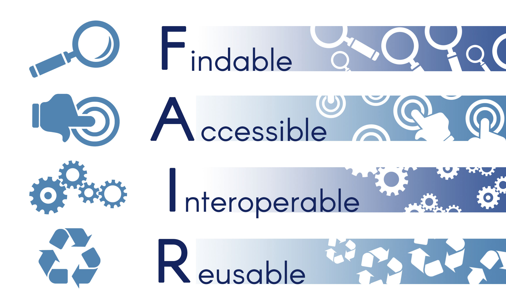
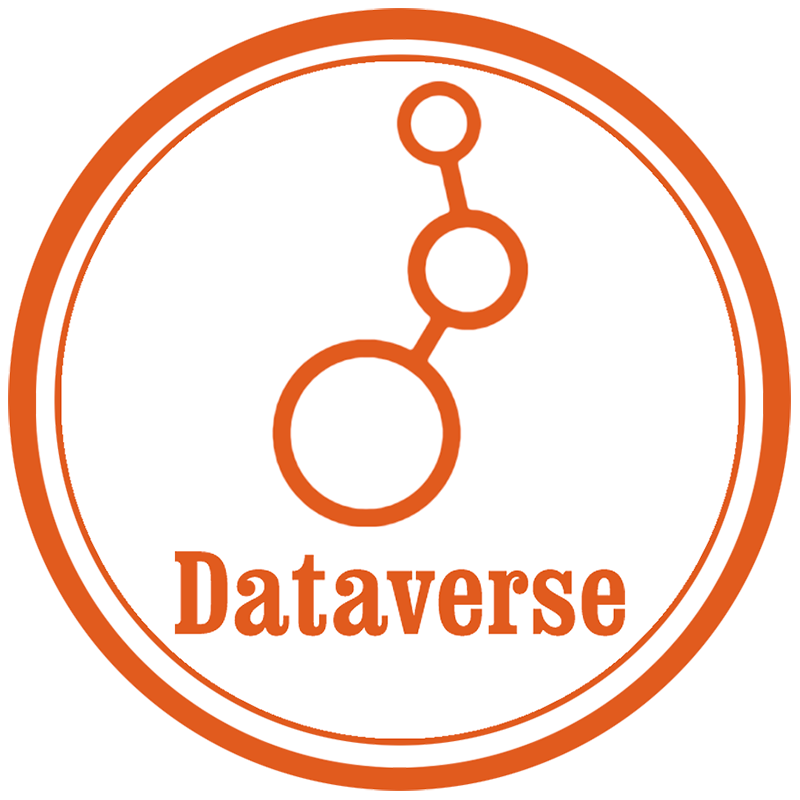
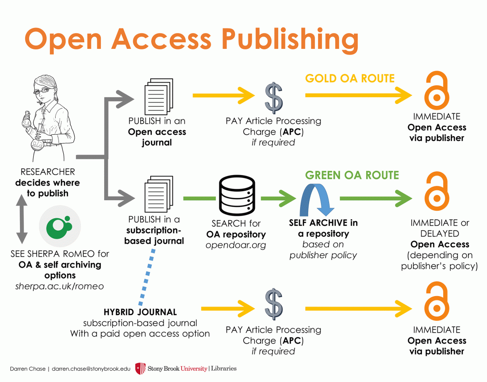
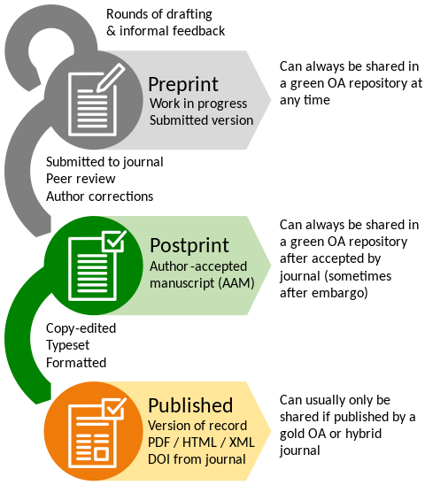
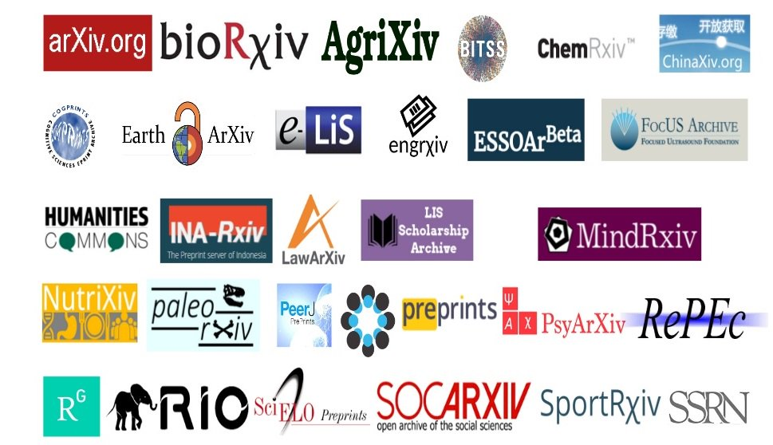
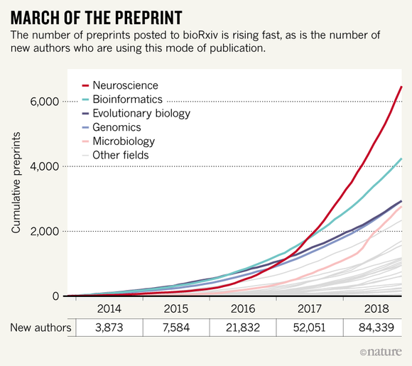
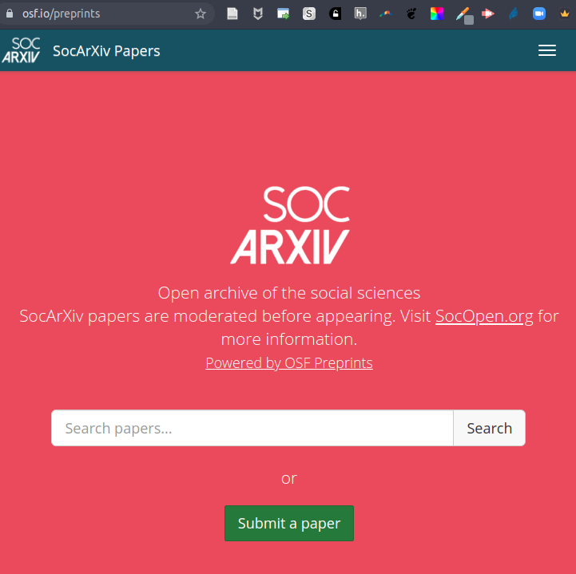
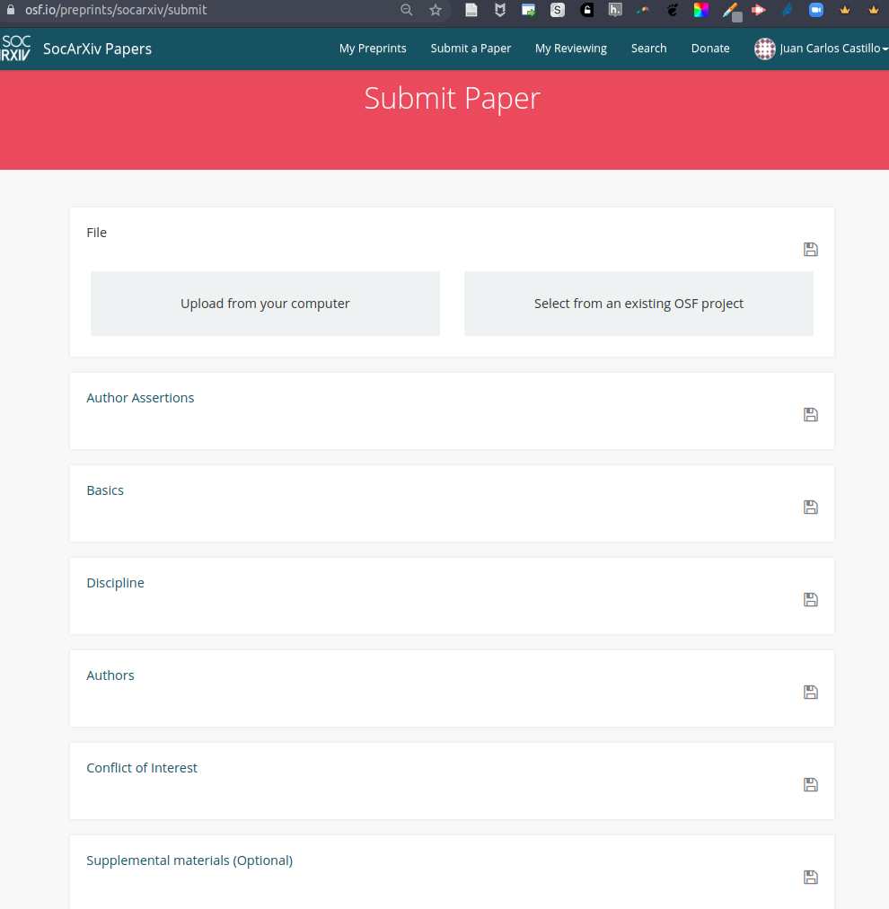

# {.hide-logo data-background-color="#9B2626"}

::::: columns
::: {.column width="33%"}

{width="100%" fig-align="right"}
:::

:::{.column width="2%"}

:::

::: {.column style="width: 65%; font-size: 22px; text-align: right; margin: 0 auto;"}

###

Ciencia Social Abierta

----
Sesión 8: Datos abiertos y publicaciones abiertas

 

Juan Carlos Castillo & Tomás Urzúa

Sociología FACSO UChile

 

Primer Semestre 2026

[cienciasocialabierta.netlify.app](https://cienciasocialabierta.netlify.app/)

:::
:::::

# Objetivos de aprendizaje

Al final de esta clase podrán:

:::{.incremental .highlight-last}
- Explicar qué son los principios FAIR y por qué importan para compartir datos.
- Identificar plataformas para publicar datos de investigación social (Dataverse, Zenodo y repositorio UChile).
- Comparar rutas de publicación abierta y discutir el problema de los APCs.
- Comprender el rol de los preprints, con énfasis en SocArXiv.
:::

# Contenidos {.indice data-background-color="#9B2626" style="text-align: right;"}

 

[1. Puente con la sesión anterior]{style="color: #f8fafb;"} 
[2. Datos abiertos y principios FAIR]{style="color: #f8fafb;"} 
[3. Dónde publicar datos]{style="color: #f8fafb;"} 
[4. Publicaciones abiertas: rutas y APC]{style="color: #f8fafb;"} 
[5. Preprints y SocArXiv]{style="color: #f8fafb;"}

# Contenidos {.indice data-background-color="#9B2626" style="text-align: right;"}

 

[1. Puente con la sesión anterior]{style="color: #ffffff;"} 
[2. Datos abiertos y principios FAIR]{style="color: #686868;"} 
[3. Dónde publicar datos]{style="color: #686868;"} 
[4. Publicaciones abiertas: rutas y APC]{style="color: #686868;"} 
[5. Preprints y SocArXiv]{style="color: #686868;"}

## Resumen rápido

:::{.incremental .highlight-last}
- En la sesión 7 vimos preregistro y separación entre análisis de tipo confirmatorio (o de hipótesis) y exploratorio.
- Recordar que lo que se pre-registra son las **hipótesis de investigación**
- Hoy avanzamos desde la transparencia del plan hacia la apertura de productos.
- Productos clave: datos, código y publicaciones.
:::

## Pregunta guia de hoy

Si nuestro artículo es abierto, pero los datos y decisiones de análisis no lo son, ¿cuán abierta es realmente la investigación?

# Contenidos {.indice data-background-color="#9B2626" style="text-align: right;"}

 

[1. Puente con la sesión anterior]{style="color: #686868;"} 
[2. Datos abiertos y principios FAIR]{style="color: #ffffff;"} 
[3. Dónde publicar datos]{style="color: #686868;"} 
[4. Publicaciones abiertas: rutas y APC]{style="color: #686868;"} 
[5. Preprints y SocArXiv]{style="color: #686868;"}

## ¿Qué entendemos por datos abiertos?

:::{.incremental .highlight-last}
- Datos disponibles para uso y reutilización, bajo condiciones explícitas.
- No significa ignorar ética o privacidad: requiere anonimización y reglas claras.
- Abiertos no es solo "subir un archivo": importa calidad documental.
:::

## FAIR no es sinónimo de "gratis"

FAIR significa que los datos deben ser fáciles de encontrar, acceder, interoperar y reutilizar.

{width="200%" fig-align="center"}

:::{.incremental .highlight-last}
- **F (Findable):** identificables y encontrables.
- **A (Accessible):** acceso por protocolos claros.
- **I (Interoperable):** formatos y metadatos compatibles.
- **R (Reusable):** documentación y licencias que permitan reutilizar.
:::

## F de Findable

:::{.incremental .highlight-last}
- Asignar identificadores persistentes (DOI/Handle).
- Completar metadatos descriptivos (autor, fecha, variables, cobertura).
- Usar títulos y palabras clave significativas.
:::

## A de Accessible

:::{.incremental .highlight-last}
- Definir niveles de acceso (abierto, restringido, bajo solicitud).
- Mantener metadatos visibles aunque el archivo tenga restricción.
- Explicar claramente cómo solicitar acceso cuando aplique.
:::

## I de Interoperable

:::{.incremental .highlight-last}
- Preferir formatos no propietarios o ampliamente soportados (csv, txt, json).
- Incluir diccionario de variables y codificación estandarizada.
- Facilitar integración con otros datasets y software.
:::

## R de Reusable

:::{.incremental .highlight-last}
- Licencia explícita (por ejemplo, Creative Commons).
- Describir el proceso de producción/limpieza de los datos.
- Explicitar límites de uso, calidad y contexto del levantamiento.
:::

## Checklist mínimo para compartir datos

1. Base de datos limpia y versión final.
2. Diccionario de variables y códigos de valores.
3. README con contexto, fuentes y decisiones de procesamiento.
4. Licencia de uso.
5. Archivo de replicación (scripts de limpieza/análisis) cuando sea posible.

# Contenidos {.indice data-background-color="#9B2626" style="text-align: right;"}

 

[1. Puente con la sesión anterior]{style="color: #686868;"} 
[2. Datos abiertos y principios FAIR]{style="color: #686868;"} 
[3. Dónde publicar datos]{style="color: #ffffff;"} 
[4. Publicaciones abiertas: rutas y APC]{style="color: #686868;"} 
[5. Preprints y SocArXiv]{style="color: #686868;"}

## Opción 1: Dataverse

::::: columns
::: {.column width="58%"}

:::{.incremental .highlight-last}
- Repositorio especializado en datos de investigación.
- Fuerte en metadatos, versionado y citación de datasets.
- Muy usado en ciencias sociales y políticas de datos institucionales.
:::

[dataverse.org](https://dataverse.org/)

:::

::: {.column width="42%"}

{width="95%" fig-align="center"}

:::
:::::

## Opción 2: Zenodo

::::: columns
::: {.column width="58%"}

:::{.incremental .highlight-last}
- Repositorio multidisciplinario respaldado por CERN/OpenAIRE.
- Entrega DOI de forma automática.
- Permite publicar datos, código, informes y versiones conectadas con GitHub.
:::

[zenodo.org](https://zenodo.org/)

:::

::: {.column width="42%"}

:::
:::::

## Opción 3: Repositorio de la Universidad de Chile

:::{.incremental .highlight-last}
- Ventaja institucional: visibilidad local y resguardo de largo plazo.
- Integrable con políticas de investigación y bibliotecas universitarias.
- Útil para resultados docentes, tesis y productos ligados a la universidad.
:::

[https://datos.uchile.cl/](https://datos.uchile.cl/)

## ¿Cómo elegir repositorio?

:::{.incremental .highlight-last}
- Tipo de datos y audiencia objetivo.
- Requisitos de revista, fondo o institución.
- Nivel de control de versiones y citación.
- Política de preservación y sostenibilidad del repositorio.
:::

# Contenidos {.indice data-background-color="#9B2626" style="text-align: right;"}

 

[1. Puente con la sesión anterior]{style="color: #686868;"} 
[2. Datos abiertos y principios FAIR]{style="color: #686868;"} 
[3. Dónde publicar datos]{style="color: #686868;"} 
[4. Publicaciones abiertas: rutas y APC]{style="color: #ffffff;"} 
[5. Preprints y SocArXiv]{style="color: #686868;"}

## Rutas de acceso abierto

{fig-alt="Rutas de acceso abierto" width="74%" fig-align="center"}

## Ruta verde, dorada y diamante

:::{.incremental .highlight-last}
- **Ruta verde:** autoarchivo en repositorio (preprint o postprint), con o sin embargo.
- **Ruta dorada:** artículo abierto en revista OA, frecuentemente con APC.
- **Ruta diamante:** revista OA sin cobro para autores ni lectores (financiamiento institucional/asociativo).
:::

## Recordando el flujo de publicación

{fig-alt="Preprint, postprint y versión publicada" width="88%" fig-align="center"}

## APCs: ¿qué son?

APC = *Article Processing Charge*: cobro por publicar en acceso abierto en algunas revistas.

:::{.incremental .highlight-last}
- Puede ir desde cientos a miles de dólares por artículo.
- No toda revista OA cobra APC.
- En revistas híbridas puede coexistir suscripción + cobro a autores.
:::

## Problemas asociados a APCs

:::{.incremental .highlight-last}
- Desigualdad de acceso a publicar entre instituciones y países.
- Dependencia de fondos de investigación para poder difundir resultados.
- Riesgo de incentivos comerciales por sobre calidad editorial.
- Puede desplazar recursos desde investigación hacia costos de publicación.
:::

## ¿Qué alternativas existen?

:::{.incremental .highlight-last}
- Priorizar revistas diamante o con exenciones claras.
- Usar ruta verde de autoarchivo cuando la revista lo permita.
- Revisar políticas editoriales en [SHERPA/RoMEO](https://v2.sherpa.ac.uk/romeo/).
- Integrar preprints para acceso temprano mientras avanza revisión.
:::

# Contenidos {.indice data-background-color="#9B2626" style="text-align: right;"}

 

[1. Puente con la sesión anterior]{style="color: #686868;"} 
[2. Datos abiertos y principios FAIR]{style="color: #686868;"} 
[3. Dónde publicar datos]{style="color: #686868;"} 
[4. Publicaciones abiertas: rutas y APC]{style="color: #686868;"} 
[5. Preprints y SocArXiv]{style="color: #ffffff;"}

## ¿Qué es un preprint?

:::{.incremental .highlight-last}
- Versión pública de un manuscrito antes (o durante) revisión por pares.
- Permite circulación temprana de resultados y retroalimentación.
- Hace citable el trabajo mediante identificador persistente.
:::

{width="65%" fig-align="center"}

## Tendencia de crecimiento de preprints

{width="70%" fig-align="center"}

## SocArXiv en foco

::::: columns
::: {.column width="42%"}

{width="100%"}

[socarxiv.org](https://osf.io/preprints/socarxiv)

:::

::: {.column width="58%"}

:::{.incremental .highlight-last}
- Servidor de preprints para ciencias sociales, vinculado a OSF.
- Proceso de moderación editorial básica.
- Asigna DOI y mejora visibilidad/citación temprana.
- Compatible con una estrategia más amplia de ciencia abierta.
:::

:::
:::::

## Flujo breve para publicar en SocArXiv

1. Preparar manuscrito y metadatos (título, autores, resumen, palabras clave).
2. Verificar política de la revista objetivo sobre preprints.
3. Subir documento en SocArXiv y completar licencia.
4. Compartir enlace para retroalimentación temprana.
5. Reportar versión posterior cuando el artículo avance a revista.

## SocArXiv: interfaz de envio

{width="80%" fig-align="center"}

## SocArXiv: confirmación y metadatos

{width="80%" fig-align="center"}

## Referencias recomendadas

- [FAIR Principles (GO FAIR)](https://www.go-fair.org/fair-principles/)
- [Dataverse Project](https://dataverse.org/)
- [Zenodo](https://zenodo.org/)
- [Sherpa Romeo](https://v2.sherpa.ac.uk/romeo/)
- [SocArXiv](https://osf.io/preprints/socarxiv)

## Cierre

:::{.incremental .highlight-last}
- Abrir datos y abrir publicaciones son dimensiones complementarias.
- FAIR ayuda a que los datos sean útiles, no solo visibles.
- Discutir APCs y rutas de acceso es parte de una estrategia ética de comunicación científica.
- Los preprints aceleran circulación y debate, especialmente vía SocArXiv en ciencias sociales.
:::

# {.hide-logo data-background-color="#9B2626"}

::::: columns
::: {.column width="35%"}

 

{width="100%" fig-align="right"}
:::

:::{.column width="2%"}

:::

::: {.column width="55%" style="font-size: 25px; text-align: right; margin: 0 auto;"}

 

### 

Ciencia Social Abierta

----

 

Juan Carlos Castillo & Tomás Urzúa

Sociología FACSO UChile

 

Primer Semestre 2026

[cienciasocialabierta.netlify.app](https://cienciasocialabierta.netlify.app/)

:::
:::::