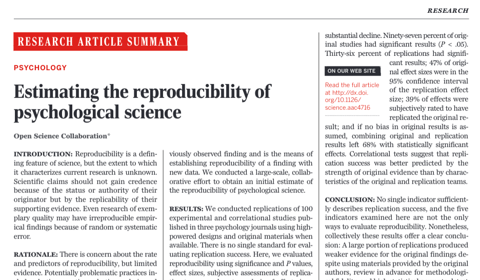
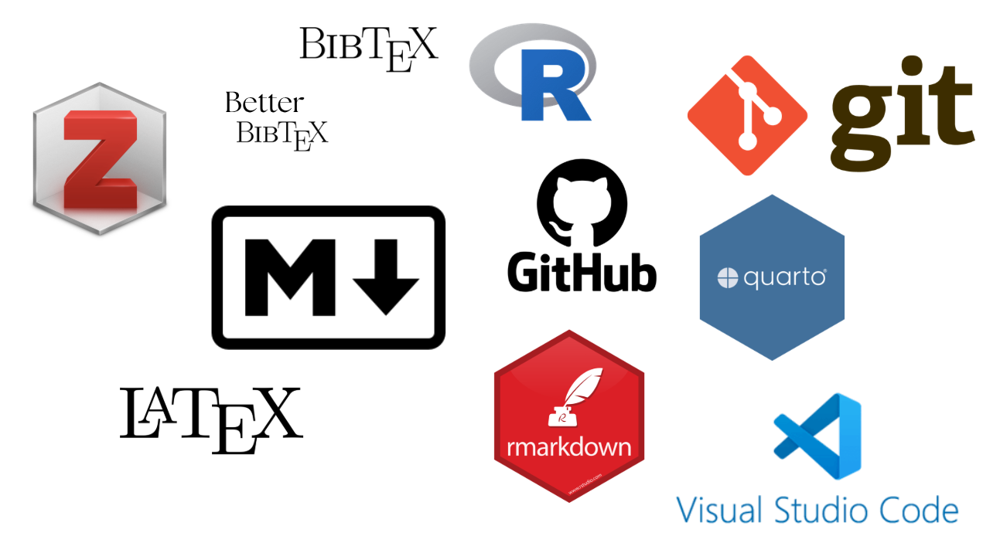

# {.hide-logo data-background-color="#9B2626"}

::::: columns
::: {.column width="33%"}

{width="100%" fig-align="right"}
:::

:::{.column width="2%"}

:::

::: {.column style="width: 65%; font-size: 22px; text-align: right; margin: 0 auto;"}

###

Ciencia Social Abierta

----
Sesión 10: Síntesis y cierre del curso

 

Juan Carlos Castillo & Tomás Urzúa

Sociología FACSO UChile

 

Primer Semestre 2026

[cienciasocialabierta.netlify.app](https://cienciasocialabierta.netlify.app/)

:::
:::::

# {background-color="#9B2626"}

### [Esta sesión]{style="color: #ffffff;"}

 

[1. Contexto retorno a clases]{style="color: #f9e98a;"}

 

[2. Resumen de contenidos]{style="color: #8c8c8c;"} 

 

[3. Repaso Quarto Book]{style="color: #8c8c8c;"} 

 

[4. Dudas trabajo final]{style="color: #8c8c8c;"}

# {background-color="#9B2626"}

### [Esta sesión]{style="color: #ffffff;"}

 

[1. Contexto retorno a clases]{style="color: #8c8c8c;"}

 

[2. Resumen de contenidos]{style="color: #f9e98a;"} 

 

[3. Repaso Quarto Book]{style="color: #8c8c8c;"} 

 

[4. Dudas trabajo final]{style="color: #8c8c8c;"}

#

:::: columns
::: {.column width="70%"}
[¿Qué conceptos asocian a ciencia abierta?]{style="font-size: 60px; color: #9B2626;"}

[Menti code: 5688 4740]{style="font-size: 40px;"}
:::
::: {.column width="30%"}

:::
::::

##

<iframe sandbox='allow-popups allow-scripts allow-same-origin allow-presentation' allowfullscreen='true' allowtransparency='true' frameborder='0' height='315' src='https://www.mentimeter.com/app/presentation/al5ch4f3ygrvo6a9usgu2hj24hnd6hon/embed' style='position: absolute; top: 0; left: 0; width: 100%; height: 100%;' width='420'></iframe>

# Resumen de contenidos {background-color="#212525"}

## 

### Diagnóstico actual de la producción del conocimiento científico

 

:::{.incremental .highlight-last}
- [Transparencia]{style="font-size: 38px;"}

 

- [Reproducibilidad]{style="font-size: 38px;"}

 

- [Acceso]{style="font-size: 38px;"}
:::

## Transparencia

:::: columns
::: {.column width="50%" .incremental}
- Diseño

  - Adaptación de hipótesis post análisis de resultados

  - HARKing y P-hacking como malas prácticas de investigación
:::
::: {.column width="50%" .incremental}
- Datos 

  - Disponibilidad de los datos

  - Carencia de documentación para comprender la información
:::
::::

## Reproducibilidad

A partir los problemas que se presentan en las etapas de diseño, recolección y análisis, un número importante de las investigaciones en ciencias sociales tienden a no ser reproducibles (40% aproximadamente)

## Acceso

:::{.incremental .highlight-last}
- El ecosistema de publicación científica se organiza en base a la privatización del conocimiento

- Bajo este contexto, la apertura no resultaría rentable para las revistas y las compañías que administran la divulgación de conocimiento.

- ¿Para quién sí, entonces?

  - Investigadores

  - Encargados de políticas públicas

  - Ciudadanía en general
:::

# Alternativas {background-color="#212525"}

## Texto plano (markdown)

:::{.incremental .highlight-last}
- Ofrece un marco de trabajo alterno al de los procesadores tradicionales de texto (Microsoft)

- Es independiente de plataformas específicas

- Permite **combinar texto y código** en un mismo documento

{width="30%"}
:::

## Documentos dinámicos (Quarto)

:::: columns
::: {.column width="50%"}

:::
::: {.column width="50%" .incremental .highlight-last}
- Integra la naturaleza de markdown

- Alto nivel de personalización de los documentos

- Distintos formatos de salida gracias a [Pandoc](https://pandoc.org/) (PDF, HTML, entre otros)

- Soporta programas externos para la publicación científica
:::
::::

## Gestión de referencias

:::: columns
::: {.column width="60%" .incremental .highlight-last}
- Almacenamiento de referencias para su organización y exportación (.bib)

- Posibilidad de gestionar la bilbiografía a nivel individual y grupal 

- Automatización en documentos dinámicos: reducción considerable de tiempo de trabajo en el apartado de referencias
:::
::: {.column width="40%"}

:::
::::

## Control de versiones

:::: columns
::: {.column width="50%" .incremental .highlight-last}
- Historial de cambios detallado: quién, cuándo y qué

- Organización de proyectos: repositorios

- Trabajo colaborativo y abierto

- Vinculación de repositorios en línea con unidades locales
:::
::: {.column width="50%"}

:::
::::

## Estructura de archivos (IPO)

:::: columns
::: {.column width="60%" .incremental .highlight-last}
- Estructura de carpetas para el orden de información

  - Input, Processing, Output

- Facilitación del flujo de trabajo

- Ayuda a comprender el entorno de trabajo a personas externas al pryecto

:::
::: {.column width="40%"}

:::
::::

## Publicación web de resultados

:::: columns
::: {.column width="40%"}

:::
:::{.column width="60%" .incremental .highlight-last}
- Mayor alcance en la difusión de la investigación

- Acceso público sencillo 

- Permite reproducibilidad de los resultados

- Publicación en distintas plataformas (GitHub Pages/Netlify)
:::
::::

## Datos abiertos

:::: columns
::: {.column width="25%"}

:::
::: {.column width="75%" .incremental .highlight-last}
- Disponibilidad de datos mediante reglas que facilitan su uso (FAIR)

 

- Existen plataformas para alojar datos de manera pública (Dataverse, Zenodo, etc)
:::
::::

## Publicaciones abiertas

:::: columns
::: {.column width="60%" .incremental .highlight-last}
- Publicación de momentos de la investigación orientado a la apertura (SocArXiv)

  - Pre-registro: transparencia de las hipótesis ex ante del análisis

  - Pre-print: versión de un manuscrito previo a la revisión por pares
:::
::: {.column width="40%"}

:::
::::

##

# Ideas centrales

:::{.incremental .highlight-last}
- La apertura de la investigación como concepto central

  - Abrir la ciencia no significa solo “mostrar resultados”, sino también transparentar cómo se producen, documentan y circulan los insumos de investigación

- Los objetivos del curso estuvieron orientados a que aprendieran cómo incorporar la apertura en sus investigaciones 

- Tanto las herramientas como los debates en torno a la apertura de la investigación se actualizan constantemente: aprendizaje continuo
:::

# {background-color="#9B2626"}

### [Esta sesión]{style="color: #ffffff;"}

 

[1. Contexto retorno a clases]{style="color: #8c8c8c;"}

 

[2. Resumen de contenidos]{style="color: #8c8c8c;"} 

 

[3. Repaso Quarto Book]{style="color: #f9e98a;"} 

 

[4. Dudas trabajo final]{style="color: #8c8c8c;"}

# Práctico 7

-> al [práctico 7](https://cienciasocialabierta.netlify.app/assignment/07-practico)

# {background-color="#9B2626"}

### [Esta sesión]{style="color: #ffffff;"}

 

[1. Contexto retorno a clases]{style="color: #8c8c8c;"}

 

[2. Resumen de contenidos]{style="color: #8c8c8c;"} 

 

[3. Repaso Quarto Book]{style="color: #8c8c8c;"} 

 

[4. Dudas trabajo final]{style="color: #f9e98a;"}

# Trabajo final -> a la [pauta](https://cienciasocialabierta.netlify.app/trabajos/trabajos#trabajo-2-reporte-abierto)

# {.hide-logo data-background-color="#9B2626"}

::::: columns
::: {.column width="33%"}

{width="100%" fig-align="right"}
:::

:::{.column width="2%"}

:::

::: {.column style="width: 65%; font-size: 22px; text-align: right; margin: 0 auto;"}

###

Ciencia Social Abierta

----

 

Juan Carlos Castillo & Tomás Urzúa

Sociología FACSO UChile

 

Primer Semestre 2026

[cienciasocialabierta.netlify.app](https://cienciasocialabierta.netlify.app/)

:::
:::::
